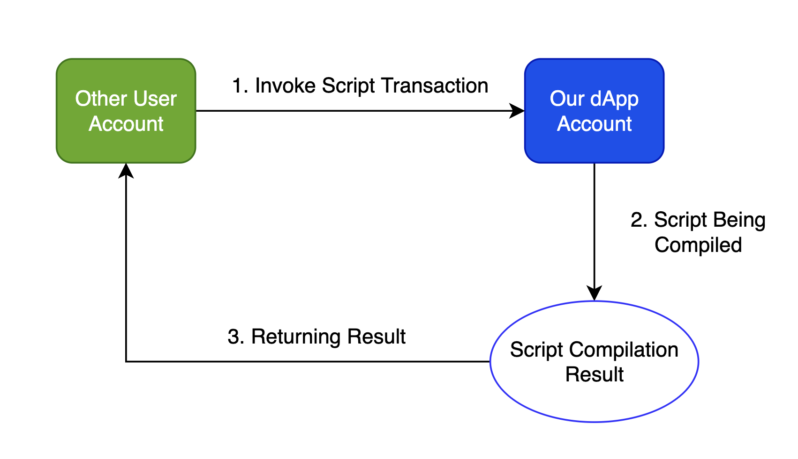
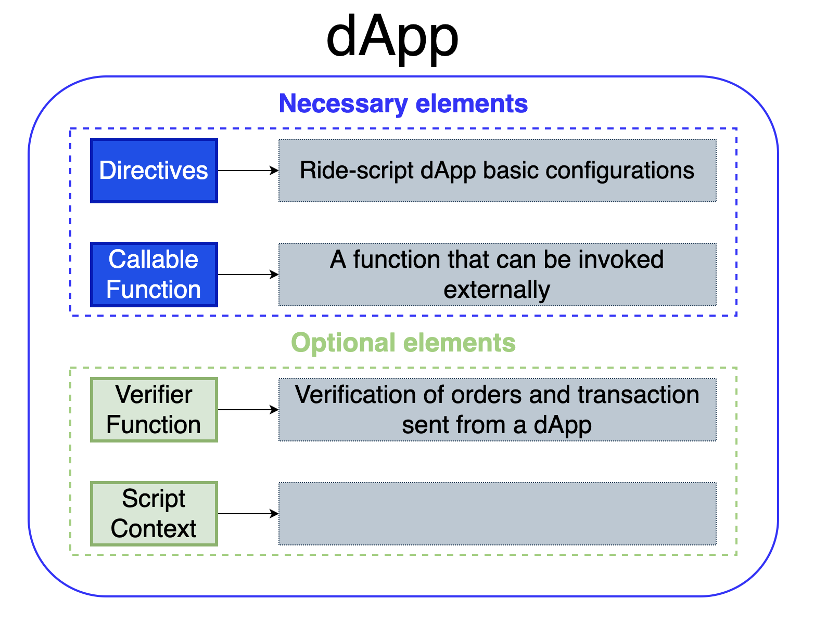
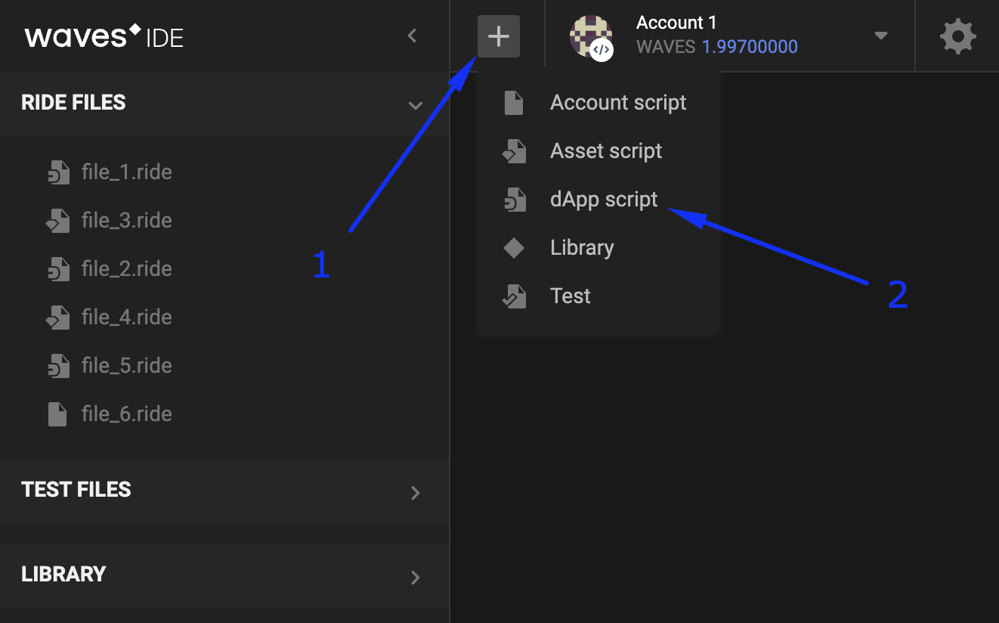
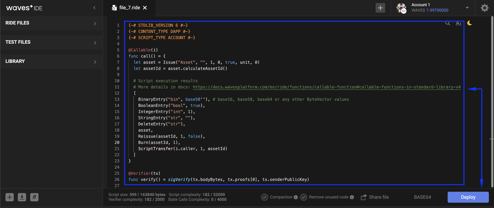
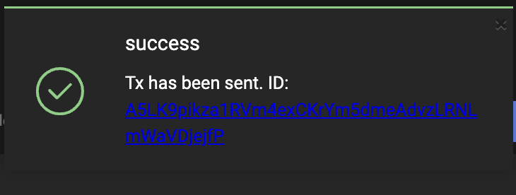

# What is a dApp And dApp Creation #

 - [DApp Definition](#dapp-definition)
 - [Usage Examples](#usage-examples)
 - [Setting A DApp Script](#seting-a-dapp-script)
   - [DApp Structure](#dapp-structure)
   - [Limitations](#limitations)
   - [Setting A DApp Script](#seting-a-dapp-script)

---

## DApp Definition ##

A dApp is a Waves account with an attached script.<br>
In the previous chapter, [What is A Smart Account And Setting Account Script](), we discussed the differences between a regular and a [smart account](#smartaccountdefinition).<br>
It will not be superfluous to remind that a dApp works with incoming transactions, while a smart account operates with outgoing transactions.<br>

For us, as for users, it may be clear what it means to operate with outgoing transactions.<br>
We just have a control over our own account, where we set a script that automates some actions.<br>
It is a way of account management that makes the life of the owner easier.<br>
<br>
Yet, it may be a bit ambigious of what an incoming transaction is.<br>
Let's give it a try to grasp the idea with the following diagram example:<br><br>

<br><br>
The blue block user is our dApp account.<br>
We are the creators of a token, called "SAMPLE" that became popular in the imaginary world.<br>
Due to the token anniversary, we decided to make a giveaway of 10 tokens to 10 unique users.<br>
To get one free token, any user should "contact" a dApp via [Invoke Script Transaction](https://docs.waves.tech/en/blockchain/transaction-type/invoke-script-transaction)<br>(will be explained in detail in the [Operations with transactions]() chapter).<br>
<br>
The green block user is a random user that decided to participate in the giveaway and receive 1 SAMPLE for free.<br>
This user "contacts" our dApp account via the invoke script transaction, which launches a script in the dApp.<br>
The script makes all necessary actions, calculations, and finds out it is a unique user that was the first one to receive the reward.<br>
Since all the script conditions were true (a unique user within the first 10 reward claimers), the dApp credited 1 SAMPLE to that account.<br>
<br>
Let's recap the dApp definition, a dApp is a Waves account with an attached script that allows to invoke the script externally.<br>
Read more about [dApp](https://docs.waves.tech/en/building-apps/smart-contracts/what-is-a-dapp).


---

## Usage Examples ##

Results of dApp usage can be completely diverse, depending on the creativity of a developer.<br>
However, there are certain limits of what those dApp callable functions are capable of:

- Editing [data storage](https://docs.waves.tech/en/blockchain/account/account-data-storage) entries;
- Working with [tokens](#tokenreference);<br>(Transfering, Issuing, Reissuing, Burning);
- Reading [blockchain data](https://docs.waves.tech/en/building-apps/smart-contracts/what-is-a-dapp#data-accessible-by-dapp);
- Setting [sponsorship](https://docs.waves.tech/en/ride/structures/script-actions/sponsor-fee).


---

## Setting A DApp Script ##


### DApp Structure ###

The structure of a dApp may seem a bit more complex than smart account's, so we will dedicate a chapter to it.<br>
Below you can see a basic structure of dApp.<br>
<br>

<br><br>

There are 2 necessary elements:

- **<ins>Directives</ins>**:<br>
    It is a set basic configurations written in the [Ride programming language](#ridechappter).<br>
    They "inform" a compiler that we:
    
    - Use the Standard library of the 6th version;
    - Type of the script is dApp;
    - The script will be assigned to an account (not an aseet).
    
    ```
    {-# STDLIB_VERSION 6 #-}
    {-# CONTENT_TYPE DAPP #-}
    {-# SCRIPT_TYPE ACCOUNT #-}
    ``` 
- **<ins>Callable function</ins>**:<br>
    A callable function that is invoked externally.<br>
    This is the very script that another user would invoke.<br>
    It is necessary that a dApp would have at least one callable function.<br>
    Also, you may write multiple callable functions within one dApp.<br>

    The callable function should be marked with the `@Callable(i)` annotation.<br>
    The `i` is an [Invocation](https://docs.waves.tech/en/ride/structures/common-structures/invocation) structure that contains invoke script transaction fields available to the callable function.

    Below you can see an example of a callable function.<br>
    It transfers 1 WAVES to an account that invoked it.<br>
    Afterward, it records the request information in the [account data storage](https://docs.waves.tech/en/blockchain/account/account-data-storage).<br>
    As well, it contains one condition: if the same account tries to invoke the script once again, the callable function does nothing.<br>

    <br>

    ```
    @Callable(i)
    func faucet () = {
        let isKnownCaller =  match getBoolean(this, toBase58String(i.caller.bytes)) {
            case hist: Boolean =>
                hist
            case _ =>
                false
        }
        if (!isKnownCaller) then 
            (
            [
                BooleanEntry(toBase58String(i.caller.bytes), true),
                ScriptTransfer(i.caller, 100000000, unit)
            ],
            unit
            )
        else ([],unit)
    }
    ```

There are 2 optional elements:

- **<ins>Verifier function</ins>**:<br>
    By default, every dApp has a built-in verifier function that verifies if an order or a transaction were signed by this account.<br>
    A verifier function cannot be invoked externally, i.e. another user cannot invoke it the same way as a callable function.<br>
    Likewise, you may also add an additional verifier function.<br>
    In the example below the verifier function allows transfer transactions and denies orders and other transaction types.<br>
    The [match](https://docs.waves.tech/en/ride/operators/match-case) operator is used to specify verification rules depending on the order/transaction type.<br>

    ```
    @Verifier(tx)
    func verify() = {
        match tx {
            case ttx:TransferTransaction => sigVerify(ttx.bodyBytes, ttx.proofs[0], ttx.senderPublicKey)
            case _ => false
        }
    }
    ```
- **<ins>Script context</ins>**:<br>
    A script context is a set of [built-in variables](https://docs.waves.tech/en/ride/variables/built-in-variables) and [built-in functions](https://docs.waves.tech/en/ride/functions/built-in-functions) available for usage within a dApp script.<br>
    Waves already created necessary functions and variables that you may use within your dApp.<br>
    If you declare a variable or a function within a certain callable function, they will be available only within that callable function.<br>
    In case you would like to declare a global variable or a global function, make sure you write the code in the global dApp scope.<br>

    For example, the [assetInfo function](https://docs.waves.tech/en/ride/functions/built-in-functions/#account-data-storage-functions:~:text=assetInfo(ByteVector)%3A%20Asset,15) requests information about the token by its ID.<br>
    After this, [isDefined function](https://docs.waves.tech/en/ride/functions/built-in-functions/#string-functions:~:text=isDefined%28T%7CUnit,1) checks that a token with this ID exists on the blockchain.

    ```
    let asset = assetInfo(base58'8LQW8f7P5d5PZM7GtZEBgaqRPGSzS3DfPuiXrURJ4AJS')
    asset.isDefined()
    ```

### Limitations ###

DApp has certain limitations with its size, complexity of the script, functions, and variables.<br>
A dApp script cannot exceed 160 Kbytes.<br>
[Complexity](https://docs.waves.tech/en/ride/base-concepts/complexity) of each callable function of dApp script cannot be more than 52,000.<br>
See the full list of possible [limitations](https://docs.waves.tech/en/ride/limits/).

### Seting A DApp Script ###

Keep in mind that the fee for the dApp Script installation is 0.01 WAVES.<br>
There are 2 ways of making your account a dApp using:

- [Waves IDE](https://waves-ide.com/):
    1. Open the [Waves IDE](https://waves-ide.com/) with a signed in account;
    2. Click "+" in the right corner of the IDE, select "dApp script":
    
    3. Write the Ride script code and click "Deploy":
    
    4. Select the account and the tool that you would sign this [transaction](https://docs.waves.tech/en/blockchain/transaction-type/set-script-transaction) with.<br>
    After this, publish the dApp script.<br>
    
    5. As a result of a succesful operation, you will see a similar notification:<br>
    
  
- [Client libraries](#XII.Libraries):<br>
    1. Prepare your [dApp script](https://docs.waves.tech/en/building-apps/smart-contracts/writing-dapps):<br>
        ```
        {-# STDLIB_VERSION 3 #-}
        {-# SCRIPT_TYPE ACCOUNT #-}
        {-# CONTENT_TYPE DAPP #-}
        let answersCount = 20

        let answers = 
        ["It is certain.", 
        "Yes - definitely.", 
        "You may rely on it.", 
        "As I see it, yes.", 
        "My reply is no.", 
        "My sources say no.",
         "Very doubtful."]

        func getAnswer (question,previousAnswer) = {
            let hash = sha256(toBytes((question + previousAnswer)))
            let index = toInt(hash)
        answers[(index % answersCount)]
            }


        func getPreviousAnswer (address) = match getString(this, (address + "_a")) {
            case a: String => 
                a
            case _ => 
                address
        }


        @Callable(i)
        func tellme (question) = {
            let callerAddress = toBase58String(i.caller.bytes)
            let answer = getAnswer(question, getPreviousAnswer(callerAddress))
            WriteSet([DataEntry((callerAddress + "_q"), question), DataEntry((callerAddress + "_a"), answer)])
            }
        ```
    2. Use a native to you programming language to send this transaction to the node.<br>
        Read more about [creating and broadcasting transactions](https://docs.waves.tech/en/building-apps/how-to/basic/transaction).<br>
        ```Java
        // Necessary imports
        import com.wavesplatform.transactions.common.Base64String;
        import com.wavesplatform.transactions.SetScriptTransaction;

        // Transforming the ride script to a base64 string
        // Make sure to insert your ride script between the brackets below
        Base64String script = node.compileScript("INSERT YOUR DAPP SCRIPT HERE").script(); 

        // Creating the transaction of the installation of a dApp script and signing it with private key of "alice" 
        SetScriptTransaction tx = SetScriptTransaction.builder(script).getSignedWith(alice);
        
        // Broadcasting the transaction to the node
        node.waitForTransaction(node.broadcast(tx).id());
        ```
        Read more about [Operations with transactions - Set Account Script Transaction](#Operationswithtransactions-SetAccountScriptTransaction).
     3. Once the transaction is sent to the node succesfully, the account will become a dApp.

