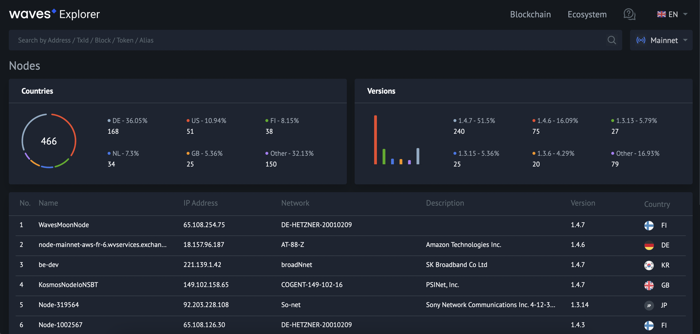

# Waves Infrastructure Products And Tools #

 - [Waves Toolset](#waves-toolset)
   - [Waves Explorer](#waves-explorer)
   - [Signer](#signer)
   - [Waves IDE](#waves-ide)
   - [Node REST API](#node-rest-api)
   - [Software Development Kits](#software-development-kits)
   - [IDE Plugins](#ide-plugins)
 - [Outro](#outro)

---

## Waves Toolset ##

The Waves blockchain platform has many ready solutions for working with the blockchain. 
It is presented in a vast variety of tools that help both developers and regular blockchain users. 

Below we will run through different tools and discover how they all can give you the best experience of the Waves blockchain interaction.  
There are 6 major instruments that are absolutely free to use:
- **<ins>[Waves Explorer](#waves-explorer)</ins>** 
    Online service that allows you to browse the Waves blockchain data. 
- **<ins>[Signer]()</ins>** 
    A TypeScript/JavaScript library featuring signing and broadcasting transactions on users behalf.  
- **<ins>[Waves IDE](#waves-ide)</ins>** 
    Online environment for developing and testing [Ride](#ridetopic) smart contracts.
- **<ins>[Node REST API](#node-rest-api)</ins>** 
    Main interface for interacting with the Waves blockchain within different [networks](#networktopic).
- **<ins>[Software Development Kits](#software-development-kits)</ins>** 
    Libraries intended for creation, signing, broadcasting [transactions](#linktotransactionlesson), and reading data from the Waves blockchain.
- **<ins>[IDE Plugins](#ide-plugins)</ins>** 
    
### Waves Explorer ###

If you would like to browse the Waves blockchain data, the [Waves Explorer](https://new.wavesexplorer.com/) is the correct place for that. 
Please, keep in mind that all the blockchain data can exist within 3 major [Waves networks (Mainnet, Testnet, and Stagenet)](). 
As well, it can be any [custom blockchain network](https://docs.waves.tech/en/waves-node/private-waves-network) you can create. 
 
All the information you would be able to see on the screen would depend on the chosen network:  

  

The platform has a user-friendly interface that allows you to:
- **<ins>See the Waves blockchain statistics</ins>**: 
   
  <!-- There will be available details about the current Waves price in the USD equivalent, the amount of completed transactions, the current block height, etc. -->
-  **<ins>Search transactions, accounts, tokens, blocks details</ins>**:
   
-  **<ins>Get detailed information about [transactions](https://new.wavesexplorer.com/transactions)</ins>**:
   
-  **<ins>Get detailed information about [blocks](https://new.wavesexplorer.com/blocks)</ins>**:
   
-  **<ins>Get detailed information about [nodes](https://new.wavesexplorer.com/nodes)</ins>**:
   

Try browsing blockchain data with the Waves Explorer! 

### Signer ###

Signer is a tool that grants integration of payments with WAVES in any other service. 
The best way to describe how Signer works is to do it with an example. 
 
Let's imagine that we manage a online pizza delivery. 
We don't want to accept any payments except with the WAVES cryptocurrency. 
In case we want to receive WAVES to our cryptowallet, we have 2 options:

- Write down the requisites of our wallet and ask a client to transfer tokens there: 
     
- Integrate payment service that would allow clients to pay with a few clicks: 
     

As we may have guessed, the first option is an outdated method. 
It puts our business at risk, as some clients can change their minds to order due to payment complexity. 
Secondly, some clients may experience troubles with proving the payment completed. 
 

The second option is what the Signer is about. 
It helps us to integrate a service 

Read more about [Signer](https://docs.waves.tech/en/building-apps/waves-api-and-sdk/client-libraries/signer).

### Waves IDE ###

### Node REST API ###

### Software Development Kits ###

### IDE Plugins ###

---

## Outro ##