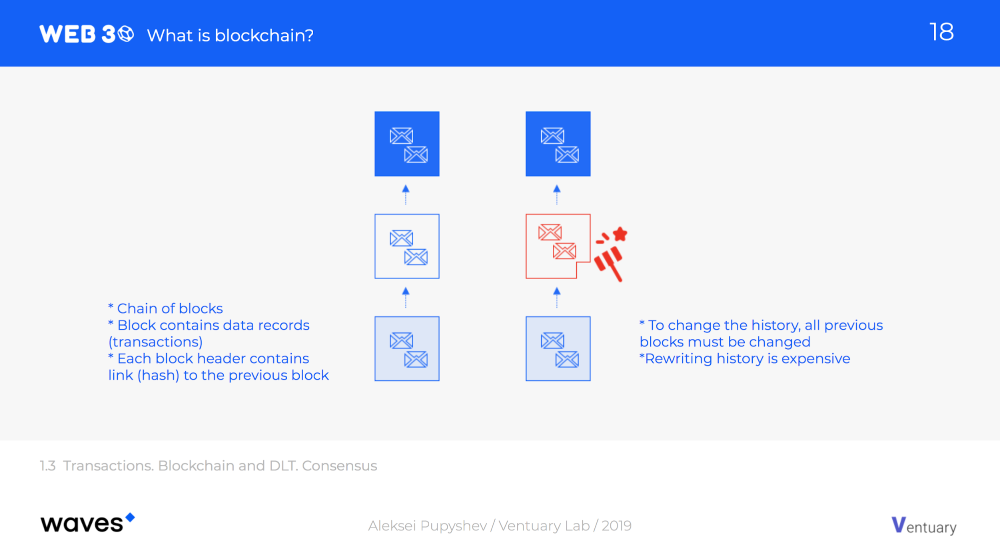
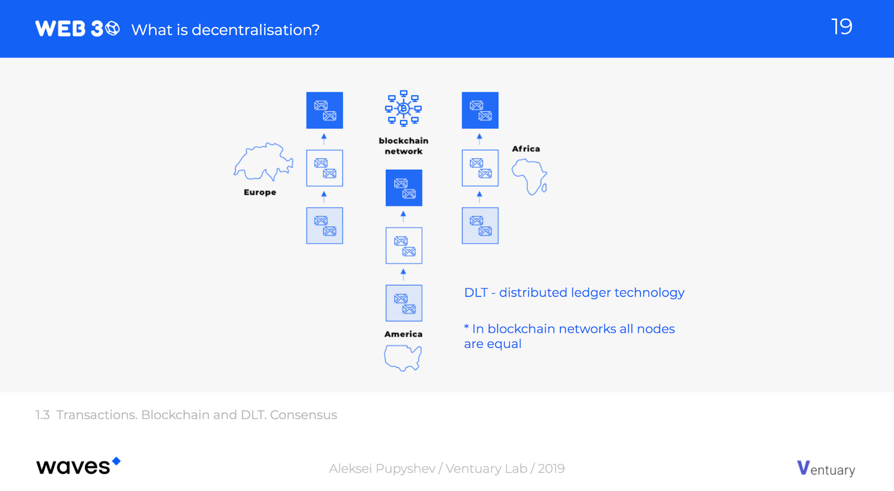

# Blockchain, Transactions, Nodes, Consensus #

  - [Blockchain](#blockchain)
  - [Transaction](#transaction)
  - [Nodes](#nodes)
  - [Types of consensus](#types-of-consensus)
    - [Proof of Work (PoW)](#proof-of-work-pow)
    - [Proof of Stake (PoS)](#proof-of-stake-pos)
    - [Proof of Authority (PoA)](#proof-of-authority-poa)
  - [Why blockchain is great](#why-blockchain-is-great)

---

## Blockchain ##

What is a blockchain? 
Basically, it’s just a data structure with specific rules: a number of transactions are combined into a block, each block has a unique hash identifier which is obtained from hashes of all transactions and a hash string of the **previous** block.

This sequence (or chain) of blocks is a blockchain. 
This unique data structure makes the blockchain **immutable** and protects it from mutations or malicious changes. 
If something is changed in block A, all subsequent blocks will be invalid and must be created again.

---

## Transaction ##

What is a transaction?  
The simplest explanation of a transaction is that it is an **event**. 
A transaction in a blockchain is a new record with some required and optional fields. 
Each new record **changes the state of the blockchain**: for example, transfers tokens from one account to another, or deploys a smart contract, or invokes it.

The Waves blockchain supports many different types of transactions at a core level. 
For example, an “asset transfer transaction” contains a timestamp, sender, recipient, amount and transaction **fee**.

As we said in the previous lesson, a transaction normally contains the sender’s digital **signature**. 
Anyone can verify the integrity of the transaction data and the authenticity of the signature, that is, make sure that the signature of the transaction matches the sender public key.

---

## Nodes ##

What is a node? 
The blockchain network consists of nodes. 
A node is a computer that stores the blockchain data or just their hashes, validates transactions and blocks, verifies signatures, and synchronizes the data with other nodes. 

Let’s imagine that we have hundreds and thousands of copies of this data distributed on different computers across many different countries and continents. 
Now, to change the block history we have to rewrite the blocks on a majority of these copies. 
That is why you might have heard that blockchain is able to ensure data is **immutable** for a long time. 

The problem is that different machines are able to generate different chains of blocks – either deliberately or by accident. 
So the copies of the blockchain they hold may not be the same. This phenomenon is called a **fork**.

To keep exactly the same data across different machines, all participants have to reach a **consensus** for each new block. 
The network participants must agree on **who** is responsible for the generation of a new block, and whether that block is **valid**. 
The participant who created the block is called a block miner, block generator or block producer. 
The block generation process is called mining. 

---

## Types of consensus ##

There are actually many types of consensus algorithms with different advantages and disadvantages. 

### `Proof of Work (PoW)` ###

Proof of Work (PoW) is the first classical consensus algorithm. 
It is based on the computation of a special “nonce” value, from which is produced a hash result with a specific number of zeros. 
The first one who is lucky enough to find the solution gets the opportunity to add the block to the chain and receive a reward. 
The probability of finding the “nonce” depends on total computational power. 
It’s a pretty expensive consensus algorithm and not efficient in terms of scalability and speed. 
The process of computation consumes large quantities of electricity, which means PoW no longer meets environmental standards. 

Bitcoin and Ethereum blockchain networks are based on the Proof of Work; however, Ethereum is now transitioning to Proof of Stake. 

### `Proof of Stake (PoS)` ###

Proof of Stake (PoS) is a category of consensus algorithms that depend on a participants’ economic stake in the network. 
Anyone who holds the blockchain’s native cryptocurrency have a chance to add a block and be rewarded. 
The probability of creating a block depends on the participant’s stake (balance) computational power, which drastically reduce energy consumption. 
Examples of uses include NXT, Tezos, Peercoin, Blackcoin. 

**Delegated Proof of Stake** is a version of PoS, where all cryptocurrency holders vote for their delegates. Delegates are responsible for validating transactions, creating new blocks, and maintaining a network. 
The best analogy for this is the US presidential elections. 
Delegates are elected by token holders through a Delegated Proof-of-Stake consensus mechanism. 
The number of delegates is limited to a predefined and relatively small number. 
No one else can participate in the block creation process. 
There are a lot of questions around whether this should be considered real decentralization. 
DPoS is used in Cosmos, Tron, EOS. 

The Waves blockchain uses **Leased Proof of Stake (LPoS)** consensus instead. 
Rather than selecting a limited number of block producers, LPoS users are able to lease (not transfer) an amount of Waves tokens to nodes they like and/or trust. 
The probability of being a block generator is proportional to the total amount of tokens leased to that account. 
Leased WAVES are locked in the user’s account and cannot be transferred or traded. 
Still, the tokens remain in the full control of the account holder, and leases can be canceled at any time. 

### `Proof of Authority (PoA)` ###

Proof of Authority (PoA) is an alternative consensus mechanism, which relies on known and reputable validators to produce blocks. 
PoA is geared towards enterprises or private organizations who want to build their own chains that are essentially closed and do not involve external participants.  

---

## Why blockchain is great ##

Blockchain has several important properties:

- **<ins>Decentralization:</ins>** 
  There is no the main storage server. 
  All records are copied and stored in different places. 
  When new information is added, it appears in all copies after verification. 
- **<ins>Reliability:</ins>** 
  Any attempts to make unauthorized changes will be rejected because of inconsistency with other copies. 
  No one has the power to manipulate or destroy the data. 
- **<ins>Transparency</ins>:** 
  Each participant can read data and track all transactions. 
- **<ins>Pseudo-anonymity</ins>:** 
  Anyone can track transactions, but cannot identify the sender or recipient. 
  To sign a transaction, only a private key is required, which itself is not associated with a person. 
  Everything is anonymous unless you state that a certain public address belongs to you or someone you know. 

In this lesson, we talked about the basics of blockchain — transactions, blocks, consensus mechanisms like proof-of-work and proof-of-stake, and delegated and leased versions of proof of stake. 
In the next lesson, we'll give some insights into how all these blockchain properties are used in Web3 services.
