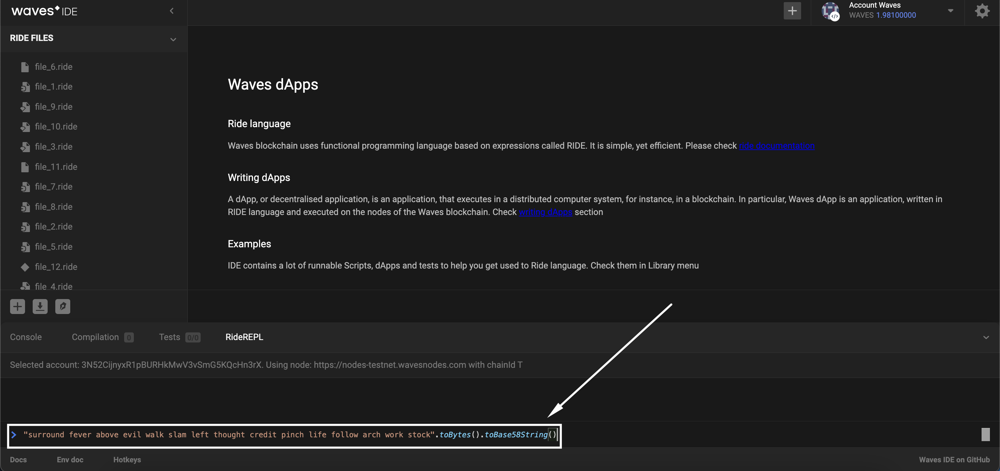

# Ubuntu Node Installation #

  - [Prerequisites](#prerequisites)
  - [Node Installation](#node-installation)
    - [Docker Installation](#docker-installation)
    - [Waves Package Installation](#waves-package-installations)


## Prerequisites ##

Before starting installation, make sure your Waves account has a [generating balance]() at least 1000 WAVES.<br>
Also, it would be necessary to keep on hand a Base58 encoded string of the seed phrase of your account.<br>
Here is how you can encode a seed phrase to Base58:<br>
1. Open the [Waves IDE](https://waves-ide.com/);
2. Click "RideREPL" down the screen:<br>
    <br>
3. Insert in the function your seed phrase:
    `"your-seed-phrase".toBytes().toBase58String()`<br>
    For example, `"surround fever above evil walk slam left thought credit pinch life follow arch work stock".toBytes().toBase58String()`
4. Copy the function with your seed phrase to the console:<br>
    <br>
5. Click "Enter" to get a Base58 encoded string of your seed phrase:
    
6. Save this Base58 encoded string, as we will use it later for node installation.<br>

## Node Installation ##

To install a node, you may use:
- <ins>[Docker](#docker-installation)</ins>:<br>
  Out-of-the-box solution easy to launch.<br>
  It is a ready container with minimum configurations you can run to have your own Waves node.
- <ins>[Waves Package](#waves-package-installation-s)</ins>:<br>
  For advanced users, it is possible to use the package.<br>
  Using the package is the way to set up a node with multiple custom configurations. 

Both ways are going to give you a fully working node.<br>
Feel free to use either of them.
  
### Docker Installation ###

Running a Waves docker container is the easiest way to install a node.<br>
Follow the steps below to install a Waves node:
1. Install [Docker](https://docs.docker.com/desktop/install/linux-install/) on Ubuntu if it wasn't yet installed.
2. Pull the latest [docker image](https://hub.docker.com/r/wavesplatform/wavesnode) of the node:
    ```
    docker pull wavesplatform/wavesnode
    ```
3. Run a docker container with such parameters as:
    - Seed of the account Base58 encoded;
    - Password of your wallet.
    ```
     docker run -d \
     --name my-waves-node \
     -p 6869:6869 \
     -e WAVES_WALLET_SEED="insert your account seed Base58 encoded that you saved earlier" \
     -e WAVES_WALLET_PASSWORD="insert your account password" \
     wavesplatform/wavesnode:latest
    ```

All done! You have a working node deployed within your docker container!<br>
The next step would be [node configuration]().

### Waves Package Installation ###

Waves node installation via package is a more advanced way of node deployment.<br>
Follow the steps below to install a Waves node:
1. Download the [latest version](https://github.com/wavesplatform/Waves/releases) of `waves-all-<version number>.jar` to any folder.<br> 
    For instance, `/opt/waves`.
2. Download the [sample](https://github.com/wavesplatform/Waves/blob/master/node/waves-sample.conf) configuration file in the same directory.<br>
3. Launch the terminal, move to the folder, and open the configuration file in the editor:<br>
   ```
   cd /opt/waves
   sudo nano waves-sample.conf
   ```
4. Study the minimum parameters.<br>
    It will be necessary to edit the configuration file to run a node.<br>
    The file contains multiple parameters related to the wallet, blockchain, rest-api, etc.<br>
    Within this lesson, we don't have a goal to configure them all, as we have the lesson [Node Configurations]() dedicated to it.<br>
    As of now, it would be enough to run a node with minimum parameters.<br>

    | Parameter | Description | Example |
    | :---- | :---- | :---- |
    | password | The password you are setting up locally on your host.<br> This password will be stored locally within the `wallet.dat` file.<br>Please, save this password to not to lose the access to the account. | `password = "RandomPassword_"` |
    | seed | The 15-words seed phrase of your Waves account encoded to Base58 string. <br> |  `seed = "K6XzUChB6DwTYCM1WxtVrv1BM6jTdcaBJrn6vkB3cK7qXCnqLV"` |
5. Edit and save the configuration file.<br>
    We may remove all the parameters except the password and the seed of the wallet.<br>
    Set a password and insert a seed Base58 encoded string.<br>
    It may look something as in the code below:<br>

    ```
    waves {

    wallet {
            # Password to protect wallet file
            password = "RandomPassword_"

            # Wallet seed as BASE58 string
            seed = "K6XzUChB6DwTYCM1WxtVrv1BM6jTdcaBJrn6vkB3cK7qXCnqLV"
        }
    }
    ```
6. Run the script in the current directory to deploy a node (`/opt/waves` in our example).<br>
    Replace {*} with the actual file name.
    ```
    cd /opt/waves
    java -jar {*}.jar {*}.conf
    ```
    For example:
    ```
    cd /opt/waves
    java -jar waves-all-1.4.7.jar waves-sample.conf
    ```
    
Congratulations!<br>
You would have a working node deployed!