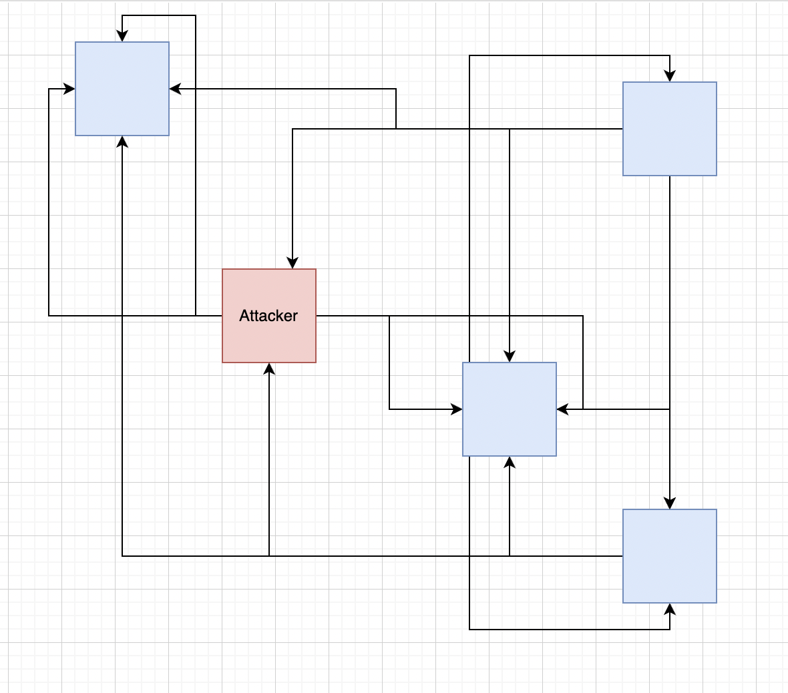

  - [Node Description](#node-description)
    - [Validating Node](#validating-node)
    - [Generating Node](#generating-node)
  - [Node Benefits](#node-benefits)

---

## Node Description ##

A node is a host that is connected to the blockchain [network]() using the [Waves Node](https://github.com/wavesplatform/Waves) application.  
In other words, it is a computer, a local machine in one big network that:  
- Is keeping the actual [blockchain copy](https://docs.waves.tech/en/waves-node/options-for-getting-actual-blockchain/state-downloading-and-applying);  
- Is participating in the block [validation]() process;  
- Can work with block [generation]().  

One of the major ideas of the blockchain is decentralization.  
To understand what decentralization is, it is better to explain first what centralization is.
    
This idea of centralization can be described with a simple example.  
If we imagine a typical centralized system, it can be a bank.  
All the information about banking accounts, transactions, all the client data - everything is stored in that specific bank.  
It would have total control over all of the client's funds and personal data.  
At any moment, at the bank's discretion, the account of a user can be blocked, and funds become frozen.  
Such a scenario can be the most negative outcome when it comes to centralized systems.  
  
In the blockchain, all the data is decentralized.   
There are hundreds of independent nodes in the network, and each of them keeps a copy of all the blockchain data.  
Even if one particular node initiates a certain action, for example, a money transfer, all other nodes will necessarily validate if:
- This transaction is valid and [signed](https://docs.waves.tech/en/blockchain/transaction/transaction-proof#transaction-signature:~:text=of%20proofs.-,Transaction%20Signature,-If%20the%20transaction) with a [private key](https://docs.waves.tech/en/blockchain/glossary#private-key:~:text=the%20next%20block.-,Private%20key,-The%20private%20key);
- There is a sufficient balance on the account.
  

There are nearly hundreds Waves nodes across the globe:  

Nodes represent witnesses that keep an eye on all of the actions completed on the blockchain.  
They check transactions and blocks to whether they were valid or if there is any attempt to alter the blockchain data.  
If there is a fraudulent transaction initiated by a node, other nodes will verify if it is a valid action.  
Once found out that the transaction is invalid, it will be rejected and not be included in a block.  

  
<!-- It is necessary to depict how a fraudulent attack of one node can look like. -->

---

### Validating Node ###

Every single node connected to the network is taking a part in the validation process.  
Once nodes receive a transaction, they begin the process of verification of that transaction.  
The transaction must:
- Be with correct [transaction fields](https://docs.waves.tech/en/blockchain/transaction/transaction-validation#:~:text=the%20following%20checks%3A-,Transaction%20fields%20check%20including,-%3A);
- Be completed only if the [balance of the sender is positive](https://docs.waves.tech/en/blockchain/transaction/transaction-validation#:~:text=the%20transaction%20type.-,Sender%27s%20balance%20check,-.);
- Contain [sender's signature](https://docs.waves.tech/en/blockchain/transaction/#sender-and-signature:~:text=Transaction%20Type%20article.-,Sender%20and%20Signature,-Each%20transaction%20contains) (ordinary accounts) or account script execution ([smart accounts](#chapter_with_smart_accounts));
- Conduct other complex verification.  
    See more about [transaction validation](https://docs.waves.tech/ru/blockchain/transaction/transaction-validation).

---

### Generating Node ###

A generating node is a node that generates blocks.  
All the nodes are [validating nodes](#validating-node), but not every node is a generating node.  
The right for block generation is given upon [LPoS consensus](#linke_to_first_chapter).  
For every block that a node generated, there is a reward this node receives.  
The reward amount is not fixed. At the current moment, it is equal to 6 WAVES.  
You can discover more about [generator's income](https://docs.waves.tech/en/blockchain/mining/).  

See more about [block generation](#next_chapter).

---

## Node Benefits ##

For every node holder, there are 2 ways to earn funds with the Waves blockchain:  

- By [block generation](#generating-node);
- By being a [lessor](https://docs.waves.tech/en/blockchain/transaction-type/lease-transaction).

In the topic [Mining And Earning On It]() we will explain the process of [node installation]() and [how to start mining]().  
As a quick preview, we will mention the minimal:

- System requirements:  
    
    | CPU | RAM | SSD | 
    | :----------:  | :----------:  | :----------: 
    | 2+ | 4+ GB| 100+ GB SSD|

- Node Requirements:  
    Generating node balance not less than 1000 WAVES.  
    See the full list of [node requirements](https://docs.waves.tech/en/blockchain/node/mining-node#:~:text=A%20node%20can%20generate%20blocks%20if%20the%20following%20conditions%20are%20met%3A).

In the next lesson, we will talk about the [Waves networks](), the networks that connect all the nodes together.  
