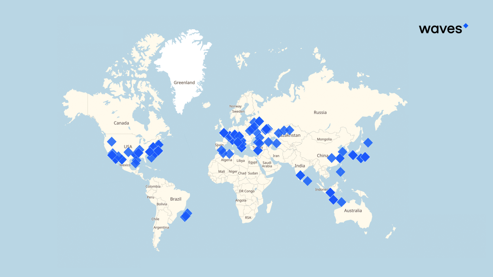

## Node description ##

A node is a host that is connected to the blockchain [network]() using the [Waves node](https://github.com/wavesplatform/Waves) application.
In other words, it is a computer, a local machine in one big network that:
- Is keeping the actual [blockchain copy](https://docs.waves.tech/en/waves-node/options-for-getting-actual-blockchain/state-downloading-and-applying);
- Is participating in the block [validation]() process;
- Can work with block [generation]().

One of the central ideas of the blockchain is decentralization.
To understand what decentralization is, it is better to explain first what centralization is.

This idea of centralization can be described with a simple example.
If we imagine a typical centralized system, it can be a bank.
All the information about banking accounts, transactions, and client data is stored in that specific bank.
It would have total control over the client's funds and personal data.
At any moment, at the bank's discretion, a user’s account can be blocked, and funds become frozen.
Such a scenario can be the most damaging outcome regarding centralized systems.

In the blockchain, all the data is decentralized. 
There are hundreds of independent nodes in the network, each keeping a copy of all the blockchain data.
Even if one particular node initiates a certain action, for example, a money transfer, all other nodes will necessarily validate if:
- This transaction is valid and [signed](https://docs.waves.tech/en/blockchain/transaction/transaction-proof#transaction-signature:~:text=of%20proofs.-,Transaction%20Signature,-If%20the%20transaction) with a [private key](https://docs.waves.tech/en/blockchain/glossary#private-key:~:text=the%20next%20block.-,Private%20key,-The%20private%20key);
- There is a sufficient balance on the account.

There are nearly hundreds of the Waves nodes across the globe:

Nodes represent witnesses that keep an eye on all the actions completed on the blockchain.
They check transactions and blocks to see whether they are valid or if there is any attempt to alter the blockchain data.
If a node initiates a fraudulent transaction, other nodes will verify if it is a valid action.
Once they find out the transaction is invalid, it will be rejected and not included in a block.

### Validating node ###

Every single node connected to the network takes part in the validation process.
Once nodes receive a transaction, they begin the process of verification of that transaction.
The transaction must:
- Be with correct [transaction fields](https://docs.waves.tech/en/blockchain/transaction/transaction-validation#:~:text=the%20following%20checks%3A-,Transaction%20fields%20check%20including,-%3A);
- Be completed only if the [balance of the sender is positive](https://docs.waves.tech/en/blockchain/transaction/transaction-validation#:~:text=the%20transaction%20type.-,Sender%27s%20balance%20check,-.);
- Contain [sender's signature](https://docs.waves.tech/en/blockchain/transaction/#sender-and-signature:~:text=Transaction%20Type%20article.-,Sender%20and%20Signature,-Each%20transaction%20contains) (ordinary accounts) or account script execution ([smart accounts](#chapter_with_smart_accounts));
- Conduct other complex verification.
    See more about [transaction validation](https://docs.waves.tech/ru/blockchain/transaction/transaction-validation).

### Generating node ###

A generating node is a node that generates blocks.
All the nodes are [validating nodes](#validating-node), but not every node is a generating node.
The right for block generation is given upon [LPoS consensus]().
For every block that a node generates, there is a reward this node receives.
The reward amount is not fixed. At the current moment, it is equal to 6 WAVES.
You can discover more about [generator's income](https://docs.waves.tech/en/blockchain/mining/).

See more about [block generation]().

## Node Benefits ##

For every node holder, there are two ways to earn funds with the Waves blockchain:

- By [block generation](#generating-node);
- By being a [lessor](https://docs.waves.tech/en/blockchain/transaction-type/lease-transaction).

In the topic [Mining and earning on it](), we will explain the process of [node installation]() and [how to start mining]().
As a quick preview, we will mention the minimal:

- System requirements:

    | CPU | RAM | SSD | 
    | :---: | :---: | :---: | 
    | 2+ | 4+ GB| 100+ GB SSD|

- Node Requirements:  
    Generating node balance not less than 1000 WAVES.
    See the complete list of [node requirements](https://docs.waves.tech/en/blockchain/node/mining-node#:~:text=A%20node%20can%20generate%20blocks%20if%20the%20following%20conditions%20are%20met%3A).

In the next lesson, we will describe the [Waves networks](), which connect all the nodes.