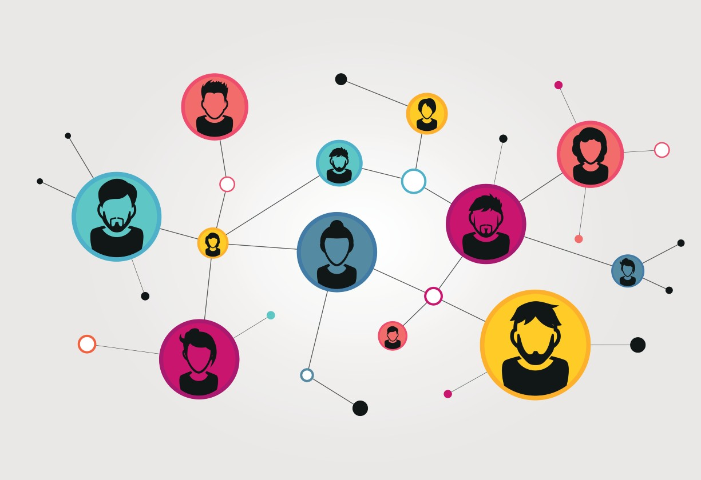
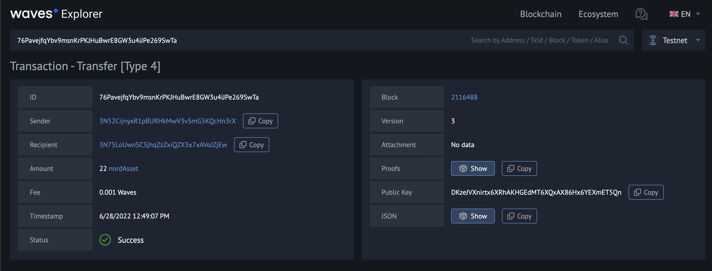
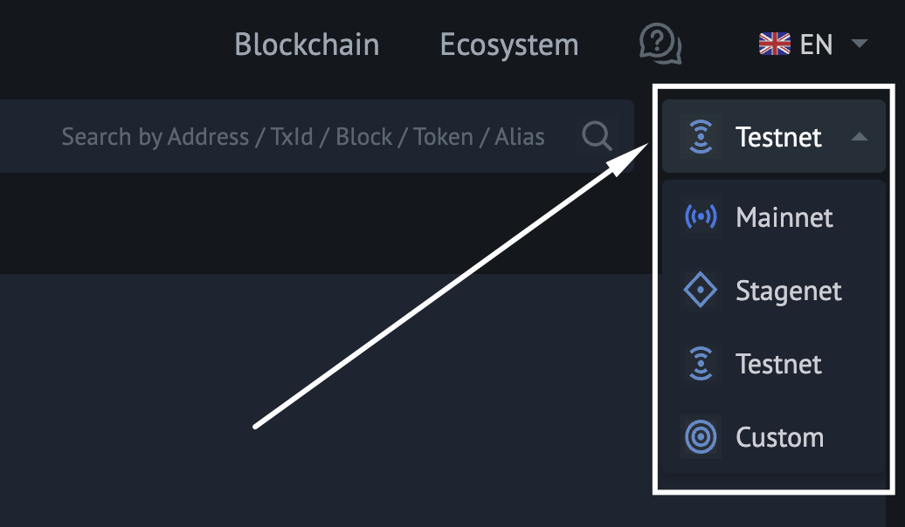
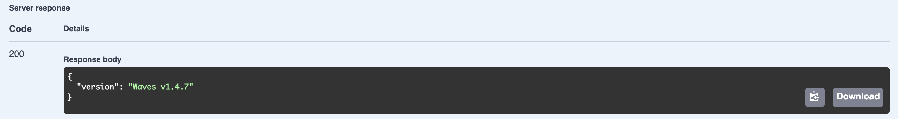

- [Network description](#network-description)
- [Mainnet, Testnet, Stagenet](#mainnet-testnet-stagenet)
- [Useful network resources](#useful-network-resources)
  - [Waves explorer](#waves-explorer)
  - [Network API](#network-api)

---

## Network description ##

A network is a way of connecting different hosts into one space.  
At home, we may have different devices connected to one WI-FI router, forming a net.  
All of those devices would be considered members of the home network.  

  

Likewise, with the Waves network, there is a space where independent [nodes]() are connected to one network.  
This space allows all the nodes to be connected to each other, forming conditions for [decentralization]().  

---

## Mainnet, Testnet, Stagenet ##

In our platform, there are 3 different networks within the Waves blockchain.  
All of the nodes are united within a network they are connected to:

- **<ins>Mainnet</ins>**:  
  The main Waves network where tokens have real value.   
  Block generators and lessors receive rewards for block generation and leasing respectively.  
  You can also check some statistics regarding the nodes launched on Mainnet [here](https://new.wavesexplorer.com/nodes).
- **<ins>Testnet</ins>**:  
  The network is intended for testing purposes.  
  Testnet is a clone of Mainnet, yet it is a testing environment.  
  There is no necessity of using real funds, and it is possible to generate free WAVES tokens.  
  Check out the [Faucet](https://testnet.wavesexplorer.com/faucet) to top up the account balance on Testnet.
- **<ins>Stagenet</ins>**:  
  The experimental network.  
  All the new features are firstly tested on Stagenet before being deployed to both Mainnet and Testnet.  
  If you would like to be the first one to test experimental features, Stagenet is the correct place.  
  Check out the [Faucet](https://stagenet.wavesexplorer.com/faucet) to top up the account balance on Stagenet.  

All the networks have their own chain ID.  
Chain ID is a symbol that differentiates one network from another.  
This chain ID is used in account address formation and makes inter-network operations impossible.  
It won't be possible to use the same address account in different networks or transfer funds from one network to another.

| Network Name | Chain ID|
| ------ | ------ |
| Mainnet | W or 87 (ASCII code of W) |
| Testnet | T or 84 (ASCII code of T) |
| Stagenet | S or 83 (ASCII code of S) |

Also, you may create your custom network.  
See more about [Custom Blockchain](https://docs.waves.tech/en/waves-node/private-waves-network#deploy-node-with-custom-blockchain-in-docker).  

Depending on the goal, you may launch your own node in any of the networks.  
Read about it in the [Mining and earning on it]() chapter.  

---

## Useful network resources ##

Since Waves has a large infrastructure, it has many different tools that function with the aforementioned networks.  
In the lesson [Waves Infrastructure Products And Tools](), all of them will be explained in detail.

Nevertheless, there are 2 services that it is worth mentioning:
- [Waves Explorer](#waves-explorer)
- [Swagger API](#network-api)

### Waves explorer ###

[Waves Explorer](https://new.wavesexplorer.com/) is a service that allows browsing the Waves blockchain data.  
For example, if we made a money transfer to our friend, such a transaction can be checked via Waves Explorer.  
  

  
Kindly note that it is very important to select the correct network when browsing any blockchain data.  
If any transaction is made in one network, meanwhile the search was made within another, no data will appear.  
The network can be changed in the right corner of the screen on the [site](https://new.wavesexplorer.com).  
  

  
The topic of the Waves Explorer will be covered in the [Infrastructure Products and tools]() chapter.  

### Network API ###

With the API service, it is possible to interact with the blockchain.  
There are 3 different APIs with each of the networks.  
All of them are accessible via the Swagger User Interface:

- [Mainnet](https://nodes.wavesnodes.com/api-docs/index.html)
- [Testnet](https://nodes-testnet.wavesnodes.com/api-docs/index.html)
- [Stagenet](https://nodes-stagenet.wavesnodes.com/api-docs/index.html)

Please, note that depending on the load of all the nodes, the Swagger tool connects you automatically to a random node that isn't overloaded.  
Therefore, at different times, different nodes' APIs may be opened in the Swagger interface.  

Using the API, it is possible to fetch some data of the blockchain or make an action on it.  
For example, we may click [/node/version](https://nodes.wavesnodes.com/api-docs/index.html#/node/getNodeVersion) to get the current Waves node version.  
  

  
The API features will be explained in more detail in the [Infrastructure Products and tools]() chapter.  
  
The topic of the next lesson will be [smart assets and how to create one]().
