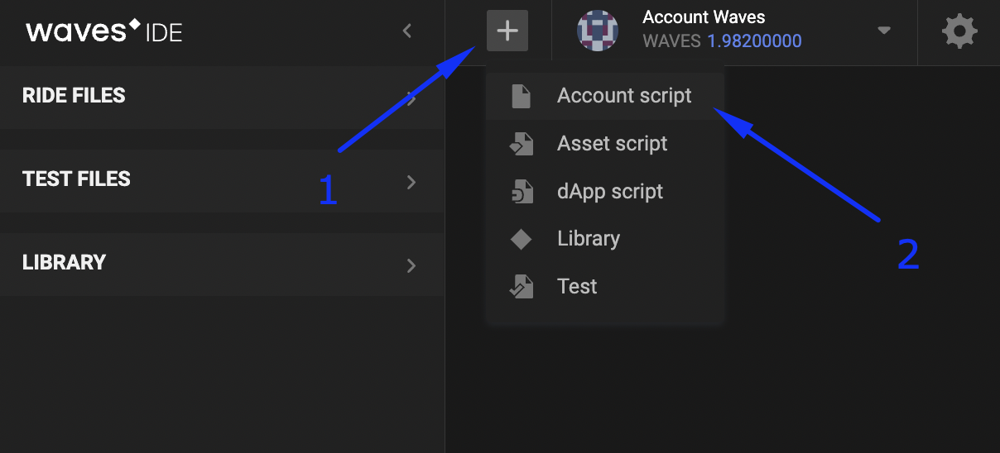
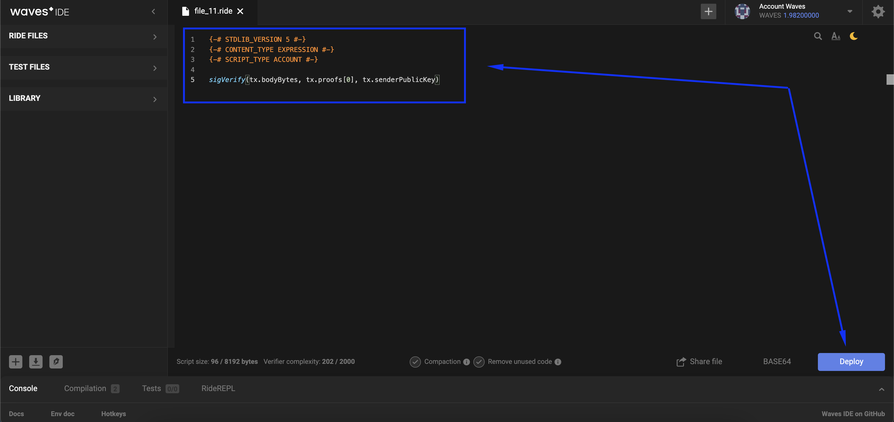
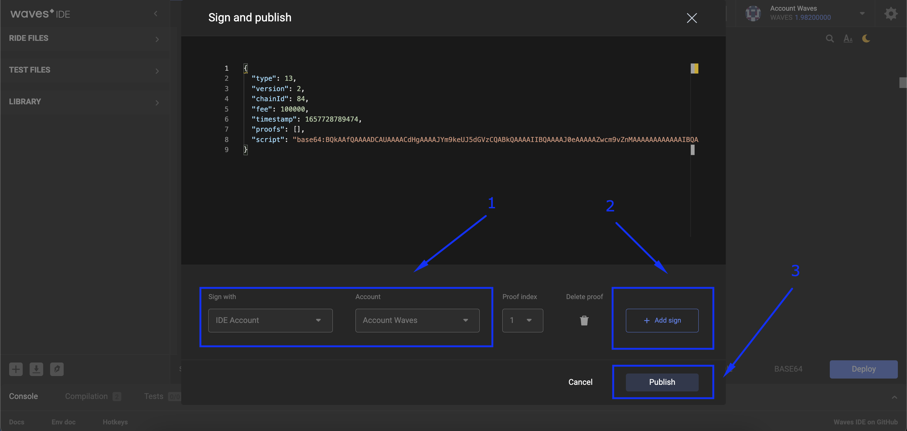
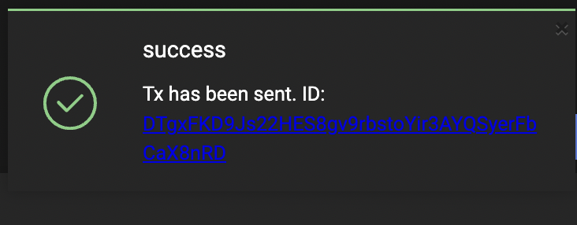

## Smart account definition ##

On the Waves platform, it is possible to create a regular account.  
With a regular account, you can send any transactions manually.  
The only verification completed automatically is checking that the transaction was sent from this account and had an available balance.  
For example, sending money from one wallet to another.   
Auto-verification will check if the account owner indeed initiated this transaction and if he has enough of the balance. 
  
A smart account is an account that has an add-on verifying that an issued transaction satisfies all conditions of the script.  
For example, sending money from one wallet to another only if the account balance is not less than 20 WAVES.  
Therefore an account that contains a script that checks all outgoing transactions whether they meet all requirements or not is called a smart account.  
  
A smart account's script can contain one or many functions (sets of rules).  
Only if a transaction meets the requirements of all the functions of the script it can be permitted.  
The possible result of the smart account's script compilation can be:

- **<u>Permitted transaction</u>**;
- **<u>Declined transaction</u>**;
- **<u>Error of compilation</u>**.

Another type of account script is called [dApp]().  
A dApp works with incoming transactions, while a smart account operates with outgoing transactions.  
We will talk about dApps in the [next lesson]().

Read more about [smart account](https://docs.waves.tech/en/building-apps/smart-contracts/what-is-smart-account).

## Usage examples ##

The examples will be written in the [Ride programming language](https://docs.waves.tech/en/ride/).  
The topic [Programming on RIDE]() will describe the basics of the language.

### Selling or buying only BTC ###

An account with the script below can make sales transactions only with BTC:  

<CodeBlock> 

```ride
{-# STDLIB_VERSION 6 #-}
{-# CONTENT_TYPE EXPRESSION #-}
{-# SCRIPT_TYPE ACCOUNT #-}

let cooperPubKey = base58'BVqYXrapgJP9atQccdBPAgJPwHDKkh6A8'
let BTCId = base58'8LQW8f7P5d5PZM7GtZEBgaqRPGSzS3DfPuiXrURJ4AJS'
match tx {
   case o: Order =>
      sigVerify(o.bodyBytes, o.proofs[0], cooperPubKey ) && 
      (o.assetPair.priceAsset == BTCId || o.assetPair.amountAsset == BTCId)
   case _ => sigVerify(tx.bodyBytes, tx.proofs[0], cooperPubKey )
}
```

</CodeBlock>

### Purchase of an asset ###

The script below allows making purchases from your account only:

- With a given asset;
- With a given price;
- With the WAVES token.

<CodeBlock>

```ride
{-# STDLIB_VERSION 6 #-}
{-# CONTENT_TYPE EXPRESSION #-}
{-# SCRIPT_TYPE ACCOUNT #-}

let myAssetId = base58'8LQW8f7P5d5PZM7GtZEBgaqRPGSzS3DfPuiXrURJ4AJS'
let cooperPubKey = base58'BVqYXrapgJP9atQccdBPAgJPwHDKkh6A8'
  
match tx {
   case o: Order =>
      sigVerify(o.bodyBytes, o.proofs[0], cooperPubKey ) && 
      o.assetPair.priceAsset == null && 
      o.assetPair.amountAsset == myAssetId && 
      o.price == 500000 && o.amount == 1000 && 
      o.orderType == Buy
   case _ => sigVerify(tx.bodyBytes, tx.proofs[0], cooperPubKey )
}
```

</CodeBlock>

## Setting a smart account script ##

### Requirements ###

To make your account a smart account, send a [set script transaction](#setting-script-transaction).  
The transaction fee for setting the script is 0.01 WAVES.

### Limitations ###

Any account may have only one script attached to it.  
“Detaching” a script from a smart account or replacing it with a new one is possible only if the "old" script does not forbid it.   

### Set script transaction ###

There are two major ways of smart account script installation:
- [Waves IDE](#wavesidechapterreference):
    1. Open the [Waves IDE](https://waves-ide.com/) with a signed-in account;
    2. Click "+" in the right corner of the IDE, and select "Account script":
    
    1. Write the Ride script code and click "Deploy":
    
    1. Select the account and the tool with which you would sign this [transaction](https://docs.waves.tech/en/blockchain/transaction-type/set-script-transaction).  
      After this, publish the smart account script.  
      
    2. As a result of a successful operation, you will see a similar notification:  
      

  
- [Client libraries](#XII.Libraries):  
    1. Prepare your smart account ride script:

         <CodeBlock>

         ```ride
         {-# STDLIB_VERSION 5 #-}
         {-# CONTENT_TYPE EXPRESSION #-}
         {-# SCRIPT_TYPE ACCOUNT #-}

         sigVerify(tx.bodyBytes, tx.proofs[0], tx.senderPublicKey)
         ```

         </CodeBlock>

    2. Use your native programming language to:
         -  Insert the ride script as an argument of the compileScript function;
         -  Send this transaction to the node.  
            (Read more about [creating and broadcasting transactions](https://docs.waves.tech/en/building-apps/how-to/basic/transaction))
            
           
         
         This is how it can be done:   

         <CodeBlock>

         ```js
         ```
         ```java
         // Necessary imports
         import com.wavesplatform.transactions.common.Base64String;
         import com.wavesplatform.transactions.SetScriptTransaction;

         // Transforming the ride script to a base64 string
         // Make sure to insert your ride script between the brackets below
         Base64String script = node.compileScript("{-# SCRIPT_TYPE ACCOUNT #-} true").script();
         SetScriptTransaction tx = SetScriptTransaction.builder(script).getSignedWith(alice);
            
         // Sending the transaction to the node
         node.waitForTransaction(node.broadcast(tx).id());
         ```
         ```php
         ```
         ```csharp
         ```
         ```go
         ```
         ```python
         ```

         </CodeBlock>


         **Parameters Description**
         | Field | Description | Example |
         | ----------- | ----------- | ----------- |
         | script | Compiled script, base64 encoded.<br>Account script up to 8192 bytes.<br>null — delete script| [Example](https://docs.waves.tech/en/blockchain/transaction-type/set-script-transaction#json-representation:~:text=%22script%22%3A,%22base64%3AAAIDAAAAAAAAAAYIARIAEgAAAAACAQAAAApyYW5kb21pemVyAAAAAQAAAANpbnYEAAAACGxhc3RQbGF5BAAAAAckbWF0Y2gwCQAEHAAAAAIFAAAABHRoaXMCAAAACGxhc3RQbGF5AwkAAAEAAAACBQAAAAckbWF0Y2gwAgAAAApCeXRlVmVjdG9yBAAAAAFzBQAAAAckbWF0Y2gwBQAAAAFzAwkAAAEAAAACBQAAAAckbWF0Y2gwAgAAAARVbml0BAAAAAFhBQAAAAckbWF0Y2gwAQAAAAxXYXZlc0xvdHRvVjIJAQAAAAV0aHJvdwAAAAAEAAAABHJhbmQJAADLAAAAAgkAAMsAAAACCQAAywAAAAIJAADLAAAAAgkAAMsAAAACBQAAAAhsYXN0UGxheQgFAAAAA2ludgAAAA10cmFuc2FjdGlvbklkCAUAAAADaW52AAAAD2NhbGxlclB1YmxpY0tleQgFAAAACWxhc3RCbG9jawAAABNnZW5lcmF0aW9uU2lnbmF0dXJlCQABmgAAAAEIBQAAAAlsYXN0QmxvY2sAAAAJdGltZXN0YW1wCQABmgAAAAEIBQAAAAlsYXN0QmxvY2sAAAAGaGVpZ2h0CQAB9wAAAAEFAAAABHJhbmQBAAAACnN0YXJ0TG90dG8AAAABAAAAA2ludgQAAAAJcGxheUxpbWl0CQAAaQAAAAIJAQAAAAx3YXZlc0JhbGFuY2UAAAABBQAAAAR0aGlzAAAAAAAAAABkBAAAAAdwYXltZW50CQEAAAAHZXh0cmFjdAAAAAEIBQAAAANpbnYAAAAHcGF5bWVudAMJAQAAAAEhAAAAAQkBAAAACWlzRGVmaW5lZAAAAAEIBQAAAANpbnYAAAAHcGF5bWVudAkAAAIAAAABAgAAAB9TaG91bGQgYmUgd2l0aCBQYXltZW50IGluIFdhdmVzAwkBAAAACWlzRGVmaW5lZAAAAAEIBQAAAAdwYXltZW50AAAAB2Fzc2V0SWQJAAACAAAAAQIAAAAaUGF5bWVudCBzaG91bGQgYmUgaW4gV2F2ZXMDCQAAZgAAAAIIBQAAAAdwYXltZW50AAAABmFtb3VudAUAAAAJcGxheUxpbWl0CQAAAgAAAAEJAAEsAAAAAgIAAAAcUGF5bWVudCBzaG91bGQgYmUgbGVzcyB0aGFuIAkAAaQAAAABBQAAAAlwbGF5TGltaXQEAAAACHJhbmRoYXNoCQEAAAAKcmFuZG9taXplcgAAAAEFAAAAA2ludgQAAAALd2luVHJhbnNmZXIJAQAAAAtUcmFuc2ZlclNldAAAAAEJAARMAAAAAgkBAAAADlNjcmlwdFRyYW5zZmVyAAAAAwgFAAAAA2ludgAAAAZjYWxsZXIJAABpAAAAAgkAAGgAAAACCAUAAAAHcGF5bWVudAAAAAZhbW91bnQAAAAAAAAAAL4AAAAAAAAAAGQFAAAABHVuaXQFAAAAA25pbAQAAAANd3JpdGVMYXN0UGxheQkBAAAACFdyaXRlU2V0AAAAAQkABEwAAAACCQEAAAAJRGF0YUVudHJ5AAAAAgIAAAAIbGFzdFBsYXkFAAAACHJhbmRoYXNoBQAAAANuaWwDCQAAZgAAAAIAAAAAAAAAAfQJAABqAAAAAgkABLEAAAABBQAAAAhyYW5kaGFzaAAAAAAAAAAD6AkBAAAADFNjcmlwdFJlc3VsdAAAAAIFAAAADXdyaXRlTGFzdFBsYXkFAAAAC3dpblRyYW5zZmVyCQEAAAAMU2NyaXB0UmVzdWx0AAAAAgUAAAANd3JpdGVMYXN0UGxheQkBAAAAC1RyYW5zZmVyU2V0AAAAAQUAAAADbmlsAAAAAgAAAANpbnYBAAAABWxvdHRvAAAAAAkBAAAACnN0YXJ0TG90dG8AAAABBQAAAANpbnYAAAADaW52AQAAAAdkZWZhdWx0AAAAAAkBAAAACnN0YXJ0TG90dG8AAAABBQAAAANpbnYAAAAA4XqnJg%3D%3D%22)|
           
          More about [Set script transaction](https://docs.waves.tech/en/blockchain/transaction-type/set-script-transaction).
  
The next lesson will be dedicated to [dApp](), another type of account script.  