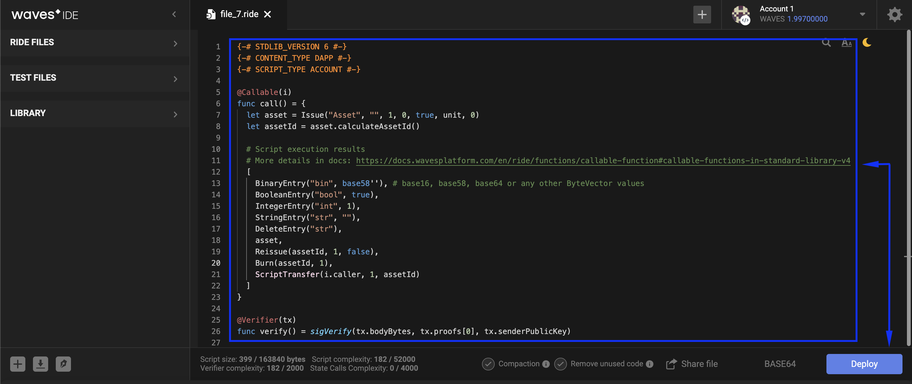
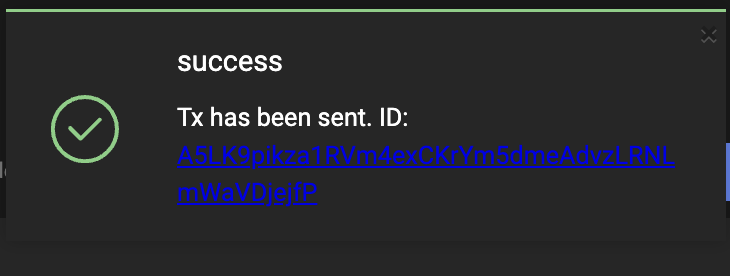

## DApp definition ##

A dApp is a Waves account with an attached script.  
In the previous chapter, [What is a smart account and setting account script](), we discussed the differences between a regular and a [smart account](#smartaccountdefinition).  
It will not be superfluous to remember that a dApp works with incoming transactions while a smart account operates with outgoing transactions.  

For us, as users, it may be clear what it means to operate with outgoing transactions.  
We control our account, where we set a script that automates some actions.  
It is a way of account management that makes the account owner’s life easier.  
  
Yet, it may be a bit ambiguous what an incoming transaction is.  
Let's give it a try to grasp the idea with the following diagram example:    

    
The blue block user is our dApp account.  
We are the creators of a token called "SAMPLE" that became popular in the imaginary world.  
Due to the token anniversary, we decided to arrange a giveaway of 10 tokens to 10 unique users.  
To get one free token, any user should "contact" a dApp via [invoke script transaction](https://docs.waves.tech/en/blockchain/transaction-type/invoke-script-transaction)  
(will be explained in detail in the [Operations with transactions]() chapter).  
  
The green block user is a random user that decided to participate in the giveaway and receive 1 SAMPLE for free.  
This user "contacts" our dApp account via the invoke script transaction, which launches a script in the dApp.  
The script makes all necessary calculations on whether it was a unique user who received the reward for the first time.  
Since all the script conditions were true (a unique user within the first ten reward claimers), the dApp credited 1 SAMPLE to that account.  
  
Let's recap the dApp definition.  
A dApp is a Waves account with an attached script that allows invoking the script externally.  
Read more about [dApp](https://docs.waves.tech/en/building-apps/smart-contracts/what-is-a-dapp).

### DApp structure ###

The structure of a dApp may seem a bit more complex than the smart account's, so we will dedicate a chapter to it.  
Below you can see the basic structure of dApp.  
  

    

There are two necessary elements:

- **<u>Directives</u>**:  
    It is a set of basic configurations written in the [Ride programming language](#ridechappter).  
    They "inform" a compiler that we:
    
    - Use the Standard library of the 6th version;
    - Type of the script is dApp;
    - The script will be assigned to an account (not an asset).
    
    <CodeBlock>

    ```ride
    {-# STDLIB_VERSION 6 #-}
    {-# CONTENT_TYPE DAPP #-}
    {-# SCRIPT_TYPE ACCOUNT #-}
    ``` 
    
    </CodeBlock>
- **<u>Callable function</u>**:    
    A callable function that is invoked externally.  
    This is the same script that another user would invoke.  
    It is necessary that a dApp would have at least one callable function.  
    Also, you may write multiple callable functions within one dApp.  

    The callable function should be marked with the `@Callable(i)` annotation.  
    The `i` is an [Invocation](https://docs.waves.tech/en/ride/structures/common-structures/invocation) structure that contains invoke script transaction fields available to the callable function.

    Below you can see an example of a callable function.  
    It transfers 1 WAVES to an account that invoked it.  
    Afterward, it records the request information in the [account data storage](https://docs.waves.tech/en/blockchain/account/account-data-storage).  
    It also contains one condition: if the same account tries to invoke the script again, the callable function does nothing.  
    
    <CodeBlock>

    ```ride
    @Callable(i)
    func faucet () = {
        let isKnownCaller =  match getBoolean(this, toBase58String(i.caller.bytes)) {
            case hist: Boolean =>
                hist
            case _ =>
                false
        }
        if (!isKnownCaller) then 
            (
            [
                BooleanEntry(toBase58String(i.caller.bytes), true),
                ScriptTransfer(i.caller, 100000000, unit)
            ],
            unit
            )
        else ([],unit)
    }
    ```
    
    </CodeBlock>

There are two optional elements:

- **<u>Verifier function</u>**:  
    By default, every dApp has a built-in verifier function that verifies if this account signed order or a transaction.  
    A verifier function cannot be invoked externally, i.e., another user cannot invoke it the same way as a callable function.  
    Likewise, you may also add a verifier function.  
    In the example below, the verifier function allows transfer transactions and denies orders and other transaction types.  
    The [match](https://docs.waves.tech/en/ride/operators/match-case) operator is used to specify verification rules depending on the order/transaction type.  

    <CodeBlock>

    ```ride
    @Verifier(tx)
    func verify() = {
        match tx {
            case ttx:TransferTransaction => sigVerify(ttx.bodyBytes, ttx.proofs[0], ttx.senderPublicKey)
            case _ => false
        }
    }
    ```

    </CodeBlock>
- **<u>Script context</u>**:  
    A script context is a set of [built-in variables](https://docs.waves.tech/en/ride/variables/built-in-variables) and [built-in functions](https://docs.waves.tech/en/ride/functions/built-in-functions) available for usage within a dApp script.  
    The Waves already created necessary functions and variables that you may use within your dApp.  
    If you declare a variable or function within a particular callable function, it will only be available within that callable function.  
    If you want to declare a global variable or a global function, make sure you write the code in the global dApp scope.  

    For example, the [assetInfo function](https://docs.waves.tech/en/ride/functions/built-in-functions/#account-data-storage-functions:~:text=assetInfo(ByteVector)%3A%20Asset,15) requests information about the token by its ID.  
    After this, [isDefined function](https://docs.waves.tech/en/ride/functions/built-in-functions/#string-functions:~:text=isDefined%28T%7CUnit,1) checks that a token with this ID exists on the blockchain.

    <CodeBlock>

    ```js
    let asset = assetInfo(base58'8LQW8f7P5d5PZM7GtZEBgaqRPGSzS3DfPuiXrURJ4AJS')
    asset.isDefined()
    ```
    ```java
    ```
    ```php
    ```
    ```csharp
    ```
    ```go
    ```
    ```python
    ```
    
    </CodeBlock>

## Usage examples ##

Depending on a developer’s creativity, dApp usage results can be completely diverse.    
However, there are certain limits to what those dApp callable functions are capable of:

- Editing [data storage](https://docs.waves.tech/en/blockchain/account/account-data-storage) entries;
- Working with [tokens](#tokenreference);  
  (Transferring, Issuing, Reissuing, Burning);
- Reading [blockchain data](https://docs.waves.tech/en/building-apps/smart-contracts/what-is-a-dapp#data-accessible-by-dapp);
- Setting [sponsorship](https://docs.waves.tech/en/ride/structures/script-actions/sponsor-fee).

## Setting a dApp script ##

### Limitations ###

DApp has limitations with its size, script complexity, functions, and variables.  
A dApp script cannot exceed 160 Kbytes.  
[Complexity](https://docs.waves.tech/en/ride/base-concepts/complexity) of each callable function of the dApp script cannot be more than 52,000.  
See the complete list of possible [limitations](https://docs.waves.tech/en/ride/limits/).

### DApp script installation ###

Keep in mind that the fee for the dApp Script installation is 0.01 WAVES.  
There are two ways of making your account a dApp using:

- [Waves IDE](#wavesidechapterreference):
    1. Open the [Waves IDE](https://waves-ide.com/) with a signed-in account;
    2. Click "+" in the right corner of the IDE, select "dApp script":
    
    1. Write the Ride script code and click "Deploy":
    
    1. Select the account and the tool with which you would sign this [transaction](https://docs.waves.tech/en/blockchain/transaction-type/set-script-transaction).  
    After this, publish the dApp script.  
    
    1. As a result of a successful operation, you will see a similar notification:  
    
  
- [Client libraries](#XII.Libraries):  
    1. Prepare your [dApp script](https://docs.waves.tech/en/building-apps/smart-contracts/writing-dapps):  
        
        <CodeBlock>

        ```ride
        {-# STDLIB_VERSION 3 #-}
        {-# SCRIPT_TYPE ACCOUNT #-}
        {-# CONTENT_TYPE DAPP #-}
        let answersCount = 20

        let answers = 
        ["It is certain.", 
        "Yes - definitely.", 
        "You may rely on it.", 
        "As I see it, yes.", 
        "My reply is no.", 
        "My sources say no.",
         "Very doubtful."]

        func getAnswer (question,previousAnswer) = {
            let hash = sha256(toBytes((question + previousAnswer)))
            let index = toInt(hash)
        answers[(index % answersCount)]
            }


        func getPreviousAnswer (address) = match getString(this, (address + "_a")) {
            case a: String => 
                a
            case _ => 
                address
        }


        @Callable(i)
        func tellme (question) = {
            let callerAddress = toBase58String(i.caller.bytes)
            let answer = getAnswer(question, getPreviousAnswer(callerAddress))
            WriteSet([DataEntry((callerAddress + "_q"), question), DataEntry((callerAddress + "_a"), answer)])
            }
        ```

        </CodeBlock>

    2. Use your native programming language to:
         -  Insert the ride script as an argument of the compileScript function;
         -  Send this transaction to the node.  
            (Read more about [creating and broadcasting transactions](https://docs.waves.tech/en/building-apps/how-to/basic/transaction))
          
         This is how it can be done:  

        <CodeBlock>

        ```js
        ```
        ```java
        // Necessary imports
        import com.wavesplatform.transactions.common.Base64String;
        import com.wavesplatform.transactions.SetScriptTransaction;

        // Transforming the ride script to a base64 string
        // Make sure to insert your ride script between the brackets below
        Base64String script = node.compileScript("INSERT YOUR DAPP SCRIPT HERE").script(); 

        // Creating the transaction of the installation of a dApp script and signing it with the private key of "alice" 
        SetScriptTransaction tx = SetScriptTransaction.builder(script).getSignedWith(alice);
        
        // Broadcasting the transaction to the node
        node.waitForTransaction(node.broadcast(tx).id());
        ```
        ```php
        ```
        ```csharp
        ```
        ```go
        ```
        ```python
        ```

        </CodeBlock>

        **Parameters Description**
        | Field | Description | Example |
        | ----------- | ----------- | ----------- |
        | script | Compiled script, base64 encoded.<br>The maximum size of a dApp script is 160 Kbytes.<br>null — delete script| [Example](https://docs.waves.tech/en/blockchain/transaction-type/set-script-transaction#json-representation:~:text=%22script%22%3A,%22base64%3AAAIDAAAAAAAAAAYIARIAEgAAAAACAQAAAApyYW5kb21pemVyAAAAAQAAAANpbnYEAAAACGxhc3RQbGF5BAAAAAckbWF0Y2gwCQAEHAAAAAIFAAAABHRoaXMCAAAACGxhc3RQbGF5AwkAAAEAAAACBQAAAAckbWF0Y2gwAgAAAApCeXRlVmVjdG9yBAAAAAFzBQAAAAckbWF0Y2gwBQAAAAFzAwkAAAEAAAACBQAAAAckbWF0Y2gwAgAAAARVbml0BAAAAAFhBQAAAAckbWF0Y2gwAQAAAAxXYXZlc0xvdHRvVjIJAQAAAAV0aHJvdwAAAAAEAAAABHJhbmQJAADLAAAAAgkAAMsAAAACCQAAywAAAAIJAADLAAAAAgkAAMsAAAACBQAAAAhsYXN0UGxheQgFAAAAA2ludgAAAA10cmFuc2FjdGlvbklkCAUAAAADaW52AAAAD2NhbGxlclB1YmxpY0tleQgFAAAACWxhc3RCbG9jawAAABNnZW5lcmF0aW9uU2lnbmF0dXJlCQABmgAAAAEIBQAAAAlsYXN0QmxvY2sAAAAJdGltZXN0YW1wCQABmgAAAAEIBQAAAAlsYXN0QmxvY2sAAAAGaGVpZ2h0CQAB9wAAAAEFAAAABHJhbmQBAAAACnN0YXJ0TG90dG8AAAABAAAAA2ludgQAAAAJcGxheUxpbWl0CQAAaQAAAAIJAQAAAAx3YXZlc0JhbGFuY2UAAAABBQAAAAR0aGlzAAAAAAAAAABkBAAAAAdwYXltZW50CQEAAAAHZXh0cmFjdAAAAAEIBQAAAANpbnYAAAAHcGF5bWVudAMJAQAAAAEhAAAAAQkBAAAACWlzRGVmaW5lZAAAAAEIBQAAAANpbnYAAAAHcGF5bWVudAkAAAIAAAABAgAAAB9TaG91bGQgYmUgd2l0aCBQYXltZW50IGluIFdhdmVzAwkBAAAACWlzRGVmaW5lZAAAAAEIBQAAAAdwYXltZW50AAAAB2Fzc2V0SWQJAAACAAAAAQIAAAAaUGF5bWVudCBzaG91bGQgYmUgaW4gV2F2ZXMDCQAAZgAAAAIIBQAAAAdwYXltZW50AAAABmFtb3VudAUAAAAJcGxheUxpbWl0CQAAAgAAAAEJAAEsAAAAAgIAAAAcUGF5bWVudCBzaG91bGQgYmUgbGVzcyB0aGFuIAkAAaQAAAABBQAAAAlwbGF5TGltaXQEAAAACHJhbmRoYXNoCQEAAAAKcmFuZG9taXplcgAAAAEFAAAAA2ludgQAAAALd2luVHJhbnNmZXIJAQAAAAtUcmFuc2ZlclNldAAAAAEJAARMAAAAAgkBAAAADlNjcmlwdFRyYW5zZmVyAAAAAwgFAAAAA2ludgAAAAZjYWxsZXIJAABpAAAAAgkAAGgAAAACCAUAAAAHcGF5bWVudAAAAAZhbW91bnQAAAAAAAAAAL4AAAAAAAAAAGQFAAAABHVuaXQFAAAAA25pbAQAAAANd3JpdGVMYXN0UGxheQkBAAAACFdyaXRlU2V0AAAAAQkABEwAAAACCQEAAAAJRGF0YUVudHJ5AAAAAgIAAAAIbGFzdFBsYXkFAAAACHJhbmRoYXNoBQAAAANuaWwDCQAAZgAAAAIAAAAAAAAAAfQJAABqAAAAAgkABLEAAAABBQAAAAhyYW5kaGFzaAAAAAAAAAAD6AkBAAAADFNjcmlwdFJlc3VsdAAAAAIFAAAADXdyaXRlTGFzdFBsYXkFAAAAC3dpblRyYW5zZmVyCQEAAAAMU2NyaXB0UmVzdWx0AAAAAgUAAAANd3JpdGVMYXN0UGxheQkBAAAAC1RyYW5zZmVyU2V0AAAAAQUAAAADbmlsAAAAAgAAAANpbnYBAAAABWxvdHRvAAAAAAkBAAAACnN0YXJ0TG90dG8AAAABBQAAAANpbnYAAAADaW52AQAAAAdkZWZhdWx0AAAAAAkBAAAACnN0YXJ0TG90dG8AAAABBQAAAANpbnYAAAAA4XqnJg%3D%3D%22)|

        Read more about [set account script transaction]().
      
    3. Once the transaction is sent to the node successfully, the account will become a dApp.
  
The next lesson will give more information about multiple products and tools of the [Waves infrastructure]().  