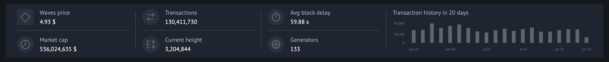
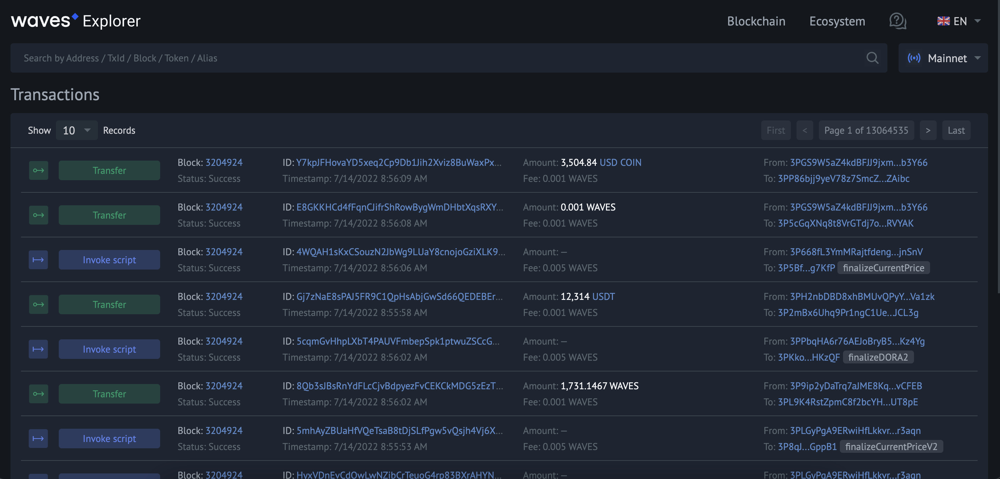
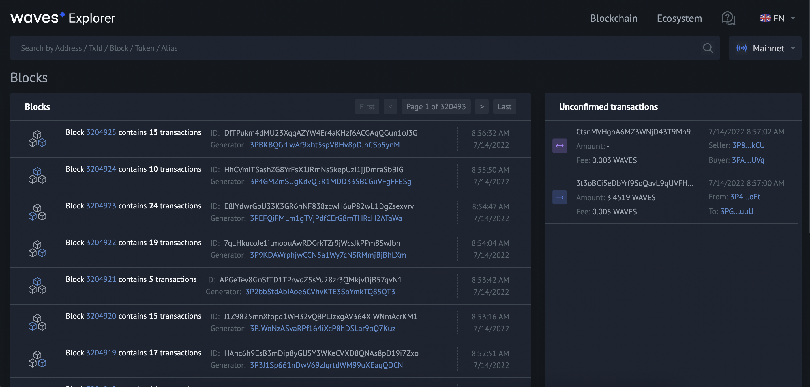
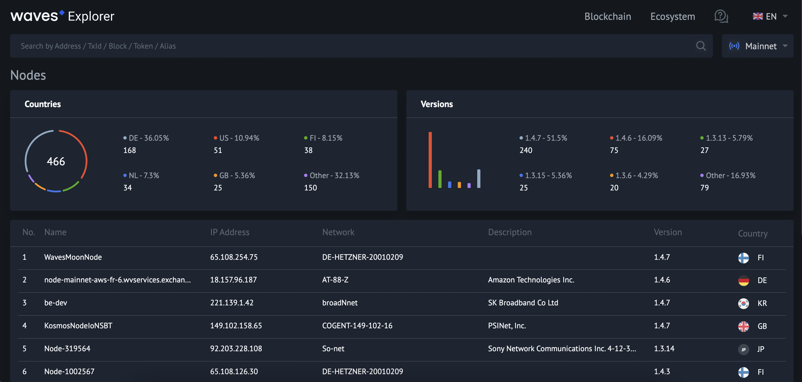
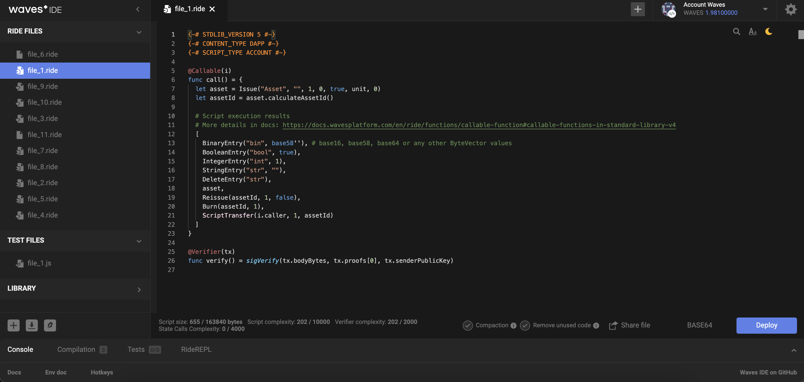
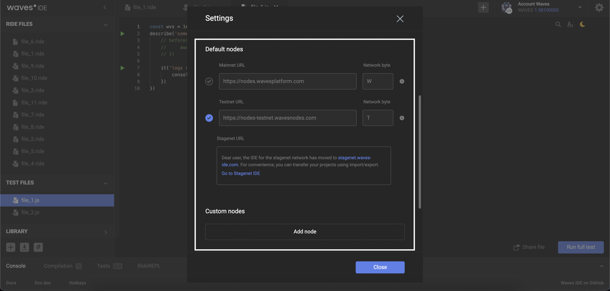
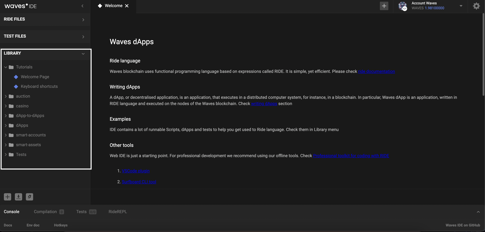
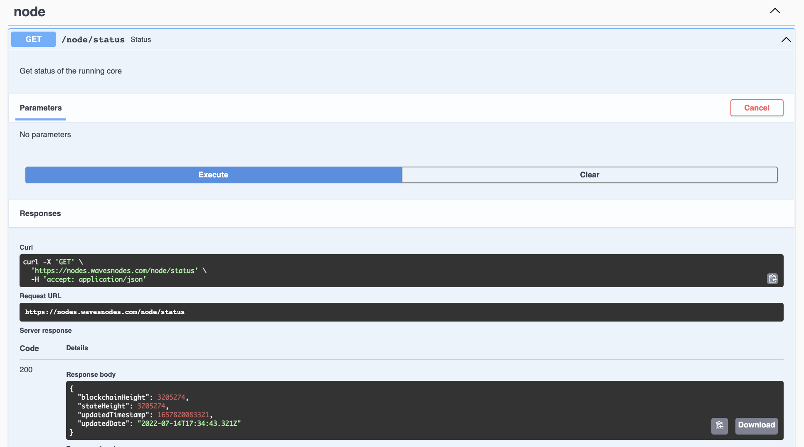

 - [Waves Toolset](#waves-toolset)
   - [Waves Explorer](#waves-explorer)
   - [Signer](#signer)
   - [Waves IDE](#waves-ide)
   - [Node REST API](#node-rest-api)
   - [Software Development Kits](#software-development-kits)
   - [IDE Plugins](#ide-plugins)
 - [Outro](#outro)

## Waves toolset ##

The Waves blockchain platform has many ready solutions for working with the blockchain.  
It is presented in a vast variety of tools that help both developers and regular blockchain users.  

Below we will run through different tools and discover how they all can give you the best experience of the Waves blockchain interaction.   
There are 6 major instruments that are absolutely free to use:
- **<u>[Waves Explorer](#waves-explorer)</u>**  
    Online service that allows you to browse the Waves blockchain data.  
- **<u>[Signer]()</u>**  
    A TypeScript/JavaScript library featuring signing and broadcasting transactions on users behalf.   
- **<u>[Waves IDE](#waves-ide)</u>**  
    Online environment for developing, testing, and deploying [Ride](#ridetopic) smart contracts.
- **<u>[Node REST API](#node-rest-api)</u>**  
    Main interface for interacting with the Waves blockchain within different [networks]().
- **<u>[Software Development Kits](#software-development-kits)</u>**  
    Libraries intended for creation, signing, broadcasting [transactions](), and reading data from the Waves blockchain.
- **<u>[IDE Plugins](#ide-plugins)</u>**  
    
### Waves explorer ###

If you would like to browse the Waves blockchain data, the [Waves Explorer](https://new.wavesexplorer.com/) is the correct place for that.  
Please, keep in mind that all the blockchain data can exist within 3 major [Waves networks (Mainnet, Testnet, and Stagenet)]().  
As well, it can be any [custom blockchain network](https://docs.waves.tech/en/waves-node/private-waves-network) you can create.  
  
All the information you would be able to see on the screen would depend on the chosen network:    

    

The platform has a user-friendly interface that allows you to:
- **<u>See the Waves blockchain statistics</u>**:  
    
-  **<u>Search transactions, accounts, tokens, blocks details</u>**:
    
-  **<u>Get detailed information about [transactions](https://new.wavesexplorer.com/transactions)</u>**:
    
-  **<u>Get detailed information about [blocks](https://new.wavesexplorer.com/blocks)</u>**:
    
-  **<u>Get detailed information about [nodes](https://new.wavesexplorer.com/nodes)</u>**:
    

Try browsing blockchain data with Waves Explorer!  

### Signer ###

Signer is a tool that grants integration of payments with WAVES in any other service.  
The best way to describe how Signer works is to do it with an example.  
  
Let's imagine that we manage an online pizza delivery.  
We don't want to accept any payments except with the WAVES cryptocurrency.  
In case we want to receive WAVES to our crypto wallet, we have 2 options:

- Write down the requisites of our wallet and ask a client to transfer tokens there:  
      
- Integrate a payment service that would allow clients to pay with a few clicks:  
      

As we may have guessed, the first option is an outdated method.  
It puts our business at risk, as some clients can change their minds to order due to payment complexity.  
Secondly, some clients may experience troubles with proving the payment completion.  
  

The second option is what the Signer is about.  
It helps us to integrate payments with WAVES to a platform.  
A client will be able to log in to his account and approve the payment right away.  

Read more about [Signer](https://docs.waves.tech/en/building-apps/waves-api-and-sdk/client-libraries/signer).

### Waves IDE ###

[Waves IDE](https://waves-ide.com/) is an environment for working with smart contracts written in [Ride](#ridetopic).  
Ride is a programming language intended for smart contract development, testing, and deployment.  
In the Waves IDE, you can work with [dApps](#dapptopic), [smart accounts](#smartacctopic), and [smart assets](#smartassettopic).  

This is a demonstration of the Waves IDE user interface:
    

    

It is possible to switch between different networks within the IDE, be it a default network or a custom one.    

    

As well you can check libraries that contain code examples and even a series of short tutorials:    

    

Read more about [Waves IDE](https://docs.waves.tech/en/building-apps/smart-contracts/tools/waves-ide).

### Node REST API ###

The Waves node REST API is the main interface for interacting with the Waves blockchain.  
The API provides public endpoints and also private endpoints that require authorization using an API key.  

The Waves team supports node pools with public API endpoints accessible to anyone:
- [Mainnet](https://nodes.wavesnodes.com)
- [Testnet](https://nodes-testnet.wavesnodes.com)
- [Stagenet](https://nodes-stagenet.wavesnodes.com)

With the help of the Swagger user interface, you can work with:  
**<u>Public methods</u>**:  
  - `Reading blockchain data`: Information about accounts, transactions, tokens, blocks, etc.
  - `Working with transactions`: Broadcasting and validating transactions, checking their statuses.
  - `Working with utilities`: Random seed generation, checking the validity of an address, etc. 
  

The Waves team does not provide the API key for public nodes.  
If you want to use private endpoints, start [your own node](https://docs.waves.tech/en/waves-node/private-waves-network).

**<u>Private Methods</u>** (only for node owners):  
- `Managing accounts in the node wallet`.
- `Signing transactions`: signing on behalf of the node wallet accounts.
- `Node management`: stop, roll back, connect to other nodes.
- `Getting debug information`.

  

For example, you can get the current node status:    

    

### Software development kits ###

For developers wishing to interact with the Waves blockchain, there is a great opportunity  
We created multiple libraries in different programming languages that allow you to:

- **<u>Work with cryptography</u>**:   
    Generation of private/public keys and wallet addresses.  
- **<u>Work with transactions</u>**:  
    Creating, signing, and broadcasting transactions.   
- **<u>Interact with the Waves node</u>**:  
    Reading blockchain data, node interaction, and working with cryptography.  
    
The list of supported languages:
- [JavaScript]()
- [Java]()
- [GoLang]()
- [Python]() 
- [PHP]()

### IDE plugins ###

The Waves team is developing different plugins for popular IDEs like Visual Studio Code or JetBrains products.  
Meanwhile, some of the plugins are still in the development stage, there is a [Visual Studo Code extension](https://marketplace.visualstudio.com/items?itemName=wavesplatform.waves-ride).  
It is a [Ride]() extension for Visual Studio Code, which provides Ride language support and interaction with the Waves blockchain.  
  

The major extension's key features are:
- **<u>Code completion (snippets).</u>**
- **<u>Syntax and error highlighting.</u>**
- **<u>JavaScript console with built-in functions for the Waves blockchain interactions.</u>**

Read more about [Visual Studio Code Extension](https://docs.waves.tech/en/building-apps/smart-contracts/tools/ride-vscode).

---

## Outro ##

We have managed to get basic ideas and discover some tools used in the Waves blockchain platform.  
The module's goal was to lay the foundation for further development in blockchain technology with Waves.  
In the next module, we will talk about [mining and how to earn with it]().  