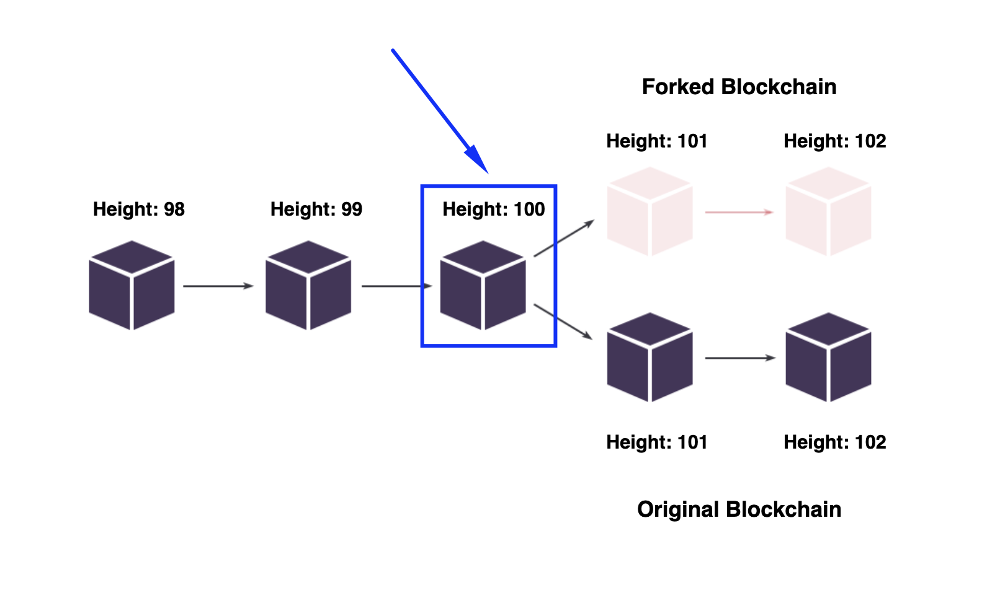
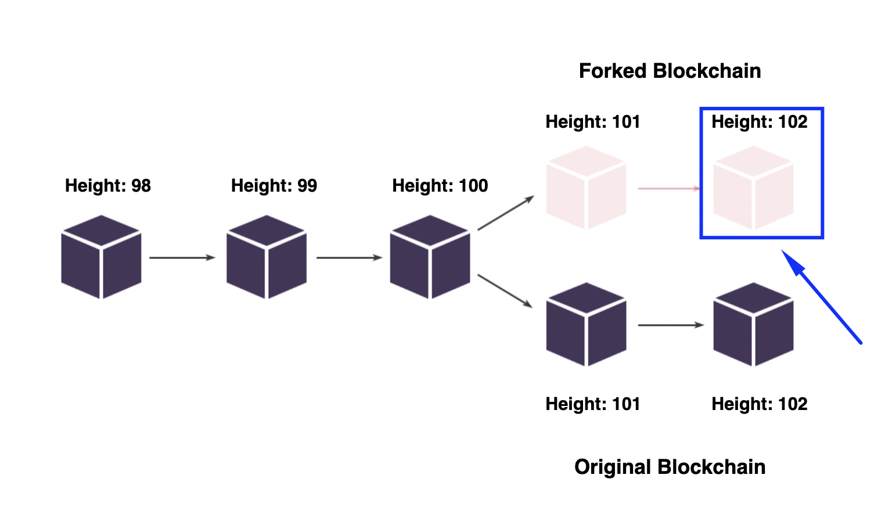
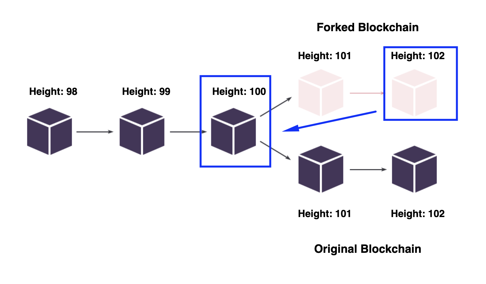

## Node rollback ##

### Why roll back your node ###

To answer the question of why it is necessary to roll back a node after a fork, let's recap a few important things:
1. A **<u>[fork]()</u>** is the moment when the blockchain gets split into two different chains.  
    It occurs because not all nodes install mandatory updates.  
    For example, a new update supports a new transaction type.  
    Some nodes installed the update and can add this transaction type to the transaction list of a [block]().  
    Other nodes that did not install it won't be able to read and broadcast this transaction type.  
    It will cause a fork, where some nodes keep pace with the original blockchain, and others do not.
2. All node update releases can be either mandatory or recommended:  
    - **<u>Mandatory updates</u>** typically contain crucial updates.  
        After an update is published, it may take some time before it is activated.  
        Sometimes it can take up to 1-2 weeks.   	You may find information about the activation time frames on the [releases page](https://github.com/wavesplatform/Waves/releases).    
        In the scenario when you don't have an update installed after its activation, your node will switch to a fork.
    - **<u>Recommended updates</u>** include minor bug fixes or slight improvements.  
        Skipping such updates will not lead to a fork.   	However, for the best experience, it is still recommended to be installed.

If you don't update your node before a feature activation within a mandatory update, your node will switch to a fork.  
The risk of staying in a fork is that the node may stop working at one moment.  
As a consequence of a non-functioning node, there will be no opportunity to generate a block and receive a reward.  
  
In the scenario you turned out to be on a fork, it will be necessary to update your node and roll back.  
Firstly, we eliminate the very issue of why our node went to the fork, i.e., we install the necessary updates that were absent.  
Secondly, we roll back our node to the height before a particular feature was activated.  
Rolling back a node is a way to restore the node blockchain height to the moment before the fork occurred.  
Lastly, the node will be able to synchronize with the current blockchain state and be ready to mine once again.  

The best way to get the idea is to watch it working on the live example.  
We will return to our fictional blockchain instance, where the blockchain split into two chains at the 100th block.  
A feature that was included in the update was activated at the 100th block:    


Since we didn't update our node before the feature activation, we switched to a fork.  
At the moment of the 102nd block, we found out that we were on the fork:  


In this situation, we will need to:
- Update our node;
- Roll it back from the 102nd block to the 100th block before the split occurred.  
    


## How to rollback a node ###

1. Check the current height of the blockchain by the [link](https://nodes.wavesnodes.com/blocks/height).  
    It can look like this:

    ```
    {"height":3000}
    ```
2. Check the blockchain height of your node via the [REST API of your node](http://localhost:6869/blocks/height).  
    Two scenarios are possible:
    - Your blockchain height is the same or is different for a few blocks.  
        It can look something like this:  

        ```
        {"height":2999}
        ```
        In such a case, please, continue with step №3 of this instruction.
    - Your blockchain height is significantly far behind the blockchain's height.  
        It can look something like this:
        
        ```
        {"height":2500}
        ```  
        In this case, you will need to install the latest update as mentioned in the [Node Upgrade](#node-upgrade).  
        Please, note that you won't need to follow this instruction below (steps №3 and below).  
        After completing this step, you can go to the [Node of the network]() chapter.
3. Verify the signature of a block of the blockchain.   
    Check the signature of the blockchain's height minus ten by the link:
    
    ```
    https://nodes.wavesnodes.com/blocks/headers/at/{insert blockchain height minus 10}
    ```
    In our example, the blockchain height was `{"height":3000}`, therefore `3000 - 10 = 2990`:  
    https://nodes.wavesnodes.com/blocks/headers/at/2990

    You will see multiple keys on the screen, but we need only the "signature" key.  
    The signature may look like this:

    ```
    "signature":"5qnRwFt4vkrvAx4jbhu7Bu8XHrxY17JkYV41nbnPEEX3euqznGg15j9i2si1K2k5rZahRiDQovwxFq459Rwewjf7"
    ```
4. Verify the signature of a block of our node's blockchain.  
    Check the signature of the blockchain's height minus ten by the link:
    
    ```
    http://localhost:6869/blocks/headers/at/{insert blockchain height minus 10}
    ```
    In our example, our node blockchain height was `{"height":2999}`.  
    Yet, it could have taken some time for our node to synchronize the height with the blockchain's height (up to `{"height":3000}`).  
    Since we are aiming at checking the same height block signature, we will need to use the same height (`3000 - 10 = 2990`):  
    http://localhost:6869/blocks/headers/at/2990

    You will see multiple keys on the screen, but we need only the "signature" key.  
    The signature may look like this:

    ```
    "signature":"5qnRwFt4vkrvAx4jbhu7Bu8XHrxY17JkYV41nbnPEEX3euqznGg15j9i2si1K2k5rZahRiDQovwxFq459Rwewjf7"
    ```

5. Compare the block signatures of the blockchain and our node blockchain.  

    Two scenarios are possible:
    - **<u>The signatures match.</u>**  
        If the signatures match, your node is up to date.  
        You won't need to update and roll it back for now.  
        You can skip all the steps of the instruction below and go directly to the [Node of the network]() chapter.
    - **<u>The signatures do not match.</u>**  
        If the signatures do not match, it will be necessary to repeat steps №3 and №4 in 20 minutes.    
        
        The reason why we are doing this is the following:     
        The [REST API user interface](https://nodes.wavesnodes.com/) connects to a random node within the Mainnet network.  
        If only one node existed, it could become unavailable or overloaded, so the REST API service would not be working.  
        For load balancing purposes, by accessing `https://nodes.wavesnodes.com`, a different node may respond at different times.   
        Due to the fact we connect to random nodes within the network via [REST API](https://nodes.wavesnodes.com/), there are chances that this particular node that responded could switch to a fork itself.   

        For this reason, there is a tiny chance we could encounter a forked node during the block's headers verification step.  
        If our signatures matched once, it signifies that both our node and the random node that responded via the REST API are not on the fork.  
        However, if the signatures do not match, there is a slight chance that the blockchain node could be on the fork.  

        We will need to repeat steps №3 and №4 in 20 minutes only one more time.  
        If it matches after the second attempt, you won't need to update and roll back your node.  
        If the signatures did not match for the second time, please continue with step №6.
6. Update your node.  
    Once you encounter two signature mismatches, run through the procedure of the [Node update](#node-upgrade).
7. Roll back your node.  
    Please ensure you are authorized in the REST API service as mentioned in the 4th step of the chapter [Configuration file setup](#configuration-file-setup).
    
    Go to the link to roll back your node at your node height minus 2000 blocks:
    
    ```
    http://localhost:6869/debug/rollbackToHeight/{insert your node blockchain height minus 2000 blocks}
    ```
    For example, since the height of our node was equal to `{"height":2999}`, we need to roll it back 2000 blocks ago (`2999 - 2000 = 999`):    

    ```
    http://localhost:6869/debug/rollbackToHeight/999
    ```

    There are two possible results:
    - **<u>The operation is successful</u>**.  
        You will receive a block id string in response.  
        You will also be able to see the logs of your node app with the current blockchain height.  
        The node blockchain height will be rolled back to 2000 blocks ago.  
        After this, your node will automatically start synchronization to the current blockchain state.  
        Once the synchronization is done, your node will be ready for mining again.  
    - **<u>The operation is failed</u>**.  
        You will receive an error, and the height of the blockchain in your app logs will not change.  
        If you encounter the roll-back failure, the fork occurred more than 2000 blocks ago.  
        It will not be possible to roll back more than 2000 blocks.   
        Therefore, you restart [Blockchain synchronization](#blockchain-synchronization).  
