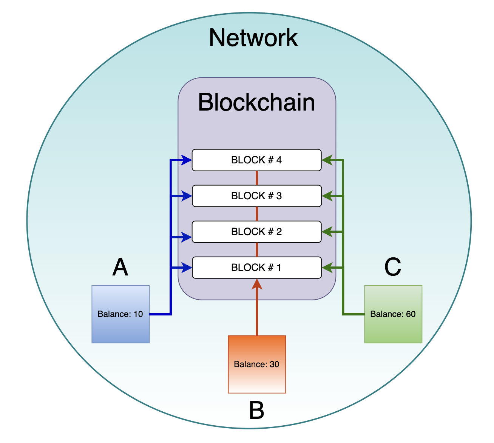

- [Module intro](#module-intro)
- [Generating node definition](#generating-node-definition)
- [Rewards for blocks generation](#rewards-for-blocks-generation)

---

## Module intro ##

This module will open the door to the world of mining with the Waves.  
Firstly we will define what a [mining node](#miner-node-definition) is and discover what nodes can do.  
Afterward, [rewards for block generation]() will be elaborated.  
We will learn how to [set up a node]() on your operating system.  
By the end of this module, you would be able to deploy your own node and be able to earn with mining.  

---

## Generating node definition ##

In the lesson [Nodes Of The Waves Network](), we gave a definition of a node and described its major features.  
Let's recap what we have just learned about it with a few short sentences.  
A node is a device (computer) that is connected to a [Waves network (Mainnet, Stagenet, Testnet)]().  
Every node is participating in the process of validation of new blocks and transactions.  
Some nodes can also receive the right of block generation, which grants the generating node owner a reward for every block generated.  
A node that is participating in block generation is called a generating node.  
Within this and the following lesson, [Summary Of Mining Node Requirements](), it will be our major task to find out how exactly we can receive that block generation right and receive profit from it.  

It is worth mentioning that with the Waves, you are mining with the [LPoS consensus]().  
In the lesson [Introduction - Blockchain, Transactions, etc](), there was given an example of [LPoS consensus]().  
What it means is that you don't need to have an extremely powerful computer to generate a block and get a reward.  
Every time there is only one block generator and not thousands of competing computers as it works with the [PoW consensus]().  
Basically, you may have one casual computer or a laptop on which you can deploy a node.  
There are certain [requirements for block generation]() that you need to satisfy to generate a block.  
If your node generates a block, you receive a [reward](#rewards-for-blocks-generation) for it in the wallet of that node.  


---

## Rewards for blocks generation ##

The reward for block generation is not static.  
At the current moment, the reward amount is 6 WAVES.  
It may change with [voting](https://docs.waves.tech/en/blockchain/mining/mining-reward#voting), both decreasing or increasing.  

Since every time there is only one block generator, multiple hosts are trying to get this right of block generation.  
The chances of getting this right are proportional to your investment amount divided by the total pool of all investments within the blockchain.  
  
Let's illustrate this complex definition with a simple instance.  
Assume that our blockchain is at the dawn of its popularity and we have only 3 nodes connected to the network.  
There is the node "A" that belongs to us and there are other 2 nodes, "B" and "C", belonging to different people.   
The "A" node has an investment amount of 10 imaginary tokens, the "B" node has 30 tokens, and the "C" has 60 tokens.  
Each new block of the example blockchain is generated within one minute.  
All 3 participants of the blockchain race for a reward want to generate a block.  
Our chances of the block generation with our node are the following:
```
1. 10 + 30 + 60 = 100 - Firstly, we sum the total investment pool 
2. 10 / 100 = 0.1 - Secondly, we calculate our share of the whole investment pool
3. 0.1 * 100 = 10% - Lastly, we discover the chances of the next block generation in percent
```
Therefore, in a world, where we have only 3 nodes with an unchangeable investment balance, our chance would always remain at 10%.  
Every minute, when a new block is generated, we compete with other nodes with a 10% chance to generate that new block.  
One moment we may get lucky and get a streak of blocks generated by our node, another moment, other nodes can generate it.

  

In the real world with the Waves blockchain, there are differences in numbers:
- **<u>The amount of participants is much bigger.</u>**  
    There are over hundreds of [generating nodes](https://dev.pywaves.org/30dGenerators) in the Waves blockchain.
- **<u>The investment balances of nodes are not static.</u>**  
    Multiple miners can withdraw their investments, making your share of the total pool bigger and chances of block generation higher.  
    As well miners can top up their balance, diluting your share in the pool and decreasing your chances of block generation.  
- **<u>Blocks are being generated with different frequencies.</u>**  
    In the Waves blockchain, every new block is generated approximately every minute.  
    This interval is not static and may differ from time to time.  
 
The next lesson will cover the [requirements]() for the deployment of a node and block generation.  


  
