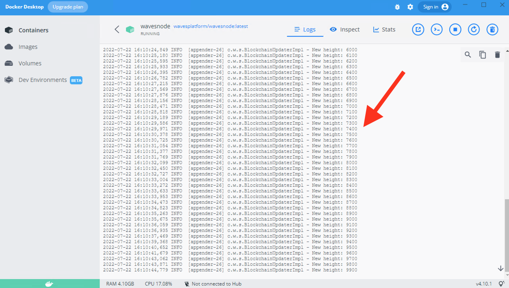
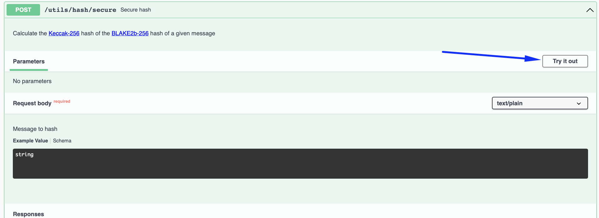
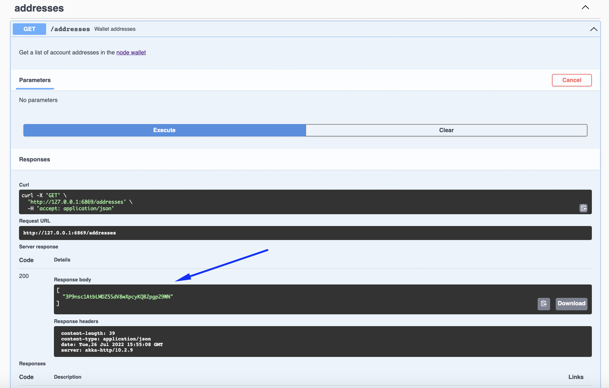
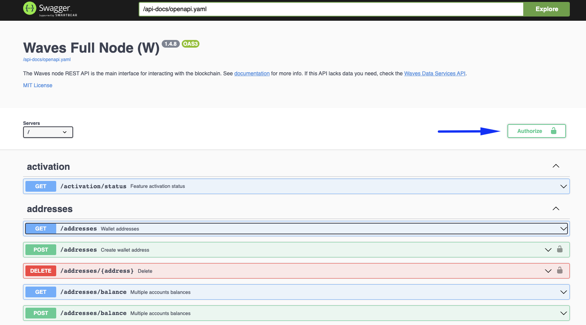
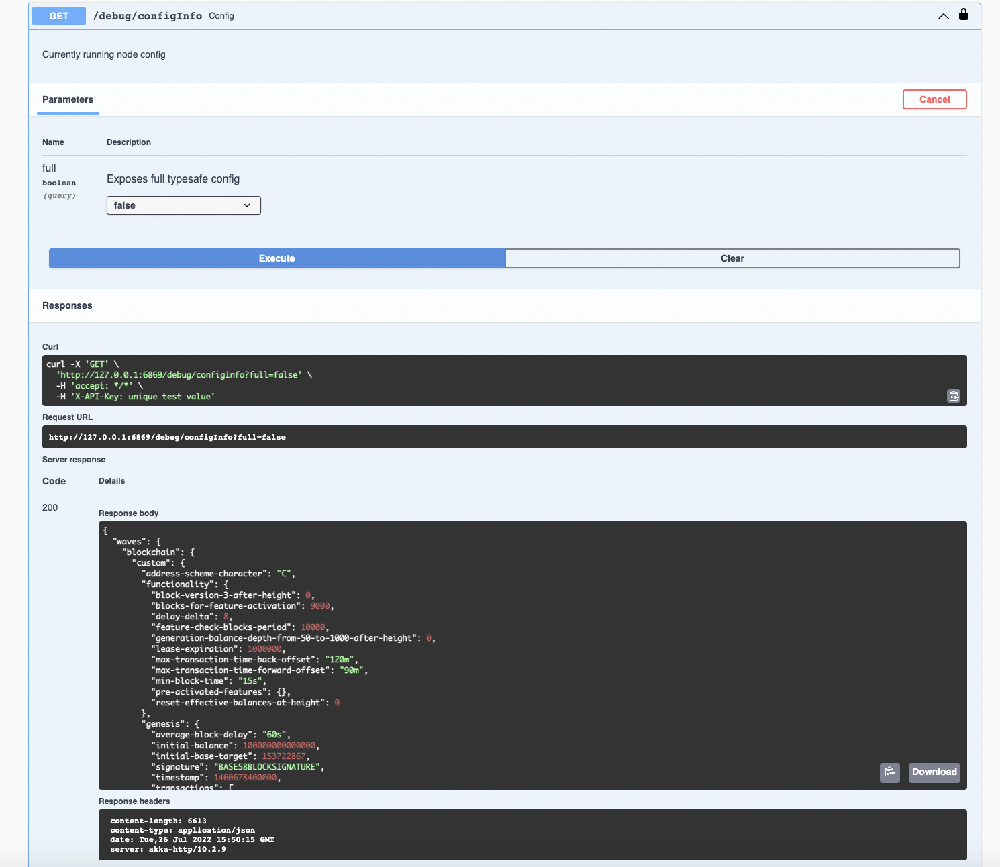

  - [Node Structure](#node-structures)
  - [Prerequisites](#prerequisites)
  - [Windows Node Deployment]()
    - [Docker Deployment]()
      - [Installation]()
      - [Configuration]()
      - [Synchronization]()
    - [Waves Package Deployment]()
      - [Installation]()
      - [Configuration]()
      - [Synchronization]()
 
---

## Node Structure ##

To clarify all of our node installation steps, it is better, to begin with, a node structure explanation.  
Understanding the structure of the node will shed some light on major essences that the node interacts with.  

Under the bonnet, every node has:
- **<ins>Blockchain database</ins>**:  
    All the nodes of the Waves blockchain are intended to ensure [decentralization]().  
    Therefore, an identical copy of all the blockchain data must be stored in every node.  
- **<ins>Configuration file</ins>**:  
    A configuration file is a set of instructions on how a node should work.  
    In the configuration file, we can define multiple parameters, for instance, which [network]() to connect to.


---

## Prerequisites ##

Before starting the installation, make sure your Waves account has a [generating balance]() at least 1000 WAVES.  
Also, it would be necessary to keep on hand a Base58 encoded string of the seed phrase of your account.  
Here is how you can encode a seed phrase to Base58:  
1. Open the [Waves IDE](https://waves-ide.com/);
2. Click "RideREPL" down the screen:  
      
3. Insert in the function your seed phrase:
    `"your-seed-phrase".toBytes().toBase58String()`  
    For example, `"surround fever above evil walk slam left thought credit pinch life follow arch work stock".toBytes().toBase58String()`
4. Copy the function with your seed phrase to the console:  
      
5. Click "Enter" to get a Base58 encoded string of your seed phrase:
    
6. Save this Base58 encoded string, as we will use it later for node installation.  

---

## Node Installation ##

Node deployment process consists of 3 major steps:
- **<ins>Node installation</ins>**  
    Firstly, we need to install our node.  
    Within this step, all necessary directories and files in them will be installed on your host.  
    You will deploy your own Waves node with minimum parameters.
- **<ins>Node configuration</ins>**  
    Secondly, the installed node needs to be configured.  
    We will work on the configuration file that defines how your node would work.
- **<ins>Blockchain synchronization</ins>**  
    After that, it is necessary to synchronize the node with the current blockchain state.  
    A newly installed node doesn't have all the blockchain data downloaded yet.  
    The goal of this step is to upload the current blockchain data to our node.

To install a node, you may use:
- <ins>[Docker](#docker-installation)</ins>:  
  That is an out-of-the-box solution easy to launch.  
  We recommend this option to run your own Waves node.
- <ins>[Waves Package](#waves-package-installation-s)</ins>:  
   For advanced users, it is also possible to use the jar-package.  

All these ways are going to give you a fully working node.  
You can choose any way that is more convenient to you.
  
### Docker Deployment ###

#### Installation  ####
Running a Waves docker container is the recommended way to install a node.  
Follow the steps below to install a Waves node:
1. Install [Docker Desktop](https://docs.docker.com/desktop/install/windows-install/) on Windows if it wasn't yet installed.
2. Pull the latest [docker image](https://hub.docker.com/r/wavesplatform/wavesnode) of the node:
    ```
    docker pull wavesplatform/wavesnode
    ```
3. Create folders to store the blockchain copy and a configuration file:

    ```
    md C:\wavesnode\data C:\wavesnode\conf
    ```
4. Open the Docker Desktop app in the "Images" section and click "Run":
    
5. The app will require you to fill in the settings of the container that is about to run:
    |  |  | 
    | :-----: | :-----: |

    It will be necessary to fill the following fields:

    | Field Name | Description | Example |
    | :----- | :----- | :----- |
    | Container Name | Gives a name to a Docker container. | wavesnode |
    | Host Port | The port that will enable the REST API service on your localhost, for example, 127.0.0.1:6869.<br>In the next lesson, [Node Configuration](), we will configure REST API of your node.  | 6869 |
    | Volumes<br>(Host Path - Container Path) | [Docker volumes](https://docs.docker.com/storage/volumes/) are intended for "connecting" the data stored locally on our host with the storage of the container.<br>It is necessary to do it for both directories that store the blockchain data (`C:\wavesnode\data`) and the configuration file (`C:\wavesnode\conf`).<br>It will "link" the data from your host to the container's storage to:<br>- `/var/lib/waves` for the blockchain data;<br>- `/etc/waves` for the configuration file.<br>In case your docker container gets accidentally deleted, your node configurations and the blockchain copy will not be lost.<br>You will be able to deploy a node once again with the stored locally data, so the progress will be resumed right from where it has been stopped. | Host Path:<br>`C:\wavesnode\data`<br>Container Path:<br>`etc/waves`<br><br>Host Path:<br>`C:\wavesnode\conf`<br>Container Path:<br>`var/lib/waves`| 
    | Environment Variables<br>Variable<br>WAVES_WALLET_PASSWORD | The password you are setting up locally on your host.<br>This password will encode your seed Base58 string within the `wallet.dat` file. | `RandomPassword_` |
    | Environment Variables<br>Variable<br>WAVES_WALLET_SEED | The seed phrase of your Waves account encoded to Base58 string. | `DCvnnTiVt77TybcCoqVogG2`|
6.  Grant access to the folders.  
    A notification regarding access request to `C:\wavesnode\data` and `C:\wavesnode\conf` may pop up.  
7.  In the "Containers" section, make sure the status of the container is "Running". 
8.  Click on the container name:
    
    You will see multiple lines of logs.  
    Please, note it may take a few moments to deploy a node.  
    
    Once you see notifications about the height of the blockchain, it means everything is working properly:

    
All done! You have a working node deployed within your docker container!  
In the next lesson, [node configuration](), we will learn how to set up a configuration file of your node.  

#### Configuration ####

##### Node Configuration File Description #####

As we previously mentioned in the [Node Structure]() chapter, every node has:
- A configuration file;
- The blockchain copy.
  
Within this lesson, we are going to work with the configuration file of the node.  
In the [next lesson](), we will talk about node synchronization with the Waves blockchain.  

A configuration file is a way of setting up instructions on how a node should work.  
  

##### Modules In The Configuration File #####

All the node modules are wrapped within the `Waves` configuration section.  
There we can define what modules we would like to configure.  
In the [sample configuration file](https://github.com/wavesplatform/Waves/blob/version-1.4.x/node/waves-sample.conf), we have 4 of them included (`wallet`, `blockchain`, `rest-api`, `network`):  

```
waves {
    wallet {
    }

    blockchain {
    }

    rest-api {
    }

    network {
    }
}
```

This list of modules in the given example is not full, you can find the full list of Waves node modules and their parameters in the [documentation](https://docs.waves.tech/en/waves-node/node-configuration#sections-of-the-configuration-file).  

For the sake of simplicity, we will concentrate on the same modules as the ones included in the [sample configuration file](https://github.com/wavesplatform/Waves/blob/version-1.4.x/node/waves-sample.conf):  
- **<ins>[Wallet](https://docs.waves.tech/en/waves-node/node-configuration#wallet-settings)</ins>**  
    Built-in node wallet parameters.  
    In the wallet module, you can configure the parameters of the [wallet built in the Waves node](https://docs.waves.tech/en/waves-node/how-to-work-with-node-wallet).  
    [Previously](), we defined the seed of the wallet Base58 encoded and set a password to encode the seed in `wallet.dat` file:
    
    ```
    waves {
        wallet{
            password = "RandomPassword_"
            seed = "K6XzUChB6DwTYCM1WxtVrv1BM6jTdcaBJrn6vkB3cK7qXCnqLV"
        }
    }
    ```

    Wallet parameters:  
    | Name | Description | Example |
    | :---- | :---- | :---- |
    | password | Random password a user sets. Encodes your seed Base58 string in the `wallet.dat` file. | RandomPassword_ |
    | seed | Connects your wallet to your node via the [wallet seed Base58 encoded]().<br><br>If you don’t have any existing wallet, comment out this parameter and start a node.<br>During the first run, the application will create a new wallet with a random seed for you.<br>In this case, the seed will be displayed in the application log.<br>If you miss it or if you don’t want to check the log files, it will also be available in [REST API]() using the `wallet/seed` method.|  K6XzUChB6DwTYCM1WxtVrv1BM6jTdcaBJrn6vkB3cK7qXCnqLV |

    Read more about [Wallet Settings](https://docs.waves.tech/en/waves-node/node-configuration#wallet-settings).
- **<ins>[Blockchain](https://docs.waves.tech/en/waves-node/node-configuration#blockchain-settings)</ins>**  
    Blockchain parameters.  
    In the blockchain module, you can select the blockchain type.  
    Since we are aimed at mining and receiving rewards for block generation, we will use the MAINNET type.  

    ```
    waves {
        blockchain {
            type = MAINNET
        }
    }
    ```

    Blockchain parameters:  
    | Name | Description | Example |
    | :---- | :---- | :---- |
    | type | Selects the blockchain type: [MAINNET, STAGENET, TESTNET]() or [CUSTOM](https://docs.waves.tech/en/waves-node/private-waves-network). | MAINNET | 

    Read more about [Blockchain Settings](https://docs.waves.tech/en/waves-node/node-configuration#blockchain-settings).
- **<ins>[REST API](https://docs.waves.tech/en/waves-node/node-configuration#rest-api-settings)</ins>**  
    Node API parameters.  
    The Waves node REST API is the main interface for blockchain interaction.  
    The API has both public (available for everyone) and private (available only via authorization) endpoints.  
    You may check the swagger REST API interface for the [MAINNET network](https://nodes.wavesnodes.com/) to get an idea of what it looks like.  

    Once this parameter is configured, you may get access to the REST API service of your personal node directly:  

    
    ```
    waves {
        rest-api {
            enable = yes
            bind-address = "0.0.0.0"
            port = 6869
            api-key-hash = "CvTpRm21PyZf15q1dD7bz46meYYtWQAgA1kQU1iqXKriv"
        }
    }
    ```

    REST API parameters:  
    | Name | Description | Example |
    | :---- | :---- | :---- |
    | enable | Activates REST API.<br>If you want to deactivate REST API, change the default value to no. | yes |
    | bind-address | Network address where the REST API accepts incoming connections.<br>Please, use 0.0.0.0 address when deploying a node with Docker.<br>Use [Nginx’s proxy pass module](http://nginx.org/en/docs/http/ngx_http_proxy_module.html) or [SSH port forwarding](https://blog.trackets.com/2014/05/17/ssh-tunnel-local-and-remote-port-forwarding-explained-with-examples.html) for external access. | 127.0.0.1 |
    | port | Port number where the REST API accepts incoming connections. | 6869 |
    | api-key-hash | Hash of the API key to access private endpoints.<br>Please, check the chapter [API Key Of Your Node](#api-key-of-your-node) to generate the API Key. | CvTpRm21PyZf15q1dD7bz46meYYtWQAgA1kQU1iqXKriv |

    Read more about [REST API Settings](https://docs.waves.tech/en/waves-node/node-configuration#rest-api-settings).
- **<ins>[Network](https://docs.waves.tech/en/waves-node/node-configuration#network-settings)</ins>**  
    Peer-to-peer network parameters.  
    This module allows you to define how your node would interact with other nodes within the network:

    ```
    waves {
        network {
            node-name = "waves-node"
            bind-address = "0.0.0.0"
            port = 6868
        }
    }
    ```

    Network parameters:  
    | Name | Description | Example |
    | :---- | :---- | :---- |
    | node-name | Sets the name of your node visible to other participants of the P2P network.<br>The name is transmitted during the initial handshake. | waves-node | 
    | bind-address | Sets the IP address of the local network interface on which Waves Node will accept incoming connections.<br>By default, node binds to 0.0.0.0 that means that it will listen on all available network adapters. | 0.0.0.0 | 
    | port | Sets the network port number to which other Waves nodes will connect.<br>Check that the port is reachable from outside, otherwise, your node will connect to the P2P network using only outgoing connections.<br>If this port is used by other applications, your node won’t start.<br>For example:<br>-6868 for Mainnet<br>-6863 for Testnet<br>-6862 for Stagenet| 6868 | 

     Read more about [Network Settings](https://docs.waves.tech/en/waves-node/node-configuration#network-settings).

##### API Key Of Your Node #####  

After the REST API module is configured and node deployed, you will be able to access the Swagger interface for blockchain interaction.  
There you can access different methods that will allow you:
- Read the blockchain data:
    - `Account data`  
        (balances, data storage entries, aliases, scripts assigned)
    - `Token data`  
        (parameters, distribution by accounts)
    - `Active leases`
    - `Blocks`
    - `Transactions`
    - `Etc`
- Operate with transactions: 
    - `Broadcast signed transactions`
    - `Validate transactions`
    - `Check the status of transactions`
- Use utilities:
    -  `Generate an address from a public key`
    -  `Generate a random seed`
    -  `Calculate hashes` 
    -  `Etc`

These methods can be:
- **<ins>Public</ins>**:  
    Methods available to everyone. Public methods do not:
    - Operate with any private data of the node owner;
    - Invoke any methods that would make an action with any node, like stopping a node or connecting to a peer.  
  
    For example, [`/blocks/height`](https://nodes.wavesnodes.com/api-docs/index.html#/blocks/getHeight) is a method that checks the current height of the blockchain.  
    This information is not private and there is no action made with a node, therefore it doesn't require any additional authorization. 
- **<ins>Private</ins>**:  
    Methods available only to node owners.  
    These methods can be invoked only by node owners via API key and API key hash authorization.  
    For example, [`/debug/configInfo`](https://nodes.wavesnodes.com/api-docs/index.html#/debug/getConfig) is a method that checks the configuration of the currently running node.

The chapter goal is to get this API key and API key hash to be able to operate with the private methods of your node.  
Here is how you can do it:
1. Open [`/utils/hash/secure`](https://nodes.wavesnodes.com/api-docs/index.html#/utils/hashSecure) in the Swagger REST API node interface.
2. Click "Try it out":  
      
3. Enter any random string value and click "Execute":
      
    Please, do not use the example in the screenshot, as it is given for demonstration purposes only.
4. In the response section below, you will receive a hash:
      
5. Save both the original phrase you entered (API key) and the hash (API key hash) of it as we will use them for interaction with private node methods in this lesson.

##### Docker Configuration File Setup #####

Follow the instructions below for setting up configurations:
1.  Once a node has been deployed, a configuration file gets automatically created.   
    Go to the directory with the configuration file (`C:\wavesnode\conf\waves-sample.conf`).
2.  Edit the configuration file.  
    [In the previous lesson](), we deployed a docker container with the Base58 encoded seed and the password as environment variables.  
    It looked something like this but with your own seed and password: 
      
    
    As of now, we will write these details in the configuration file within the `waves.wallet` module.  
    Make sure to add `wallet`, `blockchain`, `rest-api`, and `network` modules to the file.    

    Please, note `rest-api.api-key-hash` parameter doesn't necessarily have to match with the example below.  
    In the chapter [API Key Of Your Node](#api-key-of-your-node), instruction on how to generate the API key hash was given.  
    Insert the API key hash in the `rest-api.api-key-hash` parameter.
      
    After the edit, the `waves.conf` file can look something like this:  

    ```
    waves {
        wallet {
            password = "RandomPassword_"
            seed = "K6XzUChB6DwTYCM1WxtVrv1BM6jTdcaBJrn6vkB3cK7qXCnqLV"
        }

        blockchain {
            type = MAINNET
        }

        rest-api {
            enable = yes
            bind-address = "0.0.0.0"
            port = 6869
            api-key-hash = "CvTpRm21PyZf15q1dD7bz46meYYtWQAgA1kQU1iqXKriv"
        }

        network {
            node-name = "waves-node"
            bind-address = "0.0.0.0"
            port = 6868
        }
    }
    ```
3. Save the file and deploy a node once again by restarting a container:  
      
    Please, wait a few moments for the node to restart.  
4. Check the [REST API interface](http://localhost:6869/api-docs/index.html) of your deployed node.  
    There you would be able to see multiple methods to interact with your node.  
    For instance, you can try a:
    - [Public method](http://127.0.0.1:6869/api-docs/index.html#/addresses):  
        All public methods don't require any additional authorization.  
        For example, the `/addresses/` method, will return the address of your node wallet.  
         
    - [Private method](http://127.0.0.1:6869/api-docs/index.html#/debug/getConfig):  
        All private methods require authorization with an API key and API key hash.    
        Kindly note that the API key hash that you inserted in the configuration file is not equal to the API key.  
        The API key hash is the random string you typed in the [`/utils/hash/secure`](https://nodes.wavesnodes.com/api-docs/index.html#/utils/hashSecure) method.  
        In case you do not remember what API key and API key hash are, please, check [API Key Of Your Node](#api-key-of-your-node).  
          
        To authorize private method usage:
        1. Click "Authorize":
            
        2. Enter your API key (not the API hash) and click "Authorize":
            
            Please, note the API key on the screen is an example.  
            You need to use your own API key.
        3. Click "Close":
            
        4. Now you can use private methods of your node.  
            For example, [`/configInfo`](http://127.0.0.1:6869/api-docs/index.html#/debug/getConfig) method will return configurations of the currently running node.
               
      
    Read more about [Node REST API](https://docs.waves.tech/en/waves-node/node-api/).   

In the next lesson, [Blockchain Synchronization](), we will move to the final step of preparations for mining.  

#### Synchronization ####

### Waves Package Deployment ###

#### Installation ####
Waves node installation via package is a more advanced way of node deployment.  
Follow the steps below to install a Waves node:
1. Install Java (OpenJDK 8).  
    Please, note, that if you already have OpenJDK 11 installed, there is no need to roll it back to OpenJDK 8.  
    The node Installation is supported in both the 8th and the 11th versions.  
    Install OpenJDK8 as mentioned in the [documentation](https://access.redhat.com/documentation/en-us/openjdk/8/html/installing_and_using_openjdk_8_for_windows/openjdk8-windows-installation-options).  

    Check the JDK version with the following command:  
    
    ```
    java -version
    ```

    If you see in the output the version is such as below or higher, you can move to the next step:  

    ```
    java version "1.8.0_201"
    Java(TM) SE Runtime Environment (build 1.8.0_201-b09)
    Java HotSpot(TM) 64-Bit Server VM (build 25.201-b09, mixed mode)
    ```

2. Create folders to store the blockchain copy and a configuration file.  

    ```
     md C:\wavesnode\data C:\wavesnode\conf
    ```

3. Download the [latest version](https://github.com/wavesplatform/Waves/releases) of `waves-all-<version number>.jar` to the folder `C:\wavesnode`.
4. Download the [sample](https://github.com/wavesplatform/Waves/blob/master/node/waves-sample.conf) configuration file to `C:\wavesnode\conf`.  
5. Study the minimum parameters.  
    It will be necessary to edit the configuration file to run a node.  
    The file contains multiple parameters related to the wallet, blockchain, rest-api, etc.  
    Within this lesson, we don't have a goal to configure them all, as we have the lesson [Node Configurations]() dedicated to it.  
    As of now, it would be enough to run a node with minimum parameters.  

    | Parameter | Description | Example |
    | :---- | :---- | :---- |
    | password | The password you are setting up locally on your host.<br> This password will encode your seed Base58 string within the `wallet.dat` file. | `password = "RandomPassword_"` |
    | seed | The seed phrase of your Waves account [encoded to the Base58 string](#prerequisites). <br> |  `seed = "K6XzUChB6DwTYCM1WxtVrv1BM6jTdcaBJrn6vkB3cK7qXCnqLV"` |
6. Edit and save the configuration file.  
    Open `waves-sample.conf` in the directory `C:\wavesnode\conf`.  
    We may remove all the parameters except the password and the seed of the wallet.  
    Set a password and insert a seed Base58 encoded string.  
    It may look something as in the code below:  

    ```
    waves {

    wallet {
            # Password to protect wallet file
            password = "RandomPassword_"

            # Wallet seed as a BASE58 string
            seed = "K6XzUChB6DwTYCM1WxtVrv1BM6jTdcaBJrn6vkB3cK7qXCnqLV"
        }
    }
    ```
7. Run the script in the current directory to deploy a node.  
    Replace {*} with the actual file name:
    ```
    cd C:\wavesnode
    java -jar {*}.jar .\conf\{*}.conf
    ```
    For example:
    ```
    cd C:\wavesnode
    java -jar waves-all-1.4.7.jar .\conf\waves-sample.conf
    ```
8. Please, note it may take a few moments to deploy a node.  
    Once you see logs about the height of the blockchain, it means everything is working properly:

    ```
    INFO [appender-22] c.w.s.BlockchainUpdaterImpl - New height: 5100
    ```
    
Congratulations!  
You would have a working node deployed!
    
In the next lesson, [node configuration](), we will learn how to set up a configuration file of your node.  

#### Configuration ####

##### Node Configuration File Description #####

As we previously mentioned in the [Node Structure]() chapter, every node has:
- A configuration file;
- The blockchain copy.
  
Within this lesson, we are going to work with the configuration file of the node.  
In the [next lesson](), we will talk about node synchronization with the Waves blockchain.  

A configuration file is a way of setting up instructions on how a node should work.  
  

##### Modules In The Configuration File #####

All the node modules are wrapped within the `Waves` configuration section.  
There we can define what modules we would like to configure.  
In the [sample configuration file](https://github.com/wavesplatform/Waves/blob/version-1.4.x/node/waves-sample.conf), we have 4 of them included (`wallet`, `blockchain`, `rest-api`, `network`):  

```
waves {
    wallet {
    }

    blockchain {
    }

    rest-api {
    }

    network {
    }
}
```

This list of modules in the given example is not full, you can find the full list of Waves node modules and their parameters in the [documentation](https://docs.waves.tech/en/waves-node/node-configuration#sections-of-the-configuration-file).  

For the sake of simplicity, we will concentrate on the same modules as the ones included in the [sample configuration file](https://github.com/wavesplatform/Waves/blob/version-1.4.x/node/waves-sample.conf):  
- **<ins>[Wallet](https://docs.waves.tech/en/waves-node/node-configuration#wallet-settings)</ins>**  
    Built-in node wallet parameters.  
    In the wallet module, you can configure the parameters of the [wallet built in the Waves node](https://docs.waves.tech/en/waves-node/how-to-work-with-node-wallet).  
    [Previously](), we defined the seed of the wallet Base58 encoded and set a password to encode the seed in `wallet.dat` file:
    
    ```
    waves {
        wallet{
            password = "RandomPassword_"
            seed = "K6XzUChB6DwTYCM1WxtVrv1BM6jTdcaBJrn6vkB3cK7qXCnqLV"
        }
    }
    ```

    Wallet parameters:  
    | Name | Description | Example |
    | :---- | :---- | :---- |
    | password | Random password a user sets. Encodes your seed Base58 string in the `wallet.dat` file. | RandomPassword_ |
    | seed | Connects your wallet to your node via the [wallet seed Base58 encoded]().<br><br>If you don’t have any existing wallet, comment out this parameter and start a node.<br>During the first run, the application will create a new wallet with a random seed for you.<br>In this case, the seed will be displayed in the application log.<br>If you miss it or if you don’t want to check the log files, it will also be available in [REST API]() using the `wallet/seed` method.|  K6XzUChB6DwTYCM1WxtVrv1BM6jTdcaBJrn6vkB3cK7qXCnqLV |

    Read more about [Wallet Settings](https://docs.waves.tech/en/waves-node/node-configuration#wallet-settings).
- **<ins>[Blockchain](https://docs.waves.tech/en/waves-node/node-configuration#blockchain-settings)</ins>**  
    Blockchain parameters.  
    In the blockchain module, you can select the blockchain type.  
    Since we are aimed at mining and receiving rewards for block generation, we will use the MAINNET type.  

    ```
    waves {
        blockchain {
            type = MAINNET
        }
    }
    ```

    Blockchain parameters:  
    | Name | Description | Example |
    | :---- | :---- | :---- |
    | type | Selects the blockchain type: [MAINNET, STAGENET, TESTNET]() or [CUSTOM](https://docs.waves.tech/en/waves-node/private-waves-network). | MAINNET | 

    Read more about [Blockchain Settings](https://docs.waves.tech/en/waves-node/node-configuration#blockchain-settings).
- **<ins>[REST API](https://docs.waves.tech/en/waves-node/node-configuration#rest-api-settings)</ins>**  
    Node API parameters.  
    The Waves node REST API is the main interface for blockchain interaction.  
    The API has both public (available for everyone) and private (available only via authorization) endpoints.  
    You may check the swagger REST API interface for the [MAINNET network](https://nodes.wavesnodes.com/) to get an idea of what it looks like.  

    Once this parameter is configured, you may get access to the REST API service of your personal node directly:  

    
    ```
    waves {
        rest-api {
            enable = yes
            bind-address = "127.0.0.1"
            port = 6869
            api-key-hash = "CvTpRm21PyZf15q1dD7bz46meYYtWQAgA1kQU1iqXKriv"
        }
    }
    ```

    REST API parameters:  
    | Name | Description | Example |
    | :---- | :---- | :---- |
    | enable | Activates REST API.<br>If you want to deactivate REST API, change the default value to no. | yes |
    | bind-address | Network address where the REST API accepts incoming connections.<br>Please, use 127.0.0.1 address when deploying a node with deb package or waves package.<br>Use [Nginx’s proxy pass module](http://nginx.org/en/docs/http/ngx_http_proxy_module.html) or [SSH port forwarding](https://blog.trackets.com/2014/05/17/ssh-tunnel-local-and-remote-port-forwarding-explained-with-examples.html) for external access. | 127.0.0.1 |
    | port | Port number where the REST API accepts incoming connections. | 6869 |
    | api-key-hash | Hash of the API key to access private endpoints.<br>Please, check the chapter [API Key Of Your Node](#api-key-of-your-node) to generate the API Key. | CvTpRm21PyZf15q1dD7bz46meYYtWQAgA1kQU1iqXKriv |

    Read more about [REST API Settings](https://docs.waves.tech/en/waves-node/node-configuration#rest-api-settings).
- **<ins>[Network](https://docs.waves.tech/en/waves-node/node-configuration#network-settings)</ins>**  
    Peer-to-peer network parameters.  
    This module allows you to define how your node would interact with other nodes within the network:

    ```
    waves {
        network {
            node-name = "waves-node"
            bind-address = "0.0.0.0"
            port = 6868
        }
    }
    ```

    Network parameters:  
    | Name | Description | Example |
    | :---- | :---- | :---- |
    | node-name | Sets the name of your node visible to other participants of the P2P network.<br>The name is transmitted during the initial handshake. | waves-node | 
    | bind-address | Sets the IP address of the local network interface on which Waves Node will accept incoming connections.<br>By default, node binds to 0.0.0.0 that means that it will listen on all available network adapters. | 0.0.0.0 | 
    | port | Sets the network port number to which other Waves nodes will connect.<br>Check that the port is reachable from outside, otherwise, your node will connect to the P2P network using only outgoing connections.<br>If this port is used by other applications, your node won’t start.<br>For example:<br>-6868 for Mainnet<br>-6863 for Testnet<br>-6862 for Stagenet| 6868 | 

     Read more about [Network Settings](https://docs.waves.tech/en/waves-node/node-configuration#network-settings).

##### API Key Of Your Node #####  

After the REST API module is configured and node deployed, you will be able to access the Swagger interface for blockchain interaction.  
There you can access different methods that will allow you:
- Read the blockchain data:
    - `Account data`  
        (balances, data storage entries, aliases, scripts assigned)
    - `Token data`  
        (parameters, distribution by accounts)
    - `Active leases`
    - `Blocks`
    - `Transactions`
    - `Etc`
- Operate with transactions: 
    - `Broadcast signed transactions`
    - `Validate transactions`
    - `Check the status of transactions`
- Use utilities:
    -  `Generate an address from a public key`
    -  `Generate a random seed`
    -  `Calculate hashes` 
    -  `Etc`

These methods can be:
- **<ins>Public</ins>**:  
    Methods available to everyone. Public methods do not:
    - Operate with any private data of the node owner;
    - Invoke any methods that would make an action with any node, like stopping a node or connecting to a peer.  
  
    For example, [`/blocks/height`](https://nodes.wavesnodes.com/api-docs/index.html#/blocks/getHeight) is a method that checks the current height of the blockchain.  
    This information is not private and there is no action made with a node, therefore it doesn't require any additional authorization. 
- **<ins>Private</ins>**:  
    Methods available only to node owners.  
    These methods can be invoked only by node owners via API key and API key hash authorization.  
    For example, [`/debug/configInfo`](https://nodes.wavesnodes.com/api-docs/index.html#/debug/getConfig) is a method that checks the configuration of the currently running node.

The chapter goal is to get this API key and API key hash to be able to operate with the private methods of your node.  
Here is how you can do it:
1. Open [`/utils/hash/secure`](https://nodes.wavesnodes.com/api-docs/index.html#/utils/hashSecure) in the Swagger REST API node interface.
2. Click "Try it out":  
      
3. Enter any random string value and click "Execute":
      
    Please, do not use the example in the screenshot, as it is given for demonstration purposes only.
4. In the response section below, you will receive a hash:
      
5. Save both the original phrase you entered (API key) and the hash (API key hash) of it as we will use them for interaction with private node methods in this lesson.

##### Waves Package Configuration File Setup #####

Follow the instructions below for setting up configurations:
1. Go to the directory with the configuration file (`C:\wavesnode\conf\waves-sample.conf`)
2. Edit the configuration file.  
    [In the previous lesson](), we already added the `waves.wallet` module.  
    Make sure to add `blockchain`, `rest-api`, and `network` modules to the file as well.  
      
    Please, note `rest-api.api-key-hash` parameter doesn't necessarily have to match with the example below.  
    In the chapter [API Key Of Your Node](#api-key-of-your-node), an instruction of how to generate the API key hash was given.  
    Insert the API key hash in the `rest-api.api-key-hash` parameter.
      
    After the edit, the `waves.conf` file can look something like this: 

    ```
    waves {

        wallet {
            password = "RandomPassword_"
            seed = "K6XzUChB6DwTYCM1WxtVrv1BM6jTdcaBJrn6vkB3cK7qXCnqLV"
        }

        blockchain {
            type = MAINNET
        }

        rest-api {
            enable = yes
            bind-address = "127.0.0.1"
            port = 6869
            api-key-hash = "CvTpRm21PyZf15q1dD7bz46meYYtWQAgA1kQU1iqXKriv"
        

        network {
            node-name = "waves-node"
            bind-address = "0.0.0.0"
            port = 6868
        }

    }
    ```
3. Save the file and deploy a node once again.  
    Replace {*} with the actual file name:  

    ```
    cd C:\wavesnode
    java -jar {*}.jar .\conf\{*}.conf
    ```

    For example:  

    ```
    cd C:\wavesnode
    java -jar waves-all-1.4.7.jar .\conf\waves-sample.conf
    ```
    Please, note that it may take a few moments to deploy a node.
4. Check the [REST API interface](http://localhost:6869/api-docs/index.html) of your deployed node.  
    There you would be able to see multiple methods to interact with your node.  
    For instance, you can try a:
    - [Public method](http://127.0.0.1:6869/api-docs/index.html#/addresses):  
        All public methods don't require any additional authorization.  
        For example, the `/addresses/` method, will return the address of your node wallet.  
         
    - [Private method](http://127.0.0.1:6869/api-docs/index.html#/debug/getConfig):  
        All private methods require authorization with an API key and API key hash.    
        Kindly note that the API key hash that you inserted in the configuration file is not equal to the API key.  
        The API key hash is the random string you typed in the [`/utils/hash/secure`](https://nodes.wavesnodes.com/api-docs/index.html#/utils/hashSecure) method.  
        In case you do not remember what API key and API key hash are, please, check [API Key Of Your Node](#api-key-of-your-node).  
          
        To authorize private method usage:
        1. Click "Authorize":
            
        2. Enter your API key (not the API hash) and click "Authorize":
            
            Please, note the API key on the screen is an example.  
            You need to use your own API key.
        3. Click "Close":
            
        4. Now you can use private methods of your node.  
            For example, the [`/configInfo`](http://127.0.0.1:6869/api-docs/index.html#/debug/getConfig) method will return configurations of the currently running node.
               
      
    Read more about [Node REST API](https://docs.waves.tech/en/waves-node/node-api/). 

In the next lesson, [Blockchain Synchronization](), we will move to the final step of preparations for mining.  

#### Synchronization ####