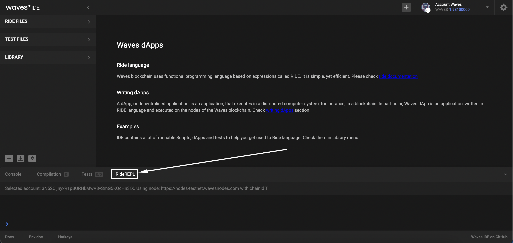
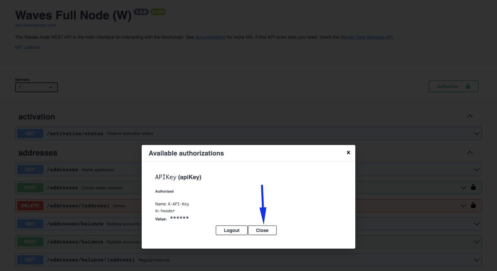

- [Node structure](#node-structure)
- [Prerequisites](#prerequisites)
- [Installation](#installation)
- [Configuration](#configuration)
  - [Node configuration file description](#node-configuration-file-description)
  - [Modules in the configuration file](#modules-in-the-configuration-file)
  - [API key of your node](#api-key-of-your-node)
  - [Configuration file setup](#configuration-file-setup)
- [Synchronization](#synchronization)
  - [Synchronization process description](#synchronization-process-description)
  - [Blockchain synchronization](#blockchain-synchronization)
- [Update](#update)
  - [Necessity of upgrading your node](#necessity-of-upgrading-your-node)
  - [Fork of blockchain](#fork-of-blockchain)
  - [Node upgrade](#node-upgrade)
  
---

## Node structure ##

To clarify all of the node deployment steps, it is required to understand the structure of a node.  
Understanding the node structure will shed some light on major essences that a node interacts with.  

Under the bonnet, every node has:
- **<ins>Blockchain database</ins>**:  
    All the nodes of the Waves blockchain are intended to ensure [decentralization]().  
    Therefore, an identical copy of all the blockchain data must be stored in every node.  
- **<ins>Configuration file</ins>**:  
    A configuration file is a set of instructions on how a node should work.  
    In the configuration file, we can define multiple parameters, for instance, which [network]() to connect to.


---

## Prerequisites ##

Before starting the installation, make sure your Waves account has a [generating balance]() at least 1000 WAVES.  
Also, it would be necessary to keep on hand a Base58 encoded string of the seed phrase of your account.  
Here is how you can encode a seed phrase to Base58:  
1. Open the [Waves IDE](https://waves-ide.com/);
2. Click "RideREPL" down the screen:  
      
3. Insert in the function your seed phrase:  
    `"your-seed-phrase".toBytes().toBase58String()`  
    For example:  
    `"surround fever above evil walk slam left thought credit pinch life follow arch work stock".toBytes().toBase58String()`
4. Copy the function with your seed phrase to the console:  
      
5. Click "Enter" to get a Base58 encoded string of your seed phrase:
    
6. Save this Base58 encoded string, as we will use it later for node installation.  

---
  
## Installation ##

Follow the steps below to install a Waves node:
1. Install [Docker](https://docs.docker.com/desktop/install/mac-install/) on macOS if it wasn't yet installed.
2. Pull the latest [docker image](https://hub.docker.com/r/wavesplatform/wavesnode) of the node:
    
    ```
    docker pull wavesplatform/wavesnode
    ```
3. Create folders to store the blockchain copy and a configuration file:  

    ```
    sudo mkdir -p /opt/waves-node/{data,conf}
    sudo chown -R $(whoami) /opt/waves-node/
    ```
    The first command will create 2 folders (data, conf) within `/opt/waves-node` directory.  
    After this, we give access to the current user logged in the system to write and read in these folders.  
4. Run a docker container:

    ```
     docker run -d \
     -v /opt/waves-node/data:/var/lib/waves \
     -v /opt/waves-node/conf:/etc/waves \
     --name waves-node \
     -p 6869:6869 \
     -e WAVES_WALLET_SEED="insert your account seed Base58 encoded that you saved earlier" \
     -e WAVES_WALLET_PASSWORD="type a password" \
     wavesplatform/wavesnode:latest
    ```

    Within this docker container, we:
    - Create [docker volumes](https://docs.docker.com/storage/volumes/) to "connect" the data we store locally on our host with the storage of the container.  
      Do it for both directories that store the blockchain data (`/opt/waves-node/data`) and the configuration file (`/opt/waves-node/conf`).  
      It will "link" the data from your host to the container's storage to `/var/lib/waves` for the blockchain data and `/etc/waves` for the configuration file.   
      In case your docker container gets accidentally deleted, your node configurations and the blockchain copy will not be lost.  
      You will be able to deploy a node once again with the stored locally data, so the progress will be resumed right from where it has been stopped.
    - [Map](https://docs.docker.com/config/containers/container-networking/) the container port to the localhost port.
    - Insert the [Base58 encoded string of the wallet seed](#prerequisites).
    - Type a password that would be stored locally on your host to protect the `wallet.dat` file.
5. To make sure everything is working properly, check logs of the running docker container:
    
    ```
    docker logs waves-node
    ```

    You will see multiple lines of logs.  
    Please, note it may take a few moments to deploy a node.  
    Once you see notifications about the height of the blockchain, it means everything is working properly:

    ```
    INFO [appender-25] c.w.s.BlockchainUpdaterImpl - New height: 100
    ```
    

All done! You have a working node deployed within your docker container!  
  
Also, it is possible to deploy a node on your custom blockchain.  
You can read more information about it in the [full documentation](https://docs.waves.tech/en/waves-node/private-waves-network).  
Please, note that mining the WAVES tokens that have value on the market is possible only on the MAINNET network.  
Within this lesson, we will be deploying our node on the MAINNET network only.  
   
In the next chapter, [node configuration](#configuration), we will learn how to set up a configuration file of your node.   

---

## Configuration ##

### Node configuration file description ###

As we previously mentioned in the [Node Structure]() chapter, every node has:
- A configuration file;
- The blockchain copy.
  
Within this lesson, we are going to work with the configuration file of the node.  
In the [next lesson](), we will talk about node synchronization with the Waves blockchain.  

A configuration file is a way of setting up instructions on how a node should work.  
  

### Modules in the configuration file ###

All the node modules are wrapped within the `Waves` configuration section.  
There we can define what modules we would like to configure.  
In the [sample configuration file](https://github.com/wavesplatform/Waves/blob/version-1.4.x/node/waves-sample.conf), we have 4 of them included (`wallet`, `blockchain`, `rest-api`, `network`):  

```
waves {
    wallet {
    }

    blockchain {
    }

    rest-api {
    }

    network {
    }
}
```

This list of modules in the given example is not full, you can find the full list of Waves node modules and their parameters in the [documentation](https://docs.waves.tech/en/waves-node/node-configuration#sections-of-the-configuration-file).  

For the sake of simplicity, we will concentrate on the same modules as the ones included in the [sample configuration file](https://github.com/wavesplatform/Waves/blob/version-1.4.x/node/waves-sample.conf):  
- **<ins>[Wallet](https://docs.waves.tech/en/waves-node/node-configuration#wallet-settings)</ins>**  
    Built-in node wallet parameters.  
    In the wallet module, you can configure the parameters of the [wallet built in the Waves node](https://docs.waves.tech/en/waves-node/how-to-work-with-node-wallet).  
    [Previously](), we defined the seed of the wallet Base58 encoded and set a password to encode the seed in `wallet.dat` file:
    
    ```
    waves {
        wallet{
            password = "RandomPassword_"
            seed = "K6XzUChB6DwTYCM1WxtVrv1BM6jTdcaBJrn6vkB3cK7qXCnqLV"
        }
    }
    ```

    Wallet parameters:  
    | Name | Description | Example |
    | :---- | :---- | :---- |
    | password | Random password a user sets. Encodes your seed Base58 string in the `wallet.dat` file. | RandomPassword_ |
    | seed | Connects your wallet to your node via the [wallet seed Base58 encoded]().<br><br>If you don’t have any existing wallet, comment out this parameter and start a node.<br>During the first run, the application will create a new wallet with a random seed for you.<br>In this case, the seed will be displayed in the application log.<br>If you miss it or if you don’t want to check the log files, it will also be available in [REST API]() using the `wallet/seed` method.|  K6XzUChB6DwTYCM1WxtVrv1BM6jTdcaBJrn6vkB3cK7qXCnqLV |

    Read more about [Wallet Settings](https://docs.waves.tech/en/waves-node/node-configuration#wallet-settings).
- **<ins>[Blockchain](https://docs.waves.tech/en/waves-node/node-configuration#blockchain-settings)</ins>**  
    Blockchain parameters.  
    In the blockchain module, you can select the blockchain type.  
    Since we are aimed at mining and receiving rewards for block generation, we will use the MAINNET type.  

    ```
    waves {
        blockchain {
            type = MAINNET
        }
    }
    ```

    Blockchain parameters:  
    | Name | Description | Example |
    | :---- | :---- | :---- |
    | type | Selects the blockchain type: [MAINNET, STAGENET, TESTNET]() or [CUSTOM](https://docs.waves.tech/en/waves-node/private-waves-network). | MAINNET | 

    Read more about [Blockchain Settings](https://docs.waves.tech/en/waves-node/node-configuration#blockchain-settings).
- **<ins>[REST API](https://docs.waves.tech/en/waves-node/node-configuration#rest-api-settings)</ins>**  
    Node API parameters.  
    The Waves node REST API is the main interface for blockchain interaction.  
    The API has both public (available for everyone) and private (available only via authorization) endpoints.  
    You may check the swagger REST API interface for the [MAINNET network](https://nodes.wavesnodes.com/) to get an idea of what it looks like.  

    Once this parameter is configured, you may get access to the REST API service of your personal node directly:  

    
    ```
    waves {
        rest-api {
            enable = yes
            bind-address = "0.0.0.0"
            port = 6869
            api-key-hash = "CvTpRm21PyZf15q1dD7bz46meYYtWQAgA1kQU1iqXKriv"
        }
    }
    ```

    REST API parameters:  
    | Name | Description | Example |
    | :---- | :---- | :---- |
    | enable | Activates REST API.<br>If you want to deactivate REST API, change the default value to no. | yes |
    | bind-address | Network address where the REST API accepts incoming connections.<br>Please, use 0.0.0.0 address when deploying a node with Docker. <br>Use [Nginx’s proxy pass module](http://nginx.org/en/docs/http/ngx_http_proxy_module.html) or [SSH port forwarding](https://blog.trackets.com/2014/05/17/ssh-tunnel-local-and-remote-port-forwarding-explained-with-examples.html) for external access. | 127.0.0.1 |
    | port | Port number where the REST API accepts incoming connections. | 6869 |
    | api-key-hash | Hash of the API key to access private endpoints.<br>Please, check the chapter [API Key Of Your Node](#api-key-of-your-node) to generate the API Key. | CvTpRm21PyZf15q1dD7bz46meYYtWQAgA1kQU1iqXKriv |

    Read more about [REST API Settings](https://docs.waves.tech/en/waves-node/node-configuration#rest-api-settings).
- **<ins>[Network](https://docs.waves.tech/en/waves-node/node-configuration#network-settings)</ins>**  
    Peer-to-peer network parameters.  
    This module allows you to define how your node would interact with other nodes within the network:

    ```
    waves {
        network {
            node-name = "waves-node"
            bind-address = "0.0.0.0"
            port = 6868
        }
    }
    ```

    Network parameters:  
    | Name | Description | Example |
    | :---- | :---- | :---- |
    | node-name | Sets the name of your node visible to other participants of the P2P network.<br>The name is transmitted during the initial handshake. | waves-node | 
    | bind-address | Sets the IP address of the local network interface on which Waves Node will accept incoming connections.<br>By default, node binds to 0.0.0.0 that means that it will listen on all available network adapters. | 0.0.0.0 | 
    | port | Sets the network port number to which other Waves nodes will connect.<br>Check that the port is reachable from outside, otherwise, your node will connect to the P2P network using only outgoing connections.<br>If this port is used by other applications, your node won’t start.<br>For example:<br>-6868 for Mainnet<br>-6863 for Testnet<br>-6862 for Stagenet| 6868 | 

     Read more about [Network Settings](https://docs.waves.tech/en/waves-node/node-configuration#network-settings).

### API key of your node ###

After the REST API module is configured and node deployed, you will be able to access the Swagger interface for blockchain interaction.  
There you can access different methods that will allow you:
- Read the blockchain data:
    - `Account data`  
        (balances, data storage entries, aliases, scripts assigned)
    - `Token data`  
        (parameters, distribution by accounts)
    - `Active leases`
    - `Blocks`
    - `Transactions`
    - `Etc`
- Operate with transactions: 
    - `Broadcast signed transactions`
    - `Validate transactions`
    - `Check the status of transactions`
- Use utilities:
    -  `Generate an address from a public key`
    -  `Generate a random seed`
    -  `Calculate hashes` 
    -  `Etc`

These methods can be:
- **<ins>Public</ins>**:  
    Methods available to everyone. Public methods do not:
    - Operate with any private data of the node owner;
    - Invoke any methods that would make an action with any node, like stopping a node or connecting to a peer.  
  
    For example, [`/blocks/height`](https://nodes.wavesnodes.com/api-docs/index.html#/blocks/getHeight) is a method that checks the current height of the blockchain.  
    This information is not private and there is no action made with a node, therefore it doesn't require any additional authorization. 
- **<ins>Private</ins>**:  
    Methods available only to node owners.  
    These methods can be invoked only by node owners via API key and API key hash authorization.  
    For example, [`/debug/configInfo`](https://nodes.wavesnodes.com/api-docs/index.html#/debug/getConfig) is a method that checks the configuration of the currently running node.

The chapter goal is to get this API key and API key hash to be able to operate with the private methods of your node.  
Here is how you can do it:
1. Open [`/utils/hash/secure`](https://nodes.wavesnodes.com/api-docs/index.html#/utils/hashSecure) in the Swagger REST API node interface.
2. Click "Try it out":  
    
      
3. Enter any random string value and click "Execute":
      
    Please, do not use the example in the screenshot, as it is given for demonstration purposes only.
4. In the response section below, you will receive a hash:
      
5. Save both the original phrase you entered (API key) and the hash (API key hash) of it as we will use them for interaction with private node methods in this lesson.

### Configuration file setup ###
Follow the instructions below for setting up configurations:

1. Once a node has been deployed, a configuration file gets automatically created.  
   Run the command below to start editing the configuration file:
   
   ```
   sudo nano /opt/waves-node/conf/waves.conf
   ```
2.  Edit the configuration file.  
    [In the previous lesson](), we deployed a docker container with the Base58 encoded seed and the password as environment variables.  
    It looked something like this but with your own seed and password: 
    
    ```
    -e WAVES_WALLET_SEED="K6XzUChB6DwTYCM1WxtVrv1BM6jTdcaBJrn6vkB3cK7qXCnqLV" \
    -e WAVES_WALLET_PASSWORD="RandomPassword_"
    ```
    
    As of now, we will write these details in the configuration file within the `waves.wallet` module.  
    Make sure to add `wallet`, `blockchain`, `rest-api`, and `network` modules to the file.    

    Please, note `rest-api.api-key-hash` parameter doesn't necessarily have to match with the example below.  
    In the chapter [API Key Of Your Node](#api-key-of-your-node), instruction on how to generate the API key hash was given.  
    Insert the API key hash in the `rest-api.api-key-hash` parameter.
      
    After the edit, the `waves.conf` file can look something like this:  

    ```
    waves {
        wallet {
            password = "RandomPassword_"
            seed = "K6XzUChB6DwTYCM1WxtVrv1BM6jTdcaBJrn6vkB3cK7qXCnqLV"
        }

        blockchain {
            type = MAINNET
        }

        rest-api {
            enable = yes
            bind-address = "0.0.0.0"
            port = 6869
            api-key-hash = "CvTpRm21PyZf15q1dD7bz46meYYtWQAgA1kQU1iqXKriv"
        }

        network {
            node-name = "waves-node"
            bind-address = "0.0.0.0"
            port = 6868
        }
    }
    ```
3. Save the file and deploy a node once again by restarting a container:
    
    ```
    docker container restart waves-node
    ```
    Please, wait a few moments for the node to restart.  
4. Check the [REST API interface](http://localhost:6869/api-docs/index.html) of your deployed node.  
    There you would be able to see multiple methods to interact with your node.  
    For instance, you can try a:
    - [Public method](http://127.0.0.1:6869/api-docs/index.html#/addresses):  
        All public methods don't require any additional authorization.  
        For example, the `/addresses/` method, will return the address of your node wallet.  
         
    - [Private method](http://127.0.0.1:6869/api-docs/index.html#/debug/getConfig):  
        All private methods require authorization with an API key and API key hash.    
        Kindly note that the API key hash that you inserted in the configuration file is not equal to the API key.  
        The API key hash is the random string you typed in the [`/utils/hash/secure`](https://nodes.wavesnodes.com/api-docs/index.html#/utils/hashSecure) method.  
        In case you do not remember what API key and API key hash are, please, check [API Key Of Your Node](#api-key-of-your-node).  
          
        To authorize private method usage:
        1. Click "Authorize":
            
        2. Enter your API key (not the API hash) and click "Authorize":
            
            Please, note the API key on the screen is an example.  
            You need to use your own API key.
        3. Click "Close":
            
        4. Now you can use private methods of your node.  
            For example, the [`/configInfo`](http://127.0.0.1:6869/api-docs/index.html#/debug/getConfig) method will return configurations of the currently running node.
               
      
    Read more about [Node REST API](https://docs.waves.tech/en/waves-node/node-api/).     

In the next lesson, [Blockchain Synchronization](), we will move to the final step of preparations for mining.  

---

## Synchronization ##

### Synchronization process description ###

Before we begin blockchain synchronization, it is necessary to understand how blockchain gets formed.  
Let's recap what we discussed in the lesson, [Waves Blockchain Description]().  
The smallest blockchain component is a transaction that may include various data (account address, sum, operation type, etc).  
All transactions are wrapped in blocks, where each block has a maximum capacity of how many transactions it may include.  
The chain of blocks is called a blockchain.  

Every node in the [Waves network]() stores the blockchain data copy, creating data decentralization.  
The major element of decentralization within the blockchain is data security.  
What it means is that all the nodes represent witnesses that:
- Watch over the data integrity so that it will not be compromised;
- No invalid transaction is saved into the blockchain.
    
The process of data validation is uninterrupted.  
There are two most significant validation processes:
- **<ins>Validation of blocks</ins>**  
  It is a single-threaded process.  
  Therefore if you have a high-frequency CPU, it will provide much better performance.  
  This process is not linear and takes as much time as blocks require.  
  The heavier a block is, the longer it takes to verify it.  
  The first 200,000 blocks are empty so they get verified much faster.  
- **<ins>Validation of signatures</ins>**  
  Unlike the block validation process, signature validation is multi-threaded.  
  Therefore it is not dependent on the CPU frequency.  

This way, every node verifies all transactions and blocks whether they are valid.  
If the data passed the validation, it will be included in the blockchain.  
In case the data is not valid, the data will be discarded.  

If the operating system does not have enough physical memory, it may lead to delays in the work of the system.   
Waves team recommends using [SSD](https://en.wikipedia.org/wiki/Solid-state_drive) and keeping at least 30% of the total memory for the needs of the operating system (cache/buffers).  
  
There are two ways how it is possible to synchronize the blockchain data with your node:
1. **<ins>Wait for the automatic synchronization</ins>**:  
    After the node deployment, you may wait until the synchronization is done automatically.  
    Without any additional actions, your node will be uploading and validating all the data on its own.  
    However, this process takes a significant amount of time for days.
2. **<ins>Upload the current blockchain data to your node<ins>**:  
    It is possible to greatly speed up the synchronization by uploading the latest blockchain data.  
    In this case, you will skip transaction execution (validation of signatures, balances, etc).  

In case you don't want to speed up the synchronization, you may wait before it is done automatically.  
If so, you can skip all the instructions below and continue with the next chapter, [Nodes Of The Network]().

However, if you wish to speed up this process, within this lesson we will concentrate on the blockchain data upload.  

### Blockchain synchronization ###

Follow the steps below to synchronize the current blockchain with your node:  
1. Remove all the data within the directory that contains the blockchain data of the node:
  
    ```
    sudo rm -rf /opt/waves-node/data/*
    ```
2. Download the [latest archive](http://blockchain.wavesnodes.com/blockchain_last.tar) with the blockchain data to the `/opt/waves-node/data` directory.  
    Please, note that the archive size is approximately 70 GB.
3. Download the [sha1sum file](http://blockchain.wavesnodes.com/blockchain_last.tar.SHA1SUM) to the `/opt/waves-node/data` directory.  
    This file is intended for testing the blockchain archive checksum hash. 
4. Install the sha1sum utility:
    
    ```
    brew install md5sha1sum
    ```
5. Run the sha1sum utility to compare the checksum of the `blockchain_last.tar` and `blockchain_last.tar.SHA1SUM` files.  
    Firstly, run the command with the `blockchain_last.tar` file in the `/opt/waves-node/data` directory:  

    ```
    sha1sum blockchain_last.tar
    ```
    The output can look like this:
    
    ```
    3c044f284026b40761638e915147c9fa6e5ff156  blockchain_last.tar
    ```
    
    After this, read the content of the `blockchain_last.tar.SHA1SUM` file:  

    ```
    cat blockchain_last.tar.SHA1SUM 
    ```

    The oupoot can look like this:

    ```
    3c044f284026b40761638e915147c9fa6e5ff156  /opt/blockchain/blockchain_last.tar
    ```
    
    The hash of the `blockchain_last.tar` file has to match with the content inside of the `blockchain_last.tar.SHA1SUM` file.  
    In our example, we receive the hash `3c044f284026b40761638e915147c9fa6e5ff156` after running both commands.
6. Restart the node:

    ```
    docker container restart waves-node
    ```
7. Check the logs of the running container:  
  
    ```
    docker logs waves-node
    ```
    You will see the height of the blockchain increasing rapidly:  
    
    ```
    INFO [appender-25] c.w.s.BlockchainUpdaterImpl - New height: 100
    ```
    Please, note that the complete synchronization may take up to 1-3 days and depends on your CPU frequency. 

After syncrhonization is completed, your node will be ready for mining!  
If your node generates a block, you will get a reward for block generation right to your node wallet.
  
Please, note that once you have a synchronized node, you can export the node's blockchain to a binary file.  
It will allow you to deploy one more node on your host.  
For more details, read [Export Blockchain to Binary File](https://docs.waves.tech/en/waves-node/options-for-getting-actual-blockchain/import-from-the-blockchain#export-blockchain-to-binary-file).    

---

## Update ##

### Necessity of upgrading your node ###

The blockchain world constantly evolves, pushing all its participants to continuous development.  
The Waves blockchain is among leaders that persistently work on technological advancement.  
Due to this, the Waves team publishes updates of the blockchain that all the nodes are required to install.    
These updates expand nodes functionality, offer new transaction types, can fix bugs, etc. 
  
There are two types of updates:
- **<u>The ones that can be implemented right away</u>**   
    Usually, it is minor bug fixes or slight changes.  
    Once you update your node with them, the new functionality will become available for you right away.  
    In case you don't update your node with such a release, it will not case a [fork](#fork-of-blockchain).
- **<u>The ones that take time to be implemented</u>**.  
    It is large updates that may include consensus changes or any other significant changes.  
    On the node releases page, node owners are warned about the upcoming switch to the new changes.  
    For example, an update may be published at the 1st of September, but in the comments of the release it is mentioned:  
    
    ```
    This is a mandatory release. 
    Mainnet nodes need to be updated before feature #​17 is activated.
    The activation will happen at height 3250000 (approx. on Sep 10 2022 05:37 UTC)."
    ```
    Therefore, node owners receive a time frame within which it is necessary to update the node.  
    In case a noder owner skips such an update after the new feature is activated, it may cause [forks](#fork-of-blockchain). 

You can subscribe to the [github releases page](https://github.com/wavesplatform/Waves/releases/) to be always aware of all published updates.  
It is recommended to install all updates without postponing to always keep your node functioning properly.   

### Fork of blockchain ###

Fork is the moment when the blockchain is split by two different chains.  
Within the Waves blockchain, fork formation is possible if the Waves team publishes a node update, but not all nodes decide to switch to the update.
    
This idea can be simplified with an instance in the fictional world.  
Let's imagine we have 5 nodes in our fictional blockchain.  
All 5 nodes have the same very node version 1.0, working identically.  
One moment, we, as blockchain creators and developers, decide to upgrade the blockchain and add some features to it.  
We publish the update of the node version, 1.1, and require all the node owners to update their nodes.   
Out of all 5 nodes, only 3 node owners upgraded their nodes with the update.  
The other 2 nodes remained with the older node version.  
After this, the blockchain has split into two different chains:  
3 nodes remained with the original blockchain, installing all necessary updates, meanwhile 2 other nodes switcheds to the fork.  
  
  
Eventually, the 2 nodes that weren not updated, may stop working.  
This is the very reason why it is important to timely update your node.  
  
To avoid forks, be subscribed to the [Waves blockchain releases page](https://github.com/wavesplatform/Waves/releases/) and timely install updates.  
In the chapter below, [Node Upgrade](), we will run through all the steps of updating your node.  
In case you didn't update your node in time, in the chapter, [Node Rollback](), we will discuss steps of how to roll back your node to the working state.


### Node upgrade ###

Approximately every two-four weeks the Waves team publishes updates to the [wavesplatform git repository](https://github.com/wavesplatform/Waves/releases/).  
The Waves team strongly recommends to subscribe to the repository page to be aware of all releases.  
There you may see the: 
- **<ins>Version of the update and its network</ins>**:  
    It is a consecutive number of the node version and the network it concerns.   
    For example: 1.4.8 (Mainnet + Testnet + Stagenet).  
    Please, note keep in mind that we deploy our node in the Mainnet network in this lesson.  
    Therefore it is necessary to pay attention only to the updates that concern the Mainnet network.  
    However, if you deployed or plan to deploy a node in other networks, pay attention to the respective updates.
- **<ins>Update description</ins>**:  
    Update description gives details what exactly has been implemented within this relase.
- **<ins>Update notes</ins>**:  
    Update notes inform a node owner whether he needs to re-import the blockchain data and synchronize it once again.
  
  
  
Once you receive a notifcation of a new node version release, follow the steps below to upgrade your node:  
1. Pull the latest Docker image:

    ```
    docker pull wavesplatform/wavesnode
    ```
2. Stop the currently running node container:

    ```
    docker stop waves-node
    ```
3. Remove the "old "node container:

    ```
    docker rm waves-node
    ```
4. On the [page with the latest release](https://github.com/wavesplatform/Waves/releases/), take a look at the "Update notes" section.  
    There you will be able to see whether your node needs to re-import the blockchain data once again.  
      
    If the blockchain re-import is not needed, it will be enough to start a new container with the freshly downloaded image:  
      
      
    If there is a re-import requirement note, make sure to re-import the blockchain database.  
    It would be necessary to:
    -  Repeat the same steps of node syncrhonization as in the chapter [Synchronization]().
    -  After the node is synchronized, run a new docker container to start a node, as it is mentioned in the step №5. 
    
        
5. Start your node once again:    
   
   ```
    docker run -d \
    -v /opt/waves-node/data:/var/lib/waves \
    -v /opt/waves-node/conf:/etc/waves \
    --name waves-node \
    -p 6869:6869 \
    -e WAVES_WALLET_SEED="insert your account seed Base58 encoded that you saved earlier" \
    -e WAVES_WALLET_PASSWORD="insert the password that you typed earlier" \
    wavesplatform/wavesnode:latest
   ```
6. Check the logs of the running node container.  

    ```
    docker logs waves-node
    ```
    It may take a few moments before the node is running.   
    Messages regarding increasing blockchain height mean that everything is completed succesfully:  
    
    ```
    INFO [appender-25] c.w.s.BlockchainUpdaterImpl - New height: 10000
    ```
