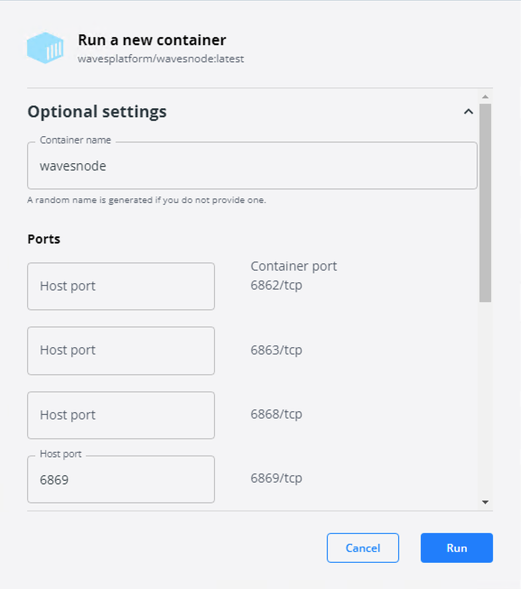
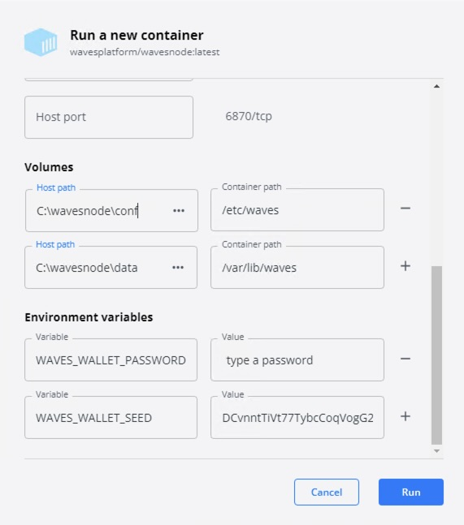

##### Necessity Of Upgrading Your Node #####

The blockchain world constantly evolves, pushing all its participants to continuous development.  
The Waves blockchain is among leaders that persistently work on technological advancement.  
Due to this, the Waves team publishes updates of the blockchain that all the nodes are required to install.  
These updates expand nodes functionality, offer new transaction types, etc. 
  
You can subscribe to the [github releases page](https://github.com/wavesplatform/Waves/releases/) to be always aware of all published updates.  
In case a noder owner skips the update, it may cause [forks](#fork-of-blockchain).  

---

##### Fork Of Blockchain #####

Fork is the moment when the blockchain is split by two different chains.  
Within the Waves blockchain, fork formation is possible if the Waves team publishes a node update, but not all nodes decide to switch to the update.
    
This idea can be simplified with an instance in the fictional world.  
Let's imagine we have 5 nodes in our fictional blockchain.  
All 5 nodes have the same very node version 1.0, working identically.  
One moment, we, as blockchain creators and developers, decide to upgrade the blockchain and add some features to it.  
We publish the update of the node version, 1.1, and require all the node owners to update their nodes.   
Out of all 5 nodes, only 3 node owners upgraded their nodes with the update.  
The other 2 nodes remained with the older node version.  
After this, the blockchain has split into two different chains:  
3 nodes remained with the original blockchain, installing all necessary updates, meanwhile 2 other nodes switcheds to the fork.  
  
  
Eventually, the 2 nodes that weren not updated, may stop working.  
This is the very reason why it is important to timely update your node.  
  
To avoid forks, be subscribed to the [Waves blockchain releases page](https://github.com/wavesplatform/Waves/releases/) and timely install updates.  
In the chapter below, [Node Upgrade](), we will run through all the steps of updating your node.  
In case you didn't update your node in time, in the chapter, [Node Rollback](), we will discuss steps of how to roll back your node to the working state.


## MacOS ##

##### Docker Node Upgrade #####

Approximately every two-four weeks the Waves team publishes updates to the [wavesplatform git repository](https://github.com/wavesplatform/Waves/releases/).  
The Waves team strongly recommends to subscribe to the repository page to be aware of all releases.  
There you may see the: 
- **<ins>Version of the update</ins>**:  
    It is a consecutive number of the node version.  
    For example: 1.4.8
- **<ins>Update description</ins>**:  
    Update description gives details what exactly has been implemented within this relase.
- **<ins>Update notes</ins>**:  
    Update notes inform a node owner whether he needs to re-import the blockchain data and synchronize it once again.
  
  
  
Once you receive a notifcation of a new node version release, follow the steps below to upgrade your node:  
1. Pull the latest Docker image:

    ```
    docker pull wavesplatform/wavesnode
    ```
2. Stop the currently running node container:

    ```
    docker stop waves-node
    ```
3. Remove the "old "node container:

    ```
    docker rm waves-node
    ```
4. On the [page with the latest release](https://github.com/wavesplatform/Waves/releases/), take a look at the "Update notes" section.  
    There you will be able to see whether your node needs to re-import the blockchain data once again.  
      
    If the blockchain re-import is not needed, it will be enough to start a new container with the freshly downloaded image:  
      
      
    If there is a re-import requirement note, make sure to re-import the blockchain database.  
    It would be necessary to:
    -  Repeat the same steps of node syncrhonization as in the chapter [Synchronization]().
    -  After the node is synchronized, run a new docker container to start a node, as it is mentioned in the step №5. 
    
        
5. Start your node once again:    
   
   ```
    docker run -d \
    -v /opt/waves-node/data:/var/lib/waves \
    -v /opt/waves-node/conf:/etc/waves \
    --name waves-node \
    -p 6869:6869 \
    -e WAVES_WALLET_SEED="insert your account seed Base58 encoded that you saved earlier" \
    -e WAVES_WALLET_PASSWORD="insert the password that you typed earlier" \
    wavesplatform/wavesnode:latest
   ```
6. Check the logs of the running node container.  

    ```
    docker logs waves-node
    ```
    It may take a few moments before the node is running.   
    Messages regarding increasing blockchain height mean that everything is completed succesfully:  
    
    ```
    INFO [appender-25] c.w.s.BlockchainUpdaterImpl - New height: 10000
    ```


##### Waves Package Node Upgrade #####

Approximately every two-four weeks the Waves team publishes updates to the [wavesplatform git repository](https://github.com/wavesplatform/Waves/releases/).  
The Waves team strongly recommends to subscribe to the repository page to be aware of all releases.  
There you may see the: 
- **<ins>Version of the update</ins>**:  
    It is a consecutive number of the node version.  
    For example: 1.4.8
- **<ins>Update description</ins>**:  
    Update description gives details what exactly has been implemented within this relase.
- **<ins>Update notes</ins>**:  
    Update notes inform a node owner whether he needs to re-import the blockchain data and synchronize it once again.
  
  
  
Once you receive a notifcation of a new node version release, follow the steps below to upgrade your node:
1. Get to the directory with the `waves-all-<version number>.jar` file:

    ```
    sudo cd /opt/waves-node
    ```
2. Check the current node version number.  
    The version number is given in the name of the jar file.  
    For example, for `waves-all-1.4.7.jar` file, the version would be 1.4.7.
3. Check the version node number of the latest blockchain update release:  
    The version number will be specified in the name of the release.  
    
4. Take a look at the "Update notes" section.  
    There you will be able to see whether your node needs to re-import the blockchain data once again.  
      
    If the blockchain re-import is not needed, it will be enough to replace the old jar file with a new one:  
      
      
    If there is a re-import requirement note, make sure to re-import the blockchain database.  
    It would be necessary to:
    -  Repeat the same steps of node syncrhonization as in the chapter [Synchronization]().
    -  After the node is synchronized, download the new jar file, as it is mentioned in the step №5.  
    
      
      
5. Replace the old jar file with a new one.  
    Delete the old `waves-all-<version number>.jar` file:  
    
    ```
    sudo rm /opt/waves-node/waves-all*.jar
    ```
    Download the latest jar file to the `/opt/waves-node` folder.  
    The file will be available for downloading under the "Assets" section:     
        
    Please, note that the version number on the screen is an example.  
    At the moment of your upgrade, there may be a newer version available.
6. Restart the node.    
    Replace {*} with the actual file name:  
    
    ```
    java -jar {*}.jar ./conf/{*}.conf
    ```
    For example:

    ```
    java -jar waves-all-1.4.8.jar ./conf/waves-sample.conf
    ```
7. Check the logs of the running node app.  
    It may take a few moments before the node is running.  
    Messages regarding increasing blockchain height mean that everything is completed succesfully:  

    ```
    INFO [appender-25] c.w.s.BlockchainUpdaterImpl - New height: 10000
    ```


## Ubuntu ##

##### Docker Node Upgrade #####

Approximately every two-four weeks the Waves team publishes updates to the [wavesplatform git repository](https://github.com/wavesplatform/Waves/releases/).  
The Waves team strongly recommends to subscribe to the repository page to be aware of all releases.  
There you may see the: 
- **<ins>Version of the update</ins>**:  
    It is a consecutive number of the node version.  
    For example: 1.4.8
- **<ins>Update description</ins>**:  
    Update description gives details what exactly has been implemented within this relase.
- **<ins>Update notes</ins>**:  
    Update notes inform a node owner whether he needs to re-import the blockchain data and synchronize it once again.
  
  
  
Once you receive a notifcation of a new node version release, follow the steps below to upgrade your node:  
1. Pull the latest Docker image:

    ```
    docker pull wavesplatform/wavesnode
    ```
2. Stop the currently running node container:

    ```
    docker stop waves-node
    ```
3. Remove the "old "node container:

    ```
    docker rm waves-node
    ```
4. On the [page with the latest release](https://github.com/wavesplatform/Waves/releases/), take a look at the "Update notes" section.  
    There you will be able to see whether your node needs to re-import the blockchain data once again.  
      
    If the blockchain re-import is not needed, it will be enough to start a new container with the freshly downloaded image:  
      
      
    If there is a re-import requirement note, make sure to re-import the blockchain database.  
    It would be necessary to:
    -  Repeat the same steps of node syncrhonization as in the chapter [Synchronization]().
    -  After the node is synchronized, run a new docker container to start a node, as it is mentioned in the step №5. 
    
        
5. Start your node once again:    
   
   ```
    docker run -d \
    -v /opt/waves-node/data:/var/lib/waves \
    -v /opt/waves-node/conf:/etc/waves \
    --name waves-node \
    -p 6869:6869 \
    -e WAVES_WALLET_SEED="insert your account seed Base58 encoded that you saved earlier" \
    -e WAVES_WALLET_PASSWORD="insert the password that you typed earlier" \
    wavesplatform/wavesnode:latest
   ```
6. Check the logs of the running node container.  

    ```
    docker logs waves-node
    ```
    It may take a few moments before the node is running.   
    Messages regarding increasing blockchain height mean that everything is completed succesfully:  
    
    ```
    INFO [appender-25] c.w.s.BlockchainUpdaterImpl - New height: 10000
    ```


##### Waves Package Node Upgrade #####

Approximately every two-four weeks the Waves team publishes updates to the [wavesplatform git repository](https://github.com/wavesplatform/Waves/releases/).  
The Waves team strongly recommends to subscribe to the repository page to be aware of all releases.  
There you may see the: 
- **<ins>Version of the update</ins>**:  
    It is a consecutive number of the node version.  
    For example: 1.4.8
- **<ins>Update description</ins>**:  
    Update description gives details what exactly has been implemented within this relase.
- **<ins>Update notes</ins>**:  
    Update notes inform a node owner whether he needs to re-import the blockchain data and synchronize it once again.
  
  
  
Once you receive a notifcation of a new node version release, follow the steps below to upgrade your node:
1. Get to the directory with the `waves-all-<version number>.jar` file:

    ```
    sudo cd /opt/waves-node
    ```
2. Check the current node version number.  
    The version number is given in the name of the jar file.  
    For example, for `waves-all-1.4.7.jar` file, the version would be 1.4.7.
3. Check the version node number of the latest blockchain update release:  
    The version number will be specified in the name of the release.  
    
4. Take a look at the "Update notes" section.  
    There you will be able to see whether your node needs to re-import the blockchain data once again.  
      
    If the blockchain re-import is not needed, it will be enough to replace the old jar file with a new one:  
      
      
    If there is a re-import requirement note, make sure to re-import the blockchain database.  
    It would be necessary to:
    -  Repeat the same steps of node syncrhonization as in the chapter [Synchronization]().
    -  After the node is synchronized, download the new jar file, as it is mentioned in the step №5.  
    
           
5. Replace the old jar file with a new one.  
    Delete the old `waves-all-<version number>.jar` file:  
    
    ```
    sudo rm /opt/waves-node/waves-all*.jar
    ```
    Download the latest jar file to the `/opt/waves-node` folder.  
    The file will be available for downloading under the "Assets" section:     
        
    Please, note that the version number on the screen is an example.  
    At the moment of your upgrade, there may be a newer version available.
6. Restart the node.    
    Replace {*} with the actual file name:  
    
    ```
    java -jar {*}.jar ./conf/{*}.conf
    ```
    For example:

    ```
    java -jar waves-all-1.4.8.jar ./conf/waves-sample.conf
    ```
7. Check the logs of the running node app.  
    It may take a few moments before the node is running.  
    Messages regarding increasing blockchain height mean that everything is completed succesfully:  

    ```
    INFO [appender-25] c.w.s.BlockchainUpdaterImpl - New height: 10000
    ```

##### Deb Package Node Upgrade #####

Approximately every two-four weeks the Waves team publishes updates to the [wavesplatform git repository](https://github.com/wavesplatform/Waves/releases/).  
The Waves team strongly recommends to subscribe to the repository page to be aware of all releases.  
There you may see the: 
- **<ins>Version of the update</ins>**:  
    It is a consecutive number of the node version.  
    For example: 1.4.8
- **<ins>Update description</ins>**:  
    Update description gives details what exactly has been implemented within this relase.
- **<ins>Update notes</ins>**:  
    Update notes inform a node owner whether he needs to re-import the blockchain data and synchronize it once again.
  
  
  
Once you receive a notifcation of a new node version release, follow the steps below to upgrade your node:
1. Stop the node:

    ```
    sudo systemctl stop waves
    ```
2. Check the current node version number:  

    ```
    dpkg -l waves
    ```  
   In the outpit, you will see the colum "Version" with the the version.
   For example:

   ```
   Version
   =======
   1.4.7
   ```
3. Check the version node number of the latest blockchain update release:  
    The version number will be specified in the name of the release.  
    
4. Take a look at the "Update notes" section.  
    There you will be able to see whether your node needs to re-import the blockchain data once again.  
      
    If the blockchain re-import is not needed, it will be enough to replace the old jar file with a new one:  
      
      
    If there is a re-import requirement note, make sure to re-import the blockchain database.  
    It would be necessary to:
    -  Repeat the same steps of node syncrhonization as in the chapter [Synchronization]().
    -  After the node is synchronized, install the deb package update, as it is mentioned in the step №5.  
    
           
5. Update the deb package.   
    Replace `X.Y.Z.` with the latest update version number you encountered in the step №3:  

    ```
    sudo dpkg -i waves_X.Y.Z_all.deb
    ```
    
    For examaple:  

    ```
    sudo dpkg -i waves_1.4.8_all.deb
    ```
6. Start the update node again:  

    ```
    sudo systemctl start waves
    ```
7. Check the logs of the running node app.  

    ```
    journalctl -u waves.service -f
    ```
    It may take a few moments before the node is running.  
    Messages regarding increasing blockchain height mean that everything is completed succesfully:  

    ```
    INFO [appender-25] c.w.s.BlockchainUpdaterImpl - New height: 10000
    ```


## Windows ##

##### Docker Node Upgrade #####

Approximately every two-four weeks the Waves team publishes updates to the [wavesplatform git repository](https://github.com/wavesplatform/Waves/releases/).  
The Waves team strongly recommends to subscribe to the repository page to be aware of all releases.  
There you may see the: 
- **<ins>Version of the update</ins>**:  
    It is a consecutive number of the node version.  
    For example: 1.4.8
- **<ins>Update description</ins>**:  
    Update description gives details what exactly has been implemented within this relase.
- **<ins>Update notes</ins>**:  
    Update notes inform a node owner whether he needs to re-import the blockchain data and synchronize it once again.
  
  
  
Once you receive a notifcation of a new node version release, follow the steps below to upgrade your node:  
1. Pull the latest Docker image:

    ```
    docker pull wavesplatform/wavesnode
    ```
2. Stop the currently running node container:  
    
3. Remove the "old "node container:  
    
4. On the [page with the latest release](https://github.com/wavesplatform/Waves/releases/), take a look at the "Update notes" section.  
    There you will be able to see whether your node needs to re-import the blockchain data once again.  
      
    If the blockchain re-import is not needed, it will be enough to start a new container with the freshly downloaded image:  
      
      
    If there is a re-import requirement note, make sure to re-import the blockchain database.  
    It would be necessary to:
    -  Repeat the same steps of node syncrhonization as in the chapter [Synchronization]().
    -  After the node is synchronized, run a new docker container to start a node, as it is mentioned in the step №5. 
    
        
5. Start your node once again:    
    | |
6. Check the logs of the running node container.  
    Click on the container name:  
      
    It may take a few moments before the node is running.   
    Messages regarding increasing blockchain height mean that everything is completed succesfully:  
    
  

##### Waves Package Node Upgrade #####

Approximately every two-four weeks the Waves team publishes updates to the [wavesplatform git repository](https://github.com/wavesplatform/Waves/releases/).  
The Waves team strongly recommends to subscribe to the repository page to be aware of all releases.  
There you may see the: 
- **<ins>Version of the update</ins>**:  
    It is a consecutive number of the node version.  
    For example: 1.4.8
- **<ins>Update description</ins>**:  
    Update description gives details what exactly has been implemented within this relase.
- **<ins>Update notes</ins>**:  
    Update notes inform a node owner whether he needs to re-import the blockchain data and synchronize it once again.
  
  
  
Once you receive a notifcation of a new node version release, follow the steps below to upgrade your node:
1. Get to the directory `C:\wavesnode` with the `waves-all-<version number>.jar` file.
2. Check the current node version number.  
    The version number is given in the name of the jar file.  
    For example, for `waves-all-1.4.7.jar` file, the version would be 1.4.7.
3. Check the version node number of the latest blockchain update release:  
    The version number will be specified in the name of the release.  
    
4. Take a look at the "Update notes" section.  
    There you will be able to see whether your node needs to re-import the blockchain data once again.  
      
    If the blockchain re-import is not needed, it will be enough to replace the old jar file with a new one:  
      
      
    If there is a re-import requirement note, make sure to re-import the blockchain database.  
    It would be necessary to:
    -  Repeat the same steps of node syncrhonization as in the chapter [Synchronization]().
    -  After the node is synchronized, download the new jar file, as it is mentioned in the step №5.  
    
           
5. Replace the old jar file with a new one.  
    Delete the old `waves-all-<version number>.jar` file.    
    Download the latest jar file to the `C:\wavesnode` folder.  
    The file will be available for downloading under the "Assets" section:     
        
    Please, note that the version number on the screen is an example.  
    At the moment of your upgrade, there may be a newer version available.
6. Restart the node.    
    Replace {*} with the actual file name:  
    
    ```
    java -jar {*}.jar ./conf/{*}.conf
    ```
    For example:

    ```
    java -jar waves-all-1.4.8.jar ./conf/waves-sample.conf
    ```
7. Check the logs of the running node app.  
    It may take a few moments before the node is running.  
    Messages regarding increasing blockchain height mean that everything is completed succesfully:  

    ```
    INFO [appender-25] c.w.s.BlockchainUpdaterImpl - New height: 10000
    ```
