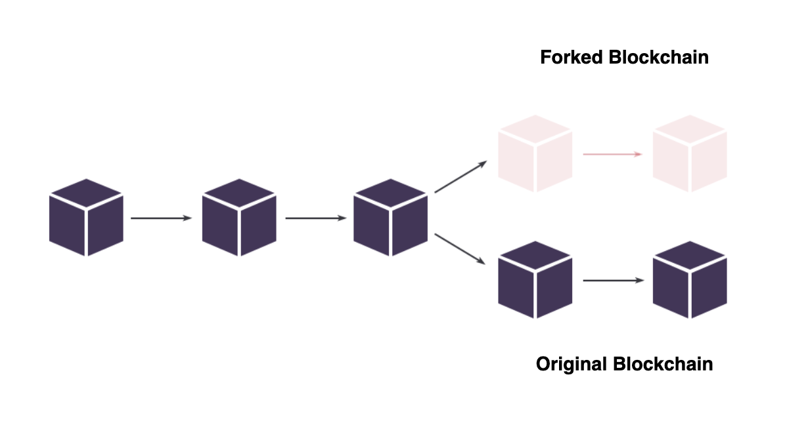

<!-- - [Blockchain Synchronization Process Description]()
- [Fork Of Blockchain]()
- [Blockchain Synchronization]()
  <!-- - [Ubuntu Synchronization]()
    - [Deb Package Synchronization]()
    - [Docker Synchronization]()
    - [Waves Package Synchronization]()
  - [MacOS Synchronization]()
    - [Docker Synchronization]()
    - [Waves Package Synchronization]()
  - [Windows Synchronization]()
    - [Docker Synchronization]()
    - [Waves Package Synchronization]() -->
<!-- - [Node Rollback]()
- [Export/Import]() -->

- [Blockchain Synchronization Process Description]()
- [MacOS](#macos)
  - [Docker Synchronization](#docker-synchronization)
  - [Waves Package Synchronization](#waves-package-synchronization)
- [Ubuntu](#ubuntu)
  - [Docker Synchronization](#docker-synchronization-1)
  - [Deb Package Synchronization](#deb-package-synchronization)
  - [Waves Package Synchronization](#waves-package-synchronization-1)
- [Windows](#windows)
  - [Docker Synchronization](#docker-synchronization-2)
  - [Waves Package Synchronization](#waves-package-synchronization-2)
- [Fork Of Blockchain](#fork-of-blockchain)
- [Node Rollback](#node-rollback)
  

## Node Upgrade ##

The blockchain world constantly evolves, pushing all its participants to continuous development.  
The Waves blockchain is among leaders that persistently work on technological advancement.  
Due to this, the Waves team publishes updates of the blockchain that all the nodes are required to install.  
These updates expand nodes functionality, offer new transaction types, etc. 
  

### MacOS ###

#### Docker ####

#### Deb ####

#### Waves Package ####

## Fork Of Blockchain ##

After our node is synchronized with the current blockchain state, we are ready to mine.  
To keep our node always ready to generate blocks, we need to timely upgrade the node to avoid forks.  
Within this chapter, we will talk discuss the fork definition and how it may affect nodes.  
In the chapter, [Node Upgrade](), we will learn why and how to upgrade your node.  
  
Fork is the moment when the blockchain is split by two different chains.  
Within the Waves blockchain, fork formation is possible if the Waves team publishes a node update, but not all nodes decide to switch to the update.
    
This idea can be simplified with an instance in the fictional world.  
Let's imagine we have 5 nodes in our fictional blockchain.  
All 5 nodes have the same very node version, working identically.  
However, at one point of time, we, as blockchain creators and developers, decide to upgrade the blockchain and add some features to it.  
Out of all 5 nodes, only 3 node owners upgraded their nodes with the update.  
The other 2 nodes remained with the older node version.  
After this, the blockchain has split into two different chains:  
3 nodes switched to the forked blockchain, meanwhile 2 other nodes remained with the original one.  
  
  

## Node Rollback ##

If 

Rollback your node to a specific height to remove all blocks after that given height.   
The rollback allows to discard a few blocks to quickly restore your node in case of fork detection without having to rebuild the whole blockchain database.