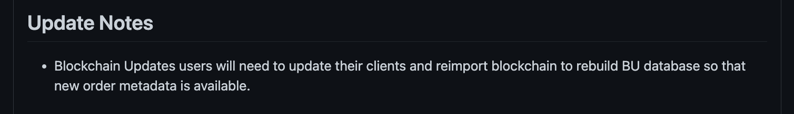

 - [Node Upgrade](#node-upgrade)
 - [Fork Of Blockchain](#fork-of-blockchain)
 - [Node Rollback](#node-rollback)
  


##### Necessity Of Upgrading Your Node #####

The blockchain world constantly evolves, pushing all its participants to continuous development.  
The Waves blockchain is among leaders that persistently work on technological advancement.  
Due to this, the Waves team publishes updates of the blockchain that all the nodes are required to install.  
These updates expand nodes functionality, offer new transaction types, etc. 
  
You can subscribe to the [github releases page](https://github.com/wavesplatform/Waves/releases/) to be always aware of all published updates.  
In case a noder owner skips the update, it may cause [forks](#fork-of-blockchain).  

---

##### Fork Of Blockchain #####

Fork is the moment when the blockchain is split by two different chains.  
Within the Waves blockchain, fork formation is possible if the Waves team publishes a node update, but not all nodes decide to switch to the update.
    
This idea can be simplified with an instance in the fictional world.  
Let's imagine we have 5 nodes in our fictional blockchain.  
All 5 nodes have the same very node version 1.0, working identically.  
At one point of time, we, as blockchain creators and developers, decide to upgrade the blockchain (version 1.1) and add some features to it.  
Out of all 5 nodes, only 3 node owners upgraded their nodes with the update.  
The other 2 nodes remained with the older node version.  
After this, the blockchain has split into two different chains:  
3 nodes switched to the forked blockchain, meanwhile 2 other nodes remained with the original one.  
  
  
Eventually, the 2 nodes that weren not updated, may stop working.  
This is the very reason why it is important timely update your node.  
  
To avoid forks, be subscribed to the [Waves blockchain releases page](https://github.com/wavesplatform/Waves/releases/) and timely install updates.  
In the chapter below, [Node Upgrade](), we will run through all the steps of updating your node.  
In case you didn't update your node in time, in the chapter, [Node Rollback](), we will discuss steps of how to roll back your node to the working state.


## MacOS ##
##### Docker Node Upgrade #####
##### Waves Package Node Upgrade #####

Approximately every two weeks - one month the Waves team publishes updates to the [wavesplatform git repository](https://github.com/wavesplatform/Waves/releases/).  
There you may see the: 
- **<ins>Version of the update</ins>**:  
    It is a consecutive number of the node version.  
    For example: 1.4.8
- **<ins>Update description</ins>**:  
    Update description gives details what exactly has been implemented within this relase.
- **<ins>Update notes</ins>**:  
    Update notes inform a node owner whether he needs to re-import the blockchain data and synchronize it once again.
  
  
  
Once you see a new update, here is what you can done to upgrade your node:
1. Get to the directory with the `waves-all-<version number>.jar` file:

    ```
    sudo cd /opt/waves-node
    ```
2. Check the number of your current node version.  
    The version number is given in the name of the jar file.  
    For example, for `waves-all-1.4.7.jar` file, the version would be 1.4.7.
3. Check the version node number of the latest blockchain update release.
    The version number will be specified in the name of the release.  
    
4. Take a look at the "Update notes" section.  
    There you will be able to see whether your node needs to re-import the blockchain data once again.  
      
    If the update is necessary, make sure to re-import the blockchain database.  
    It would be necessary to:
    -  Repeat the same steps as in the chapters [Synchronization]().
    -  Continue following this instruction with the next step № 5.  
    
      
      
    If the update is not needed, it will be enough to replace the old jar file with a new one:  
      
5. Replace the old jar file with a new one.  
    Delete the old `waves-all-<version number>.jar` file:  
    
    ```
    sudo rm /opt/waves-node/waves-all*.jar
    ```
    Download the latest jar file to the `/opt/waves-node` folder.
    The file will be available for downloading under the "Assets" section:     
        
    Please, note that the version number on the screen is an example.  
    At the moment of your upgrade, there may be a newer version available.
6. Restart the node:  
    
    ```
    java -jar {*}.jar ./conf/{*}.conf
    ```
    For example:

    ```
    java -jar waves-all-1.4.8.jar ./conf/waves-sample.conf
    ```


## Node Rollback ##

If 

Rollback your node to a specific height to remove all blocks after that given height.   
The rollback allows to discard a few blocks to quickly restore your node in case of fork detection without having to rebuild the whole blockchain database.


<!-- ### MacOS ###

#### Docker ####

#### Deb ####

#### Waves Package #### -->
