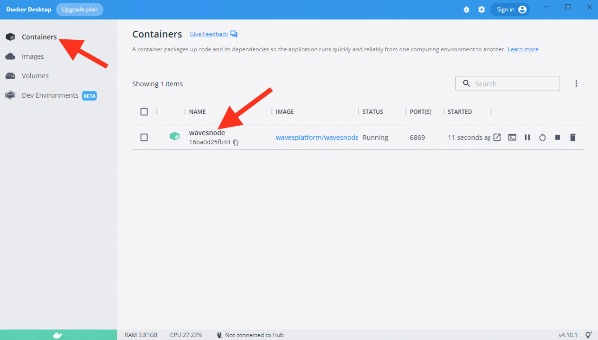

<!-- Block validation
Validation of transactions, signatures
Fork
Import Export
Don't mix existing data with imported
- Blockchain  -->

- [Blockchain Synchronization Process Description]()
- [Fork Of Blockchain]()
- [Blockchain Synchronization]()
  <!-- - [Ubuntu Synchronization]()
    - [Deb Package Synchronization]()
    - [Docker Synchronization]()
    - [Waves Package Synchronization]()
  - [MacOS Synchronization]()
    - [Docker Synchronization]()
    - [Waves Package Synchronization]()
  - [Windows Synchronization]()
    - [Docker Synchronization]()
    - [Waves Package Synchronization]() -->
- [Node Rollback]()

## Blockchain Synchronization Process Description ##

Before blockchain synchronization, it is necessary to understand how blockchain gets formed.  
Let's recap what we discussed in the lesson, [Waves Blockchain Description]().  
The smallest blockchain component is a transaction that may include various data (account address, sum, operation type, etc).  
All transactions are wrapped in blocks, where each block has a maximum capacity of how many transactions it may include.  
The chain of blocks is called blockchain.  

Every node in the [Waves network]() stores the blockchain data copy, creating data decentralization.  
The major element of decentralization within blockchain is data security.  
What it means is that all the nodes represent witnesses that:
- Watch no data has been compromised, so the data integrity is intact;
- No invalid transaction is saved into the blockchain.
    
The process of the data validation is uninterrupted.  
There are two most significant validation processes:
- **<ins>Validation of blocks</ins>**  
  It is a single-threaded process.  
  Therefore if you have a high frequency CPU, it will provide a much better perfomance.  
  This process is not linear and takes as much time as blocks require.  
  The heavier a block is, the longer it takes to verify it.  
  The first 200,000 blocks are empty so they get verified much faster.  
- **<ins>Validation of signatures</ins>**  
  Unlike the block validation process, signature validation is multi-threaded.  
  Therefore it is not dependent on the CPU frequency.  

This way, every node verifies all transactions and blocks whether they are valid.  
If the data is valid, it will be included in the blockchain.  
In case the data didn't pass validation, the data will be discarded.  

If the operating system doesn't have enough physical memory, it may lead to delays in the work of the system.   
Waves team recommends using [SSD](https://en.wikipedia.org/wiki/Solid-state_drive) and keep at least 30% of the total memory for the needs of the operating system (cache/buffers).  
  
There are two ways of how it is possible to synchronize the blockchain data with your node:
1. **<ins>Wait for the automatic synchronization</ins>**:  
    After the node deployment, you may wait untill the synchronization is done automatically.  
    Without any additional actions, your node will be uploading and validating all the data on its own.  
    However, this process takes a significant amount of time for days.
2. **<ins>Upload the current blockchain data to your node<ins>**:  
    It is possible to greatly speed up the synchronization by uploading the latest blockchain data.  
    In this case, you will skip transaction execution (validation of signatures, balances etc).  

In case you don't want to speed up the synchronization, you may wait before it is done automatically.  
If so, you can skip all the instructions below and continue with the next chapter, [Nodes Of The Network]().

However, if you wish to speed up this process, within this lesson we will concentrate on the blockchain data upload.  

# MacOS #

## Docker Synchronization ##

Follow the steps below to synchronize the current blockchain with your node:  
1. Go to the directory with the blockchain data of the node:
  
    ```
    cd /opt/waves-node/data
    ```
2. Remove all the data within the directory:
  
    ```
    sudo rm -rf *
    ```
3. Download the [latest archive](http://blockchain.wavesnodes.com/blockchain_last.tar) with the blockchain data to the `/opt/waves-node/data` directory.  
    Please, note that the archive size is approximately 70 GB.
4. Download the [sha1sum file](http://blockchain.wavesnodes.com/blockchain_last.tar.SHA1SUM) to the `/opt/waves-node/data` directory.  
    This file is intended for testing the blockchain archive checksum hash. 
5. Install the sha1sum utility:
    
    ```
    brew install md5sha1sum
    ```
6. Run the sha1sum utility to compare the checksum of the (`blockchain_last.tar`) and (`blockchain_last.tar.SHA1SUM`) files.  
    Firstly, run the command with the `blockchain_last.tar` file in the `/opt/waves-node/data` directory:  

    ```
    sha1sum blockchain_last.tar
    ```
    The output can look like this:
    
    ```
    3c044f284026b40761638e915147c9fa6e5ff156  blockchain_last.tar
    ```
    
    After this, read the content of the `blockchain_last.tar.SHA1SUM` file:  

    ```
    cat blockchain_last.tar.SHA1SUM 
    ```

    The oupoot can look like this:

    ```
    3c044f284026b40761638e915147c9fa6e5ff156  /opt/blockchain/blockchain_last.tar
    ```
    
    The hash of the `blockchain_last.tar` file has to match with the content inside of the `blockchain_last.tar.SHA1SUM` file.  
    In our example, we receive the hash `3c044f284026b40761638e915147c9fa6e5ff156` after running both commands.
7. Restart the node:

    ```
    docker container restart waves-node
    ```
8. Check the logs of the running container:  
  
    ```
    docker logs waves-node
    ```
    You will see the height of the blockchain increasing rapidly:  
    
    ```
    INFO [appender-25] c.w.s.BlockchainUpdaterImpl - New height: 100
    ```
    Please, note that the complete synchronization may take up to 1-3 days and depends on your CPU frequency. 

Right now your node is ready for mining!  
If your node generates a block, you will get a reward for block generation right to your node wallet.


## Waves Package Synchronization ##

Follow the steps below to synchronize the current blockchain with your node:  
1. Go to the directory with the blockchain data of the node:
  
    ```
    cd /opt/waves-node/data
    ```
2. Remove all the data within the directory:
  
    ```
    sudo rm -rf *
    ```
3. Download the [latest archive](http://blockchain.wavesnodes.com/blockchain_last.tar) with the blockchain data to the `/opt/waves-node/data` directory.  
    Please, note that the archive size is approximately 70 GB.
4. Download the [sha1sum file](http://blockchain.wavesnodes.com/blockchain_last.tar.SHA1SUM) to the `/opt/waves-node/data` directory.  
    This file is intended for testing the blockchain archive checksum hash. 
5. Install the sha1sum utility:
    
    ```
    brew install md5sha1sum
    ```
6. Run the sha1sum utility to compare the checksum of the (`blockchain_last.tar`) and (`blockchain_last.tar.SHA1SUM`) files.  
    Firstly, run the command with the `blockchain_last.tar` file in the `/opt/waves-node/data` directory:  

    ```
    sha1sum blockchain_last.tar
    ```
    The output can look like this:
    
    ```
    3c044f284026b40761638e915147c9fa6e5ff156  blockchain_last.tar
    ```
    
    After this, read the content of the `blockchain_last.tar.SHA1SUM` file:  

    ```
    cat blockchain_last.tar.SHA1SUM 
    ```

    The oupoot can look like this:

    ```
    3c044f284026b40761638e915147c9fa6e5ff156  /opt/blockchain/blockchain_last.tar
    ```
    
    The hash of the `blockchain_last.tar` file has to match with the content inside of the `blockchain_last.tar.SHA1SUM` file.  
    In our example, we receive the hash `3c044f284026b40761638e915147c9fa6e5ff156` after running both commands.
7. Restart the node.
    Replace {*} with the actual file name:

    ```
    cd /opt/waves-node
    java -jar {*}.jar ./conf/{*}.conf
    ```
    For example:

    ```
    cd /opt/waves-node
    java -jar waves-all-1.4.7.jar ./conf/waves-sample.conf
    ```
8. Check the logs of the running node.
    You will see the height of the blockchain increasing rapidly:  
    
    ```
    INFO [appender-25] c.w.s.BlockchainUpdaterImpl - New height: 100
    ```
    Please, note that the complete synchronization may take up to 1-3 days and depends on your CPU frequency. 

Right now your node is ready for mining!  
If your node generates a block, you will get a reward for block generation right to your node wallet.


# Ubuntu #

## Docker Synchronization ##

Follow the steps below to synchronize the current blockchain with your node:  
1. Go to the directory with the blockchain data of the node:
  
    ```
    cd /opt/waves-node/data
    ```
2. Remove all the data within the directory:
  
    ```
    sudo rm -rf *
    ```
3. Download the [latest archive](http://blockchain.wavesnodes.com/blockchain_last.tar) with the blockchain data to the directory.  
    Please, note that the archive size is approximately 70 GB.
  
    ```
    wget -P /opt/waves-node/data http://blockchain.wavesnodes.com/blockchain_last.tar
    ```
4. Download the [sha1sum file](http://blockchain.wavesnodes.com/blockchain_last.tar.SHA1SUM) to the directory.  
    This file is intended for testing the blockchain archive checksum hash. 

    ```
    wget -P /opt/waves-node/data http://blockchain.wavesnodes.com/blockchain_last.tar.SHA1SUM
    ```
5. Install the sha1sum utility:
    
    ```
    apt-get install coreutils
    ```
6. Run the sha1sum utility to compare the checksum of the (`blockchain_last.tar`) and (`blockchain_last.tar.SHA1SUM`) files.  
    Firstly, run the command with the `blockchain_last.tar` file in the `/opt/waves-node/data` directory:  

    ```
    sha1sum blockchain_last.tar
    ```
    The output can look like this:
    
    ```
    3c044f284026b40761638e915147c9fa6e5ff156  blockchain_last.tar
    ```
    
    After this, read the content of the `blockchain_last.tar.SHA1SUM` file:  

    ```
    cat blockchain_last.tar.SHA1SUM 
    ```

    The oupoot can look like this:

    ```
    3c044f284026b40761638e915147c9fa6e5ff156  /opt/blockchain/blockchain_last.tar
    ```
    
    The hash of the `blockchain_last.tar` file has to match with the content inside of the `blockchain_last.tar.SHA1SUM` file.  
    In our example, we receive the hash `3c044f284026b40761638e915147c9fa6e5ff156` after running both commands.
7. Restart the node:

    ```
    docker container restart waves-node
    ```
8. Check the logs of the running container:  
  
    ```
    docker logs waves-node
    ```
    You will see the height of the blockchain increasing rapidly:  
    
    ```
    INFO [appender-25] c.w.s.BlockchainUpdaterImpl - New height: 100
    ```
    Please, note that the complete synchronization may take up to 1-3 days and depends on your CPU frequency. 


Right now your node is ready for mining!  
If your node generates a block, you will get a reward for block generation right to your node wallet.


## Deb Package Synchronization ##

Follow the steps below to synchronize the current blockchain with your node:  
1. Go to the directory with the blockchain data of the node:
  
    ```
    cd /opt/waves-node/data
    ```
2. Remove all the data within the directory:
  
    ```
    sudo rm -rf *
    ```
3. Download the [latest archive](http://blockchain.wavesnodes.com/blockchain_last.tar) with the blockchain data to the directory.  
    Please, note that the archive size is approximately 70 GB.
  
    ```
    wget -P /opt/waves-node/data http://blockchain.wavesnodes.com/blockchain_last.tar
    ```
4. Download the [sha1sum file](http://blockchain.wavesnodes.com/blockchain_last.tar.SHA1SUM) to the directory.  
    This file is intended for testing the blockchain archive checksum hash. 

    ```
    wget -P /opt/waves-node/data http://blockchain.wavesnodes.com/blockchain_last.tar.SHA1SUM
    ```
5. Install the sha1sum utility:
    
    ```
    apt-get install coreutils
    ```
6. Run the sha1sum utility to compare the checksum of the (`blockchain_last.tar`) and (`blockchain_last.tar.SHA1SUM`) files.  
    Firstly, run the command with the `blockchain_last.tar` file in the `/opt/waves-node/data` directory:  

    ```
    sha1sum blockchain_last.tar
    ```
    The output can look like this:
    
    ```
    3c044f284026b40761638e915147c9fa6e5ff156  blockchain_last.tar
    ```
    
    After this, read the content of the `blockchain_last.tar.SHA1SUM` file:  

    ```
    cat blockchain_last.tar.SHA1SUM 
    ```

    The oupoot can look like this:

    ```
    3c044f284026b40761638e915147c9fa6e5ff156  /opt/blockchain/blockchain_last.tar
    ```
    
    The hash of the `blockchain_last.tar` file has to match with the content inside of the `blockchain_last.tar.SHA1SUM` file.  
    In our example, we receive the hash `3c044f284026b40761638e915147c9fa6e5ff156` after running both commands.
7. Restart the node:

    ```
    sudo systemctl restart waves.service
    ```
8. Check Waves app logs in journal storage:  
   
    ```
    journalctl -u waves.service -f
    ```

    You will see the height of the blockchain increasing rapidly:  

    ```
    INFO [appender-22] c.w.s.BlockchainUpdaterImpl - New height: 100
    ```
    Please, note that the complete synchronization may take up to 1-3 days and depends on your CPU frequency. 

Right now your node is ready for mining!  
If your node generates a block, you will get a reward for block generation right to your node wallet.


## Waves Package Synchronization ##

Follow the steps below to synchronize the current blockchain with your node:  
1. Go to the directory with the blockchain data of the node:
  
    ```
    cd /opt/waves-node/data
    ```
2. Remove all the data within the directory:
  
    ```
    sudo rm -rf *
    ```
3. Download the [latest archive](http://blockchain.wavesnodes.com/blockchain_last.tar) with the blockchain data to the `/opt/waves-node/data` directory.  
    Please, note that the archive size is approximately 70 GB.  

    ```
    wget -P /opt/waves-node/data http://blockchain.wavesnodes.com/blockchain_last.tar
    ```
4. Download the [sha1sum file](http://blockchain.wavesnodes.com/blockchain_last.tar.SHA1SUM) to the `/opt/waves-node/data` directory.  
    This file is intended for testing the blockchain archive checksum hash.  

    ```
    wget -P /opt/waves-node/data http://blockchain.wavesnodes.com/blockchain_last.tar.SHA1SUM
    ```
5. Install the sha1sum utility:
    
    ```
    apt-get install coreutils
    ```
6. Run the sha1sum utility to compare the checksum of the (`blockchain_last.tar`) and (`blockchain_last.tar.SHA1SUM`) files.  
    Firstly, run the command with the `blockchain_last.tar` file in the `/opt/waves-node/data` directory:  

    ```
    sha1sum blockchain_last.tar
    ```
    The output can look like this:
    
    ```
    3c044f284026b40761638e915147c9fa6e5ff156  blockchain_last.tar
    ```
    
    After this, read the content of the `blockchain_last.tar.SHA1SUM` file:  

    ```
    cat blockchain_last.tar.SHA1SUM 
    ```

    The oupoot can look like this:

    ```
    3c044f284026b40761638e915147c9fa6e5ff156  /opt/blockchain/blockchain_last.tar
    ```
    
    The hash of the `blockchain_last.tar` file has to match with the content inside of the `blockchain_last.tar.SHA1SUM` file.  
    In our example, we receive the hash `3c044f284026b40761638e915147c9fa6e5ff156` after running both commands.
7. Restart the node.
    Replace {*} with the actual file name:

    ```
    cd /opt/waves-node
    java -jar {*}.jar ./conf/{*}.conf
    ```
    For example:

    ```
    cd /opt/waves-node
    java -jar waves-all-1.4.7.jar ./conf/waves-sample.conf
    ```
8. Check the logs of the running node.
    You will see the height of the blockchain increasing rapidly:  
    
    ```
    INFO [appender-25] c.w.s.BlockchainUpdaterImpl - New height: 100
    ```
    Please, note that the complete synchronization may take up to 1-3 days and depends on your CPU frequency. 

Right now your node is ready for mining!  
If your node generates a block, you will get a reward for block generation right to your node wallet.


# Windows #

## Docker Synchronization ##

Follow the steps below to synchronize the current blockchain with your node:  
1. Go to the directory with the blockchain data of the node `C:\wavesnode\data`.
2. Remove all the data within the directory.
3. Download the [latest archive](http://blockchain.wavesnodes.com/blockchain_last.tar) with the blockchain data to the `C:\wavesnode\data` folder.  
4. Download the [sha1sum file](http://blockchain.wavesnodes.com/blockchain_last.tar.SHA1SUM) to the `C:\wavesnode\data` folder.  
    This file is intended for testing the blockchain archive checksum hash. 
5. Run the [certutil](https://docs.microsoft.com/en-us/windows-server/administration/windows-commands/certutil) utility to compare the checksum of the (`blockchain_last.tar`) and (`blockchain_last.tar.SHA1SUM`) files.  
    Please, use [PowerShell](https://docs.microsoft.com/en-us/powershell/scripting/overview) command line.  
    Firstly, run the command with the `blockchain_last.tar` file in the `C:\wavesnode\data` directory:  

    ```
    CertUtil -hashfile 'C:\wavesnode\data\blockchain_last.tar` 
    ```

    The output can look like this:

    ```
    SHA1 hash of C:\wavesnode\data\blockchain_last.tar:
    f464c9da265077063f68e3f097cd9b0337b148e5
    CertUtil: -hashfile command completed successfully.
    ```

    After this, read the content of the `blockchain_last.tar.SHA1SUM` file:  
    
    ```
    C:\wavesnode\data cat blockchain_last.tar.SHA1SUM`
    ```

    The oupoot can look like this:
    
    ```
     f464c9da265077063f68e3f097cd9b0337b148e5
    ```    
    The hash of the `blockchain_last.tar` file has to match with the content inside of the `blockchain_last.tar.SHA1SUM` file.  
    In our example, we receive the hash ` f464c9da265077063f68e3f097cd9b0337b148e5` after running both commands.
6. Restart the node:  
      
    
7. Check the logs of the running container.  
    Click on the container name:  
      
 
    You will see the height of the blockchain increasing rapidly:  
      
    Please, note that the complete synchronization may take up to 1-3 days and depends on your CPU frequency. 


Right now your node is ready for mining!  
If your node generates a block, you will get a reward for block generation right to your node wallet.

## Waves Package Synchronization ##

Follow the steps below to synchronize the current blockchain with your node:  
1. Go to the directory with the blockchain data of the node `C:\wavesnode\data`.
2. Remove all the data within the directory.
3. Download the [latest archive](http://blockchain.wavesnodes.com/blockchain_last.tar) with the blockchain data to the `C:\wavesnode\data` folder.  
4. Download the [sha1sum file](http://blockchain.wavesnodes.com/blockchain_last.tar.SHA1SUM) to the `C:\wavesnode\data` folder.  
    This file is intended for testing the blockchain archive checksum hash. 
5. Run the [certutil](https://docs.microsoft.com/en-us/windows-server/administration/windows-commands/certutil) utility to compare the checksum of the (`blockchain_last.tar`) and (`blockchain_last.tar.SHA1SUM`) files.  
    Please, use [PowerShell](https://docs.microsoft.com/en-us/powershell/scripting/overview) command line.  
    Firstly, run the command with the `blockchain_last.tar` file in the `C:\wavesnode\data` directory:  

    ```
    CertUtil -hashfile 'C:\wavesnode\data\blockchain_last.tar` 
    ```

    The output can look like this:

    ```
    SHA1 hash of C:\wavesnode\data\blockchain_last.tar:
    f464c9da265077063f68e3f097cd9b0337b148e5
    CertUtil: -hashfile command completed successfully.
    ```

    After this, read the content of the `blockchain_last.tar.SHA1SUM` file:  
    
    ```
    C:\wavesnode\data cat blockchain_last.tar.SHA1SUM`
    ```

    The oupoot can look like this:
    
    ```
     f464c9da265077063f68e3f097cd9b0337b148e5
    ```    
    The hash of the `blockchain_last.tar` file has to match with the content inside of the `blockchain_last.tar.SHA1SUM` file.  
    In our example, we receive the hash ` f464c9da265077063f68e3f097cd9b0337b148e5` after running both commands.
6. Restart the node.  
    Replace {*} with the actual file name:
    ```
    cd C:\wavesnode
    java -jar {*}.jar .\conf\{*}.conf
    ```

    For example:
    ```
    cd C:\wavesnode
    java -jar waves-all-1.4.7.jar .\conf\waves-sample.conf
    ```
7. Check the logs of the running node.   
    You will see the height of the blockchain increasing rapidly:  
    
    ```
    INFO [appender-22] c.w.s.BlockchainUpdaterImpl - New height: 5100
    ```
    Please, note that the complete synchronization may take up to 1-3 days and depends on your CPU frequency. 


Right now your node is ready for mining!  
If your node generates a block, you will get a reward for block generation right to your node wallet.


## Fork Of Blockchain ##

Another concept that is imporant to understand before we upload the blockchain data is the fork of blockchain.  
Fork is the moment when the blockchain is split by two different chains.  
Within the Waves blockchain, fork formation is possible if the Waves team publishes a node update, but not all nodes decide to switch to the new update.
    
This idea can be simplified with an instance in the fictional world.  
Let's imagine we have 5 nodes in our fictional blockchain.  
All 5 nodes have the same very configurations, working identically.  
However, at one point of time, we, as blockchain creators and developers, decide to upgrade the blockchain and add some features to it.  
Out of all 5 nodes, only 3 nodes owners upgraded their nodes with the update.  
The other 2 nodes remained with the older node version.  

After this, the blockchain has split into two different chains.  
3 nodes switched to the forked blockchain, meanwhile 2 other node remained with the original one.  
  

## Node Rollback ##

If 

Rollback your node to a specific height to remove all blocks after that given height.   
The rollback allows to discard a few blocks to quickly restore your node in case of fork detection without having to rebuild the whole blockchain database.