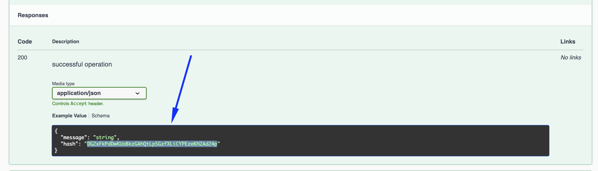
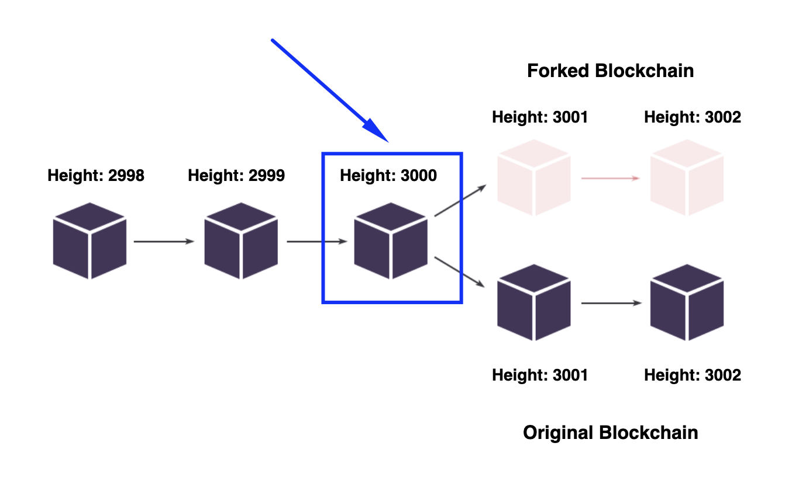
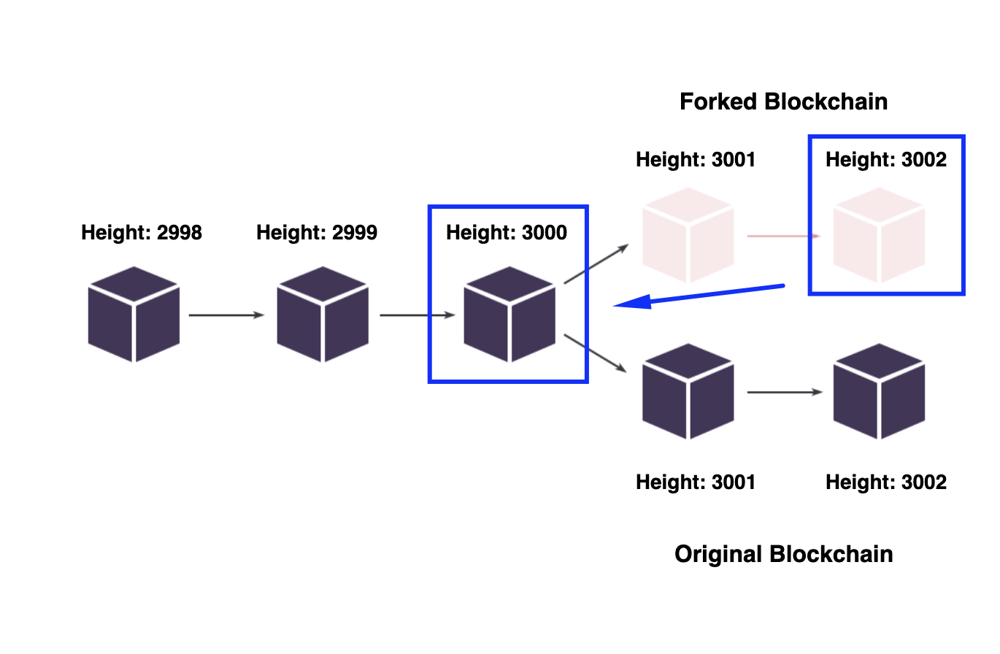

## Node structure ##

To clarify all of the node deployment steps, it is required to understand the structure of a node.  
Understanding the node structure will shed some light on the principal essences that a node interacts with.  

Under the bonnet, every node has:
- **<u>Blockchain database</u>**:  
    All the nodes of the Waves blockchain are intended to ensure [decentralization]().  
    Therefore, an identical copy of all the blockchain data must be stored in every node.  
- **<u>Configuration file</u>**:  
    A configuration file is a set of instructions on how a node should work.  
    We can define multiple parameters in the configuration file, such as [network]() to connect to.


## Prerequisites ##

Before installing a node, ensure your Waves account has a [generating balance]() at least 1000 WAVES.  
Also, it would be necessary to keep on hand a Base58 encoded string of the seed phrase of your account.  
Here is how you can encode a seed phrase to Base58:  
1. Open the [Waves IDE](https://waves-ide.com/);
2. Click "RideREPL" down the screen:  
      
3. Insert in the function your seed phrase:  
    `"your-seed-phrase".toBytes().toBase58String()`  
    For example:  
    `"surround fever above evil walk slam left thought credit pinch life follow arch work stock".toBytes().toBase58String()`
4. Copy the function with your seed phrase to the console:  
      
5. Click "Enter" to get a Base58 encoded string of your seed phrase:
    
6. Save this Base58 encoded string, as we will use it later for node installation.  

## Installation ##

Waves node installation via package is a more advanced way of node deployment.  
Follow the steps below to install a Waves node:
1. Install Java (OpenJDK 8).  
    Please, note that if you already have OpenJDK 11 installed, there is no need to roll it back to OpenJDK 8.  
    The node Installation is supported in both the 8th and the 11th versions.  
    Install OpenJDK8 as mentioned in the [documentation](https://access.redhat.com/documentation/en-us/openjdk/8/html/installing_and_using_openjdk_8_for_windows/openjdk8-windows-installation-options).  

    Check the JDK version with the following command:  
    
    ```
    java -version
    ```

    If you see in the output that the version is such as below or higher, you can move to the next step:  

    ```
    java version "1.8.0_201"
    Java(TM) SE Runtime Environment (build 1.8.0_201-b09)
    Java HotSpot(TM) 64-Bit Server VM (build 25.201-b09, mixed mode)
    ```

2. Create folders to store the blockchain copy and a configuration file.  

    ```
     md C:\wavesnode\data C:\wavesnode\conf
    ```

3. Download the [latest version](https://github.com/wavesplatform/Waves/releases) of `waves-all-<version number>.jar` to the folder `C:\wavesnode`.
4. Download the [sample](https://github.com/wavesplatform/Waves/blob/master/node/waves-sample.conf) configuration file to `C:\wavesnode\conf`.  
5. Study the minimum parameters.  
    It will be necessary to edit the configuration file to run a node.  
    The file contains multiple parameters related to the wallet, blockchain, rest-api, etc.  
    Within this chapter, we do not have a goal to configure them all, as we have the chapter [Configuration](#configuration) dedicated to it.  
    As of now, it would be enough to run a node with minimum parameters.  

    | Parameter | Description | Example |
    | :---- | :---- | :---- |
    | password | The password you are setting up locally on your host.<br> This password will encode your seed Base58 string within the `wallet.dat` file. | `password = "RandomPassword_"` |
    | seed | The seed phrase of your Waves account [encoded to the Base58 string](#prerequisites). <br> |  `seed = "K6XzUChB6DwTYCM1WxtVrv1BM6jTdcaBJrn6vkB3cK7qXCnqLV"` |
6. Edit and save the configuration file.  
    Open `waves-sample.conf` in the directory `C:\wavesnode\conf`.  
    We may remove all the parameters except the password and the wallet’s seed.  
    Set a password and insert a seed Base58 encoded string.  
    It may look something as in the code below:  

    ```
    waves {

    wallet {
            # Password to protect wallet file
            password = "RandomPassword_"

            # Wallet seed as a BASE58 string
            seed = "K6XzUChB6DwTYCM1WxtVrv1BM6jTdcaBJrn6vkB3cK7qXCnqLV"
        }
    }
    ```
7. Run the script in the current directory to deploy a node.  
    Replace {*} with the actual file name:
    ```
    cd C:\wavesnode
    java -jar {*}.jar .\conf\{*}.conf
    ```
    For example:
    ```
    cd C:\wavesnode
    java -jar waves-all-1.4.7.jar .\conf\waves-sample.conf
    ```
8. Please, note that it may take a few moments to deploy a node.  
    Once you see logs about the height of the blockchain, it means everything is working correctly:

    ```
    INFO [appender-22] c.w.s.BlockchainUpdaterImpl - New height: 5100
    ```
    
All done! You have a working node deployed!  
  
Also, it is possible to deploy a node on your custom blockchain.  
You can read more information about it in the [complete documentation](https://docs.waves.tech/en/waves-node/private-waves-network).  
Please, note that mining the WAVES tokens that have value on the market is possible only on the Mainnet network.  
In this lesson, we will deploy our node in the Mainnet network.  
   
In the next chapter, [Node configuration](#configuration), we will learn how to set up a configuration file of your node.  
  
## Configuration ##

### Node configuration file description ###

As we previously mentioned in the [Node structure]() chapter, every node has:
- A configuration file;
- The blockchain copy.
  
Within this chapter, we will work with the node’s configuration file.  
In the [next chapter](#synchronization), we will discuss node synchronization with the Waves blockchain.  

A configuration file is a way of setting up instructions on how a node should work.  
  

### Modules in the configuration file ###

All the node modules are wrapped within the `Waves` configuration section.  
There we can define what modules we would like to configure.  
In the [sample configuration file](https://github.com/wavesplatform/Waves/blob/version-1.4.x/node/waves-sample.conf), we have 4 of them included (`wallet`, `blockchain`, `rest-api`, `network`):  

```
waves {
    wallet {
    }

    blockchain {
    }

    rest-api {
    }

    network {
    }
}
```

This list of modules in the given example is not complete.   
You can find the complete list of Waves node modules and their parameters in the [documentation](https://docs.waves.tech/en/waves-node/node-configuration#sections-of-the-configuration-file).  

For the sake of simplicity, we will concentrate on the same modules as the ones included in the [sample configuration file](https://github.com/wavesplatform/Waves/blob/version-1.4.x/node/waves-sample.conf):  
- **<u>[Wallet](https://docs.waves.tech/en/waves-node/node-configuration#wallet-settings)</u>**  
    Built-in node wallet parameters.  
    In the wallet module, you can configure the parameters of the [wallet built in the Waves node](https://docs.waves.tech/en/waves-node/how-to-work-with-node-wallet).  
    [Previously](), we defined the seed of the wallet Base58 encoded and set a password to encode the seed in the `wallet.dat` file:
    
    ```
    waves {
        wallet{
            password = "RandomPassword_"
            seed = "K6XzUChB6DwTYCM1WxtVrv1BM6jTdcaBJrn6vkB3cK7qXCnqLV"
        }
    }
    ```

    Wallet parameters:  
    | Name | Description | Example |
    | :---- | :---- | :---- |
    | password | Random password a user sets. Encodes your seed Base58 string in the `wallet.dat` file. | RandomPassword_ |
    | seed | Connects your wallet to your node via the [wallet seed Base58 encoded]().<br><br>If you don’t have any existing wallet, comment out this parameter and start a node.<br>During the first run, the application will create a new wallet with a random seed for you.<br>In this case, the seed will be displayed in the application log.<br>If you miss it or if you don’t want to check the log files, it will also be available in [REST API]() using the `wallet/seed` method.|  K6XzUChB6DwTYCM1WxtVrv1BM6jTdcaBJrn6vkB3cK7qXCnqLV |

    Read more about [Wallet settings](https://docs.waves.tech/en/waves-node/node-configuration#wallet-settings).
- **<u>[Blockchain](https://docs.waves.tech/en/waves-node/node-configuration#blockchain-settings)</u>**  
    Blockchain parameters.  
    In the blockchain module, you can select the blockchain type.  
    Since we are aimed at mining and receiving rewards for block generation, we will use the Mainnet type.  

    ```
    waves {
        blockchain {
            type = MAINNET
        }
    }
    ```

    Blockchain parameters:  
    | Name | Description | Example |
    | :---- | :---- | :---- |
    | type | Selects the blockchain type: [MAINNET, STAGENET, TESTNET]() or [CUSTOM](https://docs.waves.tech/en/waves-node/private-waves-network). | MAINNET | 

    Read more about [Blockchain settings](https://docs.waves.tech/en/waves-node/node-configuration#blockchain-settings).
- **<u>[REST API](https://docs.waves.tech/en/waves-node/node-configuration#rest-api-settings)</u>**  
    Node API parameters.  
    The Waves node REST API is the primary interface for blockchain interaction.  
    The API has both public (available for everyone) and private (available only via authorization) endpoints.  
    You may check the swagger REST API interface for the [Mainnet network](https://nodes.wavesnodes.com/) to understand what it looks like.  

    Once this parameter is configured, you may get access to the REST API service of your node directly:  

    
    ```
    waves {
        rest-api {
            enable = yes
            bind-address = "127.0.0.1"
            port = 6869
            api-key-hash = "CvTpRm21PyZf15q1dD7bz46meYYtWQAgA1kQU1iqXKriv"
        }
    }
    ```

    REST API parameters:  
    | Name | Description | Example |
    | :---- | :---- | :---- |
    | enable | Activates REST API.<br>If you want to deactivate REST API, change the default value to no. | yes |
    | bind-address | Network address where the REST API accepts incoming connections.<br>Please, use the 127.0.0.1 address when deploying a node with deb package or waves package.<br>Use [Nginx’s proxy pass module](http://nginx.org/en/docs/http/ngx_http_proxy_module.html) or [SSH port forwarding](https://blog.trackets.com/2014/05/17/ssh-tunnel-local-and-remote-port-forwarding-explained-with-examples.html) for external access. | 127.0.0.1 |
    | port | Port number where the REST API accepts incoming connections. | 6869 |
    | api-key-hash | Hash of the API key to access private endpoints.<br>Please, check the chapter [API key of your node](#api-key-of-your-node) to generate the API Key. | CvTpRm21PyZf15q1dD7bz46meYYtWQAgA1kQU1iqXKriv |

    Read more about [REST API settings](https://docs.waves.tech/en/waves-node/node-configuration#rest-api-settings).
- **<u>[Network](https://docs.waves.tech/en/waves-node/node-configuration#network-settings)</u>**  
    Peer-to-peer network parameters.  
    This module allows you to define how your node would interact with other nodes within the network:

    ```
    waves {
        network {
            node-name = "waves-node"
            bind-address = "0.0.0.0"
            port = 6868
        }
    }
    ```

    Network parameters:  
    | Name | Description | Example |
    | :---- | :---- | :---- |
    | node-name | Sets the name of your node visible to other participants of the P2P network.<br>The name is transmitted during the initial handshake. | waves-node | 
    | bind-address | Sets the IP address of the local network interface on which Waves Node will accept incoming connections.<br>By default, node binds to 0.0.0.0 that means that it will listen on all available network adapters. | 0.0.0.0 | 
    | port | Sets the network port number to which other Waves nodes will connect.<br>Check that the port is reachable from outside. Otherwise, your node will connect to the P2P network using only outgoing connections.<br>If other applications use this port, your node won’t start.<br>For example:<br>-6868 for Mainnet<br>-6863 for Testnet<br>-6862 for Stagenet| 6868 | 

     Read more about [Network settings](https://docs.waves.tech/en/waves-node/node-configuration#network-settings).

### API key of your node ###

After the REST API module is configured and node deployed, you can access the Swagger interface for blockchain interaction.  
There you can access different methods that will allow you:
- Read the blockchain data:
    - `Account data`  
        (balances, data storage entries, aliases, scripts assigned)
    - `Token data`  
        (parameters, distribution by accounts)
    - `Active leases`
    - `Blocks`
    - `Transactions`
    - `Etc`
- Operate with transactions: 
    - `Broadcast signed transactions`
    - `Validate transactions`
    - `Check the status of transactions`
- Use utilities:
    -  `Generate an address from a public key`
    -  `Generate a random seed`
    -  `Calculate hashes` 
    -  `Etc`

These methods can be:
- **<u>Public</u>**:  
    Methods that are available to everyone. Public methods do not:
    - Operate with any private data of the node owner;
    - Invoke any methods that would make an action with any node, like stopping a node or connecting to a peer.  
  
    For example, [`/blocks/height`](https://nodes.wavesnodes.com/api-docs/index.html#/blocks/getHeight) is a method that checks the current height of the blockchain.  
    This information is not private, and there is no action made with a node.  
    Therefore itdoes not require any additional authorization. 
- **<u>Private</u>**:  
    Methods that are available only to node owners.  
    These methods can be invoked only by node owners via API key and API key hash authorization.  
    For example, [`/debug/configInfo`](https://nodes.wavesnodes.com/api-docs/index.html#/debug/getConfig) is a method that checks the configuration of the currently running node.

The chapter goal is to get this API key and API key hash to operate with your node’s private methods.  
Here is how you can do it:
1. Open [`/utils/hash/secure`](https://nodes.wavesnodes.com/api-docs/index.html#/utils/hashSecure) in the Swagger REST API node interface.
2. Click "Try it out":  
      
3. Enter any random string value and click "Execute":
      
    Please do not use the example in the screenshot, as it is only for demonstration purposes.
4. In the response section below, you will receive a hash:
      
5. Save both the original phrase you entered (API key) and its hash (API key hash) as we will use them for interaction with private node methods in this lesson.

### Configuration file setup ###

Follow the instructions below for setting up configurations:
1. Go to the directory with the configuration file (`C:\wavesnode\conf\waves-sample.conf`)
2. Edit the configuration file.  
    [In the previous chapter](#installation), we already added the `waves.wallet` module.  
    Add `blockchain`, `rest-api`, and `network` modules to the file.  
      
    Please note that the `rest-api.api-key-hash` parameter does not necessarily have to match the example below.  
    The chapter [API key of your node](#api-key-of-your-node) gave instructions on how to generate the API key hash.  
    Insert the API key hash in the `rest-api.api-key-hash` parameter.
      
    After the edit, the `waves.conf` file can look something like this: 

    ```
    waves {

        wallet {
            password = "RandomPassword_"
            seed = "K6XzUChB6DwTYCM1WxtVrv1BM6jTdcaBJrn6vkB3cK7qXCnqLV"
        }

        blockchain {
            type = MAINNET
        }

        rest-api {
            enable = yes
            bind-address = "127.0.0.1"
            port = 6869
            api-key-hash = "CvTpRm21PyZf15q1dD7bz46meYYtWQAgA1kQU1iqXKriv"
        

        network {
            node-name = "waves-node"
            bind-address = "0.0.0.0"
            port = 6868
        }

    }
    ```
3. Save the file and deploy a node once again.  
    Replace {*} with the actual file name:  

    ```
    cd C:\wavesnode
    java -jar {*}.jar .\conf\{*}.conf
    ```

    For example:  

    ```
    cd C:\wavesnode
    java -jar waves-all-1.4.7.jar .\conf\waves-sample.conf
    ```
    Please, note that it may take a few moments to deploy a node.
4. Check your deployed node’s [REST API interface](http://localhost:6869/api-docs/index.html).  
    There you could see multiple methods to interact with your node.  
    For instance, you can try a:
    - [Public method](http://127.0.0.1:6869/api-docs/index.html#/addresses):  
        All public methods do not require any additional authorization.  
        For example, the `/addresses/` method will return the address of your node wallet.  
         
    - [Private method](http://127.0.0.1:6869/api-docs/index.html#/debug/getConfig):  
        All private methods require authorization with an API key and API key hash.    
        Kindly note that the API key hash inserted in the configuration file does not equal the API key.  
        The API key hash is the random string you typed in the [`/utils/hash/secure`](https://nodes.wavesnodes.com/api-docs/index.html#/utils/hashSecure) method.  
        In case you do not remember what API key and API key hash are, please, check [API key of your node](#api-key-of-your-node).  
          
        To authorize private method usage:
        1. Click "Authorize":
            
        2. Enter your API key (not the API hash) and click "Authorize":
            
            Please, note that the API key on the screen is an example.  
            You need to use your API key.
        3. Click "Close":
            
        4. Now, you can use the private methods of your node.  
            For example, the [`/configInfo`](http://127.0.0.1:6869/api-docs/index.html#/debug/getConfig) method will return configurations of the currently running node.
               
      
    Read more about [Node REST API](https://docs.waves.tech/en/waves-node/node-api/). 

In the next chapter, [Synchronization](#synchronization), we will move to the next step of preparations for mining.  

## Synchronization ##

### Synchronization process description ###

Before we begin blockchain synchronization, it is necessary to understand how blockchain gets formed.  
Let's recap what we discussed in the lesson, [Waves blockchain description]().  
The smallest blockchain component is a transaction that may include various data (account address, sum, operation type, etc.).  
All transactions are wrapped in blocks, where each block has a maximum capacity of how many transactions it may include.  
The chain of blocks is called a blockchain.  

Every node in the [Waves network]() stores the blockchain data copy, creating data decentralization.  
The primary element of decentralization within the blockchain is data security.  
What it means is that all the nodes represent witnesses that:
- Watch over the data integrity so that it will not be compromised;
- No invalid transaction is saved into the blockchain.
    
The process of data validation is uninterrupted.  
There are two most crucial validation processes:
- **<u>Validation of blocks</u>**  
  It is a single-threaded process.  
  Therefore if you have a high-frequency CPU, it will provide much better performance.  
  This process is not linear and takes as much time as blocks require.  
  The heavier a block is, the longer it takes to verify it.  
  The first 200,000 blocks are empty, so they get verified much faster.  
- **<u>Validation of signatures</u>**  
  Unlike the block validation process, signature validation is multi-threaded.  
  Therefore it is not dependent on the CPU frequency.  

This way, every node verifies all transactions and blocks whether they are valid.  
If the data passes the validation, it will be included in the blockchain.  
In case the data is not valid, the data will be discarded.  

If the operating system does not have enough physical memory, it may delay the system’s work.   
Waves team recommends using [SSD](https://en.wikipedia.org/wiki/Solid-state_drive) and keeping at least 30% of the total memory for the needs of the operating system (cache/buffers).  
  
There are two ways how it is possible to synchronize the blockchain data with your node:
1. **<u>Wait for the automatic synchronization</u>**:  
    After the node deployment, you may wait until the synchronization is done automatically.  
    Without any additional actions, your node will be uploading and validating all the data on its own.  
    However, this process takes a significant amount of time for days.
2. **<u>Upload the current blockchain data to your node</u>**:  
    It is possible to greatly speed up the synchronization by uploading the latest blockchain data.  
    In this case, you will skip transaction execution (signatures validation, balances, etc.).  

If you do not want to speed up the synchronization, you may wait before it is done automatically.  
If so, you can skip all the instructions below and continue with the next chapter, [Node networks]().

However, if you wish to speed up this process, we will concentrate on the blockchain data upload within this chapter.  

### Blockchain synchronization ###

Follow the steps below to synchronize the current blockchain with your node:  
1. Go to the directory with the node blockchain data `C:\wavesnode\data`.
2. Remove all the data within the directory.
3. Download the [latest archive](http://blockchain.wavesnodes.com/blockchain_last.tar) with the blockchain data to the `C:\wavesnode\data` folder.  
4. Download the [sha1sum file](http://blockchain.wavesnodes.com/blockchain_last.tar.SHA1SUM) to the `C:\wavesnode\data` folder.  
    This file is intended for testing the blockchain archive checksum hash. 
5. Run the [certutil](https://docs.microsoft.com/en-us/windows-server/administration/windows-commands/certutil) utility to compare the checksum of the `blockchain_last.tar` and `blockchain_last.tar.SHA1SUM` files.  
    Please, use [PowerShell](https://docs.microsoft.com/en-us/powershell/scripting/overview) command line.  
    Firstly, run the command with the `blockchain_last.tar` file in the `C:\wavesnode\data` directory:  

    ```
    CertUtil -hashfile 'C:\wavesnode\data\blockchain_last.tar` 
    ```

    The output can look like this:

    ```
    SHA1 hash of C:\wavesnode\data\blockchain_last.tar:
    f464c9da265077063f68e3f097cd9b0337b148e5
    CertUtil: -hashfile command completed successfully.
    ```

    After this, read the content of the `blockchain_last.tar.SHA1SUM` file:  
    
    ```
    C:\wavesnode\data cat blockchain_last.tar.SHA1SUM`
    ```

    The output can look like this:
    
    ```
     f464c9da265077063f68e3f097cd9b0337b148e5
    ```    
    The hash of the `blockchain_last.tar` file must match the content inside the `blockchain_last.tar.SHA1SUM` file.  
    In our example, we receive the hash ` f464c9da265077063f68e3f097cd9b0337b148e5` after running both commands.
6. Restart the node.  
    Replace {*} with the actual file name:
    ```
    cd C:\wavesnode
    java -jar {*}.jar .\conf\{*}.conf
    ```

    For example:
    ```
    cd C:\wavesnode
    java -jar waves-all-1.4.7.jar .\conf\waves-sample.conf
    ```
7. Check the logs of the running node.   
    You will see the height of the blockchain increasing rapidly:  
    
    ```
    INFO [appender-22] c.w.s.BlockchainUpdaterImpl - New height: 5100
    ```
    Please, note that the complete synchronization may take up to 1-3 days and depends on your CPU frequency. 


After synchronization is completed, your node will be ready for mining!  
If your node generates a block, you will get a reward for block generation right to your node wallet.
  
Please, note that once you have a synchronized node, you can export the node's blockchain to a binary file.  
It will allow you to deploy one more node on your host.  
For more details, read [Export blockchain to binary file](https://docs.waves.tech/en/waves-node/options-for-getting-actual-blockchain/import-from-the-blockchain#export-blockchain-to-binary-file).  
  
## Update ##

### Necessity of upgrading your node ###

The blockchain world constantly evolves, pushing all its participants to continuous development.  
The Waves blockchain is among leaders that persistently work on technological advancement.  
Due to this, the Waves team publishes updates of the blockchain that all the nodes are required to install.    
These updates expand nodes’ functionality, offer new transaction types, can fix bugs, etc. 
  
There are two types of updates:
- **<u>The ones that can be implemented right away</u>**   
    Usually, it is minor bug fixes or slight changes.  
    Once you update your node with them, the new functionality will become available for you right away.  
    If you do not update your node with such a release, it will not cause a [fork](#fork-of-blockchain).
- **<u>The ones that take time to be implemented</u>**  
    Extensive updates may include consensus changes or any other significant changes.  
    On the node releases page, node owners are warned about the upcoming switch to the new changes.  
    For example, an update may be published on the 1st of September, but in the comments of the release, it is mentioned:  
    
    ```
    This is a mandatory release. 
    Mainnet nodes need to be updated before feature #​17 is activated.
    The activation will happen at the height 3250000 (approximately Sep 10, 2022, 05:37 UTC)."
    ```
    Therefore, node owners receive a time frame within which it is necessary to update the node.  
    If a node owner skips such an update after the new feature is activated, it may cause [forks](#fork-of-blockchain). 

You can subscribe to the [github releases page](https://github.com/wavesplatform/Waves/releases/) to be constantly aware of all published updates.  
Installing all updates without postponing is recommended to keep your node functioning properly.   

### Fork of blockchain ###

A fork is when the blockchain is split into two different chains.  
Within the Waves blockchain, fork formation is possible if the Waves team publishes a node update, but not all nodes decide to switch to the update.
    
This idea can be simplified with an instance in the fictional world.  
Let's imagine we have five nodes in our fictional blockchain.  
All five nodes have the same very node version 1.0, working identically.  
As blockchain creators and developers, one moment, we decide to upgrade the blockchain and add some features.  
We publish the update of the node version, 1.1, and require all the node owners to update their nodes.   
Out of all five nodes, only three node owners upgraded their nodes with the update.  
The other two nodes remained with the older node version.  
After this, the blockchain has split into two different chains:  
Three nodes remained with the original blockchain, installing all necessary updates, while two other nodes switched to the fork.  
  
  
Eventually, the two nodes that were not updated may stop working.  
This is why it is vital to timely update your node.  
  
To avoid forks, be subscribed to the [Waves blockchain releases page](https://github.com/wavesplatform/Waves/releases/) and timely install updates.  
In the chapter below, [Node upgrade](), we will run through all the steps of updating your node.  
In case you did not update your node in time, in the chapter [Node rollback](), we will discuss steps to roll back your node to the working state.

### Node upgrade ###

Approximately every two-four weeks, the Waves team publishes updates to the [wavesplatform git repository](https://github.com/wavesplatform/Waves/releases/).  
The Waves team strongly recommends subscribing to the repository page to know about all releases.  
There you may see the: 
- **<u>Version of the update and its network</u>**:  
    It is a consecutive number of the node version and the network it concerns.   
    For example: 1.4.8 (Mainnet + Testnet + Stagenet).  
    Please keep in mind that we deploy our node in the Mainnet network in this lesson.  
    Therefore it is necessary to pay attention only to the updates that concern the Mainnet network.  
    However, if you deployed or planning to deploy a node in other networks, pay attention to the respective updates.
- **<u>Update description</u>**:  
    Update description gives details of what exactly has been implemented within this release.
- **<u>Update notes</u>**:  
    Update notes inform a node owner whether he needs to re-import the blockchain data and synchronize it again.
  
  
  
Once you receive a notification of a new node version release, follow the steps below to upgrade your node:
1. Get to the directory `C:\wavesnode` with the `waves-all-<version number>.jar` file.
2. Check the current node version number.  
    The version number is given in the name of the jar file.  
    For example, the version of the `waves-all-1.4.7.jar` file would be 1.4.7.
3. Check the version node number of the latest blockchain update release:  
    The version number will be specified in the name of the release.  
    
4. Take a look at the "Update notes" section.  
    There you will be able to see whether your node needs to re-import the blockchain data again.  
      
    If the blockchain re-import is not needed, it will be enough to replace the old jar file with a new one:  
      
      
    If there is a re-import requirement note, make sure to re-import the blockchain database.  
    It would be necessary to:
    -  Repeat the same steps of node synchronization as in the chapter [Synchronization]().
    -  After the node is synchronized, download the new jar file, as mentioned in step №5.  
    
           
5. Replace the old jar file with a new one.  
    Delete the old `waves-all-<version number>.jar` file.    
    Download the latest jar file to the `C:\wavesnode` folder.  
    The file will be available for download under the "Assets" section:     
        
    Please, note that the version number on the screen is an example.  
    At the moment of your upgrade, a newer version may be available.
6. Restart the node.    
    Replace {*} with the actual file name:  
    
    ```
    java -jar {*}.jar ./conf/{*}.conf
    ```
    For example:

    ```
    java -jar waves-all-1.4.8.jar ./conf/waves-sample.conf
    ```
7. Check the logs of the running node app.  
    It may take a few moments before the node is running.  
    Messages regarding increasing blockchain height mean that everything is completed successfully:  

    ```
    INFO [appender-25] c.w.s.BlockchainUpdaterImpl - New height: 10000
    ```

## Node rollback ##

### Why roll back your node ###

To answer the question of why it is necessary to roll back a node after a fork, let's recap a few important things:
1. A **<u>[fork]()</u>** is the moment when the blockchain gets split into two different chains.  
    It occurs because not all nodes install mandatory updates.  
    For example, a new update supports a new transaction type.  
    Some nodes installed the update and can add this transaction type to the transaction list of a [block]().  
    Other nodes that did not install it will not be able to read and broadcast this transaction type.  
    It will cause a fork, where some nodes keep pace with the original blockchain, and others do not.
2. All node update releases can be either mandatory or recommended:  
    - **<u>Mandatory updates</u>** typically contain crucial updates.  
        After an update is published, it may take some time before it is activated.  
        Sometimes it can take up to 1-2 weeks.  
        You may find information about the activation time frames on the [releases page](https://github.com/wavesplatform/Waves/releases).    
        In the scenario when you do not have an update installed after its activation, your node will switch to a fork.
    - **<u>Recommended updates</u>** include minor bug fixes or slight improvements.  
        Skipping such updates will not lead to a fork.  
        However, for the best experience, it is still recommended to be installed.

If you do not update your node before a feature activation within a mandatory update, your node will switch to a fork.  
The risk of staying in a fork is that the node may stop working at one moment.  
As a consequence of a non-functioning node, there will be no opportunity to generate a block and receive a reward.  
  
In the scenario you turned out to be on a fork, it will be necessary to update your node and roll back.  
Firstly, we eliminate the very issue of why our node went to the fork, i.e., we install the necessary updates that were absent.  
Secondly, we roll back our node to the height before a particular feature was activated.  
Rolling back a node is a way to restore the node blockchain height to the moment before the fork occurred.  
Lastly, the node will be able to synchronize with the current blockchain state and be ready to mine once again.  

The best way to get the idea is to watch it working on the live example.  
We will return to our fictional blockchain instance, where the blockchain split into two chains at the 3000th block.  
A feature that was included in the update was activated at the 3000th block:    


Since we did not update our node before the feature activation, we switched to a fork.  
At the moment of the 3002nd block, we found out that we were on the fork:  


In this situation, we will need to:
- Update our node;
- Roll it back from the 3002nd block to the 3000th block before the split occurred.  
    


### How to rollback a node ###

1. Check the current height of the blockchain by the [link](https://nodes.wavesnodes.com/blocks/height).  
    It can look like this:

    ```
    {"height":3000}
    ```
2. Check the blockchain height of your node via the [REST API of your node](http://localhost:6869/blocks/height).  
    Two scenarios are possible:
    - Your blockchain height is the same or is different for a few blocks.  
        It can look something like this:  

        ```
        {"height":2999}
        ```
        In such a case, please, continue with step №3 of this instruction.
    - Your blockchain height is significantly far behind the blockchain's height.  
        It can look something like this:
        
        ```
        {"height":2500}
        ```  
        In this case, you will need to install the latest update mentioned in the [Node upgrade](#node-upgrade).  
        Please, note that you will not need to follow this instruction below (steps №3 and below).  
        After completing this step, you can go to the [Node networks]() chapter.
3. Verify the signature of a block of the blockchain.   
    Check the signature of the blockchain's height minus ten by the link:
    
    ```
    https://nodes.wavesnodes.com/blocks/headers/at/{insert blockchain height minus 10}
    ```
    In our example, the blockchain height was `{"height":3000}`, therefore `3000 - 10 = 2990`:  
    https://nodes.wavesnodes.com/blocks/headers/at/2990

    You will see multiple keys on the screen, but we need only the "signature" key.  
    The signature may look like this:

    ```
    "signature":"5qnRwFt4vkrvAx4jbhu7Bu8XHrxY17JkYV41nbnPEEX3euqznGg15j9i2si1K2k5rZahRiDQovwxFq459Rwewjf7"
    ```
4. Verify the signature of a block of our node's blockchain.  
    Check the signature of the blockchain's height minus ten by the link:
    
    ```
    http://localhost:6869/blocks/headers/at/{insert blockchain height minus 10}
    ```
    In our example, our node blockchain height was `{"height":2999}`.  
    Yet, it could have taken some time for our node to synchronize the height with the blockchain's height (up to `{"height":3000}`).  
    Since we are aiming at checking the same height block signature, we will need to use the same height (`3000 - 10 = 2990`):  
    http://localhost:6869/blocks/headers/at/2990

    You will see multiple keys on the screen, but we need only the "signature" key.  
    The signature may look like this:

    ```
    "signature":"5qnRwFt4vkrvAx4jbhu7Bu8XHrxY17JkYV41nbnPEEX3euqznGg15j9i2si1K2k5rZahRiDQovwxFq459Rwewjf7"
    ```

5. Compare the block signatures of the blockchain and our node blockchain.  

    Two scenarios are possible:
    - **<u>The signatures match.</u>**  
        If the signatures match, your node is up to date.  
        You will not need to update and roll it back for now.  
        You can skip all the steps of the instruction below and go directly to the [Node networks]() chapter.
    - **<u>The signatures do not match.</u>**  
        If the signatures do not match, it will be necessary to repeat steps №3 and №4 in 20 minutes.    
        
        The reason why we are doing this is the following:     
        The [REST API user interface](https://nodes.wavesnodes.com/) connects to a random official Waves node within the Mainnet network.  
        If only one node existed, it could become unavailable or overloaded, so the REST API service would not be working.  
        For load balancing purposes, by accessing `https://nodes.wavesnodes.com`, a different official Waves node may respond at different times.   
        Due to the fact we connect to random Waves nodes within the network via [REST API](https://nodes.wavesnodes.com/), there are chances that this particular node that responded could switch to a fork itself.   

        For this reason, there is a tiny chance we could encounter a forked Waves node during the block's headers verification step.  
        If our signatures matched once, it signifies that both our node and the random node that responded via the REST API are not on the fork.  
        However, if the signatures do not match, there is a slight chance that the official Waves node could be on the fork.  

        We will need to repeat steps №3 and №4 in 20 minutes only one more time.  
        If it matches after the second attempt, you will not need to update and roll back your node.   
        You can skip all the steps of the instruction below and go directly to the [Node networks]() chapter.   
        If the signatures did not match for the second time, please continue with step №6.
6. Update your node.  
    Once you encounter two signature mismatches, run through the procedure of the [Node update](#node-upgrade).
7. Roll back your node.  
    Please ensure you are authorized in the REST API service as mentioned in the 4th step of the chapter [Configuration file setup](#configuration-file-setup).
    
    Go to the link to roll back your node at your node height minus 2000 blocks:
    
    ```
    http://localhost:6869/debug/rollbackToHeight/{insert your node blockchain height minus 2000 blocks}
    ```
    For example, since the height of our node was equal to `{"height":2999}`, we need to roll it back 2000 blocks ago (`2999 - 2000 = 999`):    

    ```
    http://localhost:6869/debug/rollbackToHeight/999
    ```

    Rolling back to 2000 blocks is due to the facts:
    - We do not have certainty at which block a fork occurred;
    - We need to roll back the maximum number of blocks, whereas the limit is 2000.

    There are two possible results:
    - **<u>The operation is successful</u>**.  
        You will receive a block id string in response.  
        You will also be able to see the logs of your node app with the current blockchain height.  
        The node blockchain height will be rolled back to 2000 blocks ago.  
        After this, your node will automatically start synchronization to the current blockchain state.  
        Once the synchronization is done, your node will be ready for mining again.  
    - **<u>The operation is failed</u>**.  
        You will receive an error, and the height of the blockchain in your app logs will not change.  
        If you encounter the roll-back failure, the fork occurred more than 2000 blocks ago.  
        It will not be possible to roll back more than 2000 blocks.   
        Therefore, you restart [Blockchain synchronization](#blockchain-synchronization).  
  
In the next lesson, [Node networks](), we will discuss different networks, their REST API service, and their functionalities.  