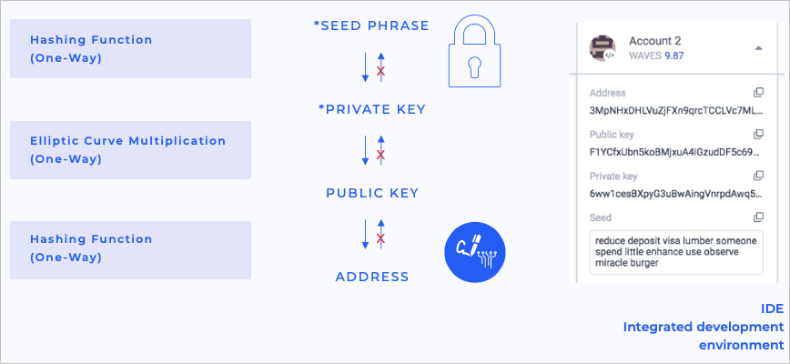

## Account definition ##

An account is a unique record on the platform where its management is available only to its creator. Every person can create an account on the Waves blockchain platform and manage funds. Previously, we mentioned seed phrases and private and public keys in the lesson [Getting to know web 3.0](#Digitalsignatureschapter). Now we can connect all this knowledge into one whole piece. The main goal of an account is to provide resource management available only to the account owner. Nowadays, the security and safety of your funds are critically vital. Therefore if one is to have a private account, one has to ensure the account will be secured and the funds will remain safe and untouched by malefactors. Blockchain cryptography offers a solution to account security that makes it impossible to hack it.

Let's run through the stages of account creation to understand why it is safe. Schematically, it would look like this:


1. **<u>Account creation from a seed phrase</u>**   
If we were to create an account on any social media, most likely, we would be asked to use our phone number, nickname, or email and enter a password. On our platform, it is possible to create an account from a seed phrase. A seed phrase is a set of different words that will be encoded into a hash with the help of the SHA256 algorithm. Users can either type any seed phrase manually or receive a random unique seed phrase during registration. As an example, the phrase `I love Waves` will turn into a hash `0da73e9fd2df9630bcb689f5b66e76b7d1809d71ea841f7e075b8b82bd05a155`. It will be impossible to calculate it backwards that the hash `0da73e9fd2df9630bcb689f5b66e76b7d1809d71ea841f7e075b8b82bd05a155` is equal to `I love Waves`. The probability of generating two identical seed phrases is 1/2048<sup>15</sup> that even after millions of years and the heat death of the universe, a hacker would not be able to get access to the seed.
1. **<u>Private key generation from the seed</u>**  
A private key is intended for transaction signature. It is automatically generated after an account is created with the seed phrase. Every account has only one private key. The mission of a private key is to sign transactions or orders. For instance, if someone wants to send money from an A account to a B account, he must prove ownership of the A account, so the private key plays the role of such an approver. No one except the account owner can receive access to this private key. A private key can look like this: `6yCStrsBs4VgTmYcSgF37pmQhCo6t9LZk5bQqUyUNSAs`.
3. **<u>Public key generation from the private key</u>**  
A public key is intended for transaction verification. From the received private key, a unique public key is automatically generated. Every account has one unique public key. After a [transaction]() is signed by an account, it has to be verified by [multiple nodes](nodesofthewaves) as a valid one. Since network nodes do not have access to private keys, they can only check the [transaction signature](https://docs.waves.tech/en/blockchain/transaction/transaction-proof) against the public key. The result of such a verification function can be either `true`, meaning the user who initiated the transaction has a valid private key so that the transaction can be permitted, or `false`, meaning the user does not have a valid private key for this transaction initiation, and the transaction will be declined. A public key example: `5cqzmxsmFPBHm4tb7D8DMA7s5eutLXTDnnNMQKy2AYxh`.
4. **<u>Account address generation from the public key</u>**  
The final step of account generation is account address generation. An account address is generated from the public key of the account. Everyone can see the address of your account as it is public information, yet, it has no disclosure of your identity and any personal data. Account address instance: `3PDfnPknnYrg2k2HMvkNLDb3Y1tDTtEnp9X`.

This subsequential chain of steps of seed phrases transformation into private/public keys and an account address is one-sided. It will not be possible to calculate from an account address, a public or a private key what your seed phrase was. The only possible scenario is if a hacker would overtake all world's computers and concentrate on attempting to hack a particular account for the next thousands centuries. Therefore keeping a seed phrase in secret is a way to protect an account.



In the lessons, [What is a smart account and setting account script]() and [What is a dApp and dApp creation]() we covered definition of a smart account and a dApp. A smart account or a dApp are also considered accounts, yet with an additional configuration that regular accounts do not have.

## Operations with account ##

There are multiple different operations that we can perform with with an account:
- Account creation
- 


### Account creation ###

Essential attributes

<CodeBlock>

```js
```
```java
package com.wavesplatform.examples;
import com.wavesplatform.transactions.account.Address;
import com.wavesplatform.transactions.account.PrivateKey;
import com.wavesplatform.transactions.account.PublicKey;
import com.wavesplatform.transactions.common.ChainId;
import com.wavesplatform.wavesj.Node;
import com.wavesplatform.wavesj.Profile;
import com.wavesplatform.wavesj.exceptions.NodeException;
import java.io.IOException;

public class WavesExample {
    public static void main(String[] args) throws NodeException, IOException {
        // Create a node instance
        Node node = new Node(Profile.TESTNET);
        // Create the private key from a seed
        PrivateKey privateKey = PrivateKey.fromSeed("seed phrase");
        // Get the public key from the private key
        PublicKey publicKey = PublicKey.from(privateKey);
        // Get an address from the public key
        Address address = Address.from(ChainId.TESTNET, publicKey);
        // Print the address
        System.out.println(address.encoded());
    }
} 
```
```php
```
```csharp
```
```go
package main

import (
    "context"
    "fmt"
    "net/http"
    "time"
    "github.com/tyler-smith/go-bip39"
    "github.com/wavesplatform/gowaves/pkg/client"
    "github.com/wavesplatform/gowaves/pkg/crypto"
    "github.com/wavesplatform/gowaves/pkg/proto"
)

func main() {
    // Generate a new random entropy bytes
    entropy, err := bip39.NewEntropy(160)
    if err != nil {
        panic(err)
    }
    // Make a mnemonic seed phrase out of the entropy
    mnemonic, err := bip39.NewMnemonic(entropy)
    if err != nil {
        panic(err)
    }
    fmt.Println("Seed:", mnemonic)
    // Generate a key pair for the seed phrase
    // The private key (first value returned) is not used later, so it can be omitted
    _, pk, err := crypto.GenerateKeyPair([]byte(mnemonic))
    if err != nil {
        panic(err)
    }
    // Make an address from the public key witin the Testnet network
    addr, err := proto.NewAddressFromPublicKey(proto.TestNetScheme, pk)
    if err != nil {
        panic(err)
    }
    fmt.Println("Address:", addr.String())
} 
```
```python
```

</CodeBlock>

### Different methods ###


