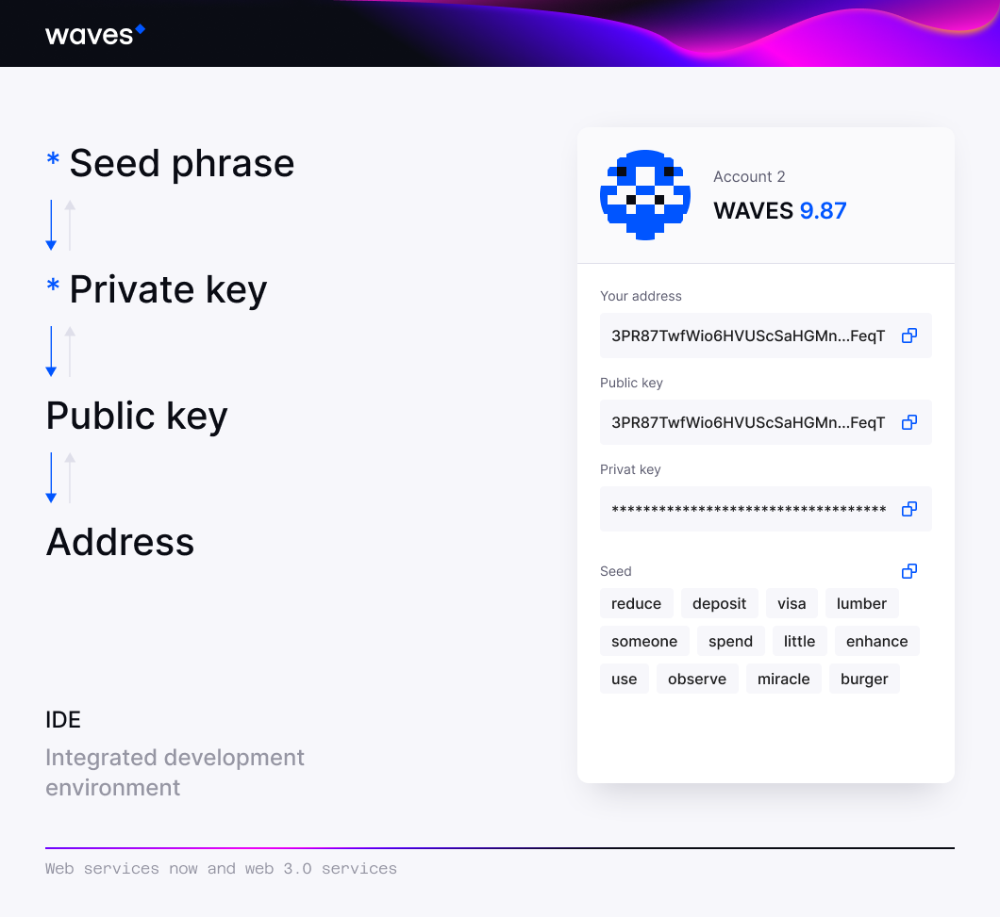

## Account definition ##

An account is a unique record on the platform where its management is available only to its creator. 
Every person can create an account on the Waves blockchain platform and manage resources. 
In the lesson [Getting to know web 3.0](#Digitalsignatureschapter), we mentioned essential account entities: a seed phrase, private and public keys, and an address.
This lesson's material will provide a broader understanding of creating a private/public key and an account address using client libraries.

Let's run through the stages of account creation:

<Message type="warning">

The stages described below will demonstrate the most common way of account creation, i.e., via a manually specified seed phrase.
However, it is also possible to create an account via five different methods:
1. **Randomly generated seed phrase**;  
2. **Given bytes set of seed phrase**;
3. **Randomly generated bytes set of seed phrase**;
4. **Given bytes set**;
5. **Base58 encoded string**.

Read about [all possible methods of account creation](#different-methods-of-account-creation).
</Message>



1. **<u>Account creation from a seed phrase</u>**   
If we were to create an account on any social media, most likely, we would be asked to use our phone number, nickname, or email and enter a password.
On our platform, it is possible to create an account from a seed phrase, providing a much higher level of account security. 
A seed phrase is a set of different words that will be encoded into a hash with the help of the SHA256 algorithm.
As an example, the phrase `I love Waves` will turn into a hash `0da73e9fd2df9630bcb689f5b66e76b7d1809d71ea841f7e075b8b82bd05a155`. 
It will be impossible to calculate it backwards that the hash `0da73e9fd2df9630bcb689f5b66e76b7d1809d71ea841f7e075b8b82bd05a155` is equal to `I love Waves`.
Typically, a seed phrase can be a set of 15-16 words, for example:
`couple remind obey mind core window talk maid small crisp card sure valve position sword`.
The probability of generating two identical seed phrases is 1/2048<sup>15</sup> that even after millions of years and the heat death of the universe, a hacker would not be able to get access to the seed.
2. **<u>Private key generation from the seed</u>**  
A private key is intended for transaction and order signature. 
In other words, it is a way to prove that you are the account owner authorized to perform transactions. 
Every account has one unique private key that cannot be changed. 
For instance, if someone wants to send money from an A to a B account, he must prove ownership of the account A. Signing a transaction with the private key plays the role of such an approver. No one except the account owner can receive access to this private key. 
A private key can look like this: `6yCStrsBs4VgTmYcSgF37pmQhCo6t9LZk5bQqUyUNSAs`.
At this step, a cryptographic algorithm transforms your seed phrase into the private key of your account.
3. **<u>Public key generation from the private key</u>**  
A public key is intended for transaction verification. 
Every account has one unique public key that cannot be changed. 
After a [transaction]() is signed by an account with a private key, it has to be verified by [multiple nodes](nodesofthewaves) as a valid one. 
Since network nodes do not have access to private keys, they can only check a [transaction signature](https://docs.waves.tech/en/blockchain/transaction/transaction-proof) against a public key. 
The result of such a verification function can be either `true`, meaning the user who initiated the transaction has a valid private key so that the transaction can be permitted, or `false`, meaning the user does not have a valid private key for this transaction initiation, and the transaction will be declined. 
A public key example: `5cqzmxsmFPBHm4tb7D8DMA7s5eutLXTDnnNMQKy2AYxh`.
At this step, a cryptographic algorithm transforms your private account key into the public account key.
4. **<u>Account address generation from the public key</u>**  
The final step of account generation is account address generation. 
An account address is generated from the public key of the account. 
Everyone can see the address of your account as it is public information, yet, it has no disclosure of your identity or personal data. 
An account address instance: `3PDfnPknnYrg2k2HMvkNLDb3Y1tDTtEnp9X`.


This sequential chain of steps of a seed phrase transformation into private/public keys and an account address is one-sided. It will not be possible to calculate from an account address, a public or a private key what your seed phrase was. The only likely scenario is if a hacker would overtake all world's computers and concentrate on attempting to hack a particular account for the next thousands of centuries without any guarantees to succeed. Therefore keeping a seed phrase secret is a way to protect an account.

In the lessons [What is a smart account and setting account script]() and [What is a dApp and dApp creation](), we covered the definition of a smart account and a dApp. A smart account or a dApp are also considered accounts with an additional configuration that regular accounts do not have.

## Operations with accounts ##

This chapter will help to distinguish operations with accounts among many possible actions on the Waves blockchain. All operations with assets can be grouped into two categories:
- **<u>Transactions</u>**:   
    Out of [various transaction types](https://docs.waves.tech/en/blockchain/transaction-type/), there are approximately four of them that are related to interaction with accounts:
    * [Create alias transaction]()
    * [Data transaction]()  
    * [Set script transaction]()  
    * [Invoke script transaction]()  

    The lesson [Work with assets]() will be dedicated to elaborating on these transaction types.
- **<u>Node object methods</u>**:  
    * **`getAddresses`**  
        Get a list of account addresses in the [node wallet](https://docs.waves.tech/en/waves-node/how-to-work-with-node-wallet).
    * **`getBalance`**  
        Get the regular balance in WAVES at a given address. Read more about [account balance types](https://docs.waves.tech/en/blockchain/account/account-balance).
    * **`getBalanceDetails`**  
        Get [available, regular, generating, and effective account balances](https://docs.waves.tech/en/blockchain/account/account-balance#account-balance-in-waves).
    * **`getBalances`**  
        Get regular balances for multiple addresses. Read more about [account balance types](https://docs.waves.tech/en/blockchain/account/account-balance).
    * **`getData`**  
        Read account [data entries](https://docs.waves.tech/en/blockchain/account/account-data-storage) by given keys.
    * **`getScriptInfo`**          
        Get an [account script]() or a [dApp script]() information by a given address.
    * **`getScriptMeta`**  
        Get an [account script]() meta data.

## Different methods of account creation ##

To create an [account](#account-definition), you will need to obtain:
- **[private key](#private-key-creation)**
- **[public key](#public-key-creation)**
- **[address](#account-address-creation)**

### Private key creation ###

Aside from using a seed phrase as the foundation of account creation, there are also different methods where the function of a seed phrase is performed by an array of bytes or a base8 encoded string. You can use any of the six ways to create a private key via:

1. **Given seed phrase**:  
    It is possible to create an account via a manually written seed phrase. We used this way of an account creation in the [library initialization chapter](b36f01e4-ac85-4aa4-8a7f-9fe6a5fc26f8#how-to-initialize-a-library-to-start-operating-with-the-waves-blockchain). 

    <CodeBlock>

    ```js
    ```
    ```java
    // Create a private key from a seed
    PrivateKey privateKey = PrivateKey.fromSeed("seed phrase");
    ```
    ```php
    ```
    ```csharp
    ```
    ```go
    ```
    ```python
    ```

    </CodeBlock>
2. **Randomly generated seed phrase**:  
    When creating an account from a randomly generated seed phrase, you can specify the optional parameter of a [`nonce`](https://ru.wikipedia.org/wiki/Nonce) step.

    <CodeBlock>

    ```js
    ```
    ```java
    // Generate a random seed phrase
    String seed = Crypto.getRandomSeedPhrase();
    // Create the private key from the seed
    PrivateKey privateKey = PrivateKey.fromSeed(seed);
    // Create the private key from the seed and the nonce step of 2
    PrivateKey privateKey = PrivateKey.fromSeed(seed, 2);
    ```
    ```php
    ```
    ```csharp
    ```
    ```go
    ```
    ```python
    ```

    </CodeBlock>
3. **Given bytes set of seed phrase**:

    <CodeBlock>

    ```js
    ```
    ```java
    // Create a seed phrase bytes set 
    byte[] seedBytes = {21, 55, 87, 117, -8, -81, 77, 77, -99, -87, -23, 7, 116, -99, -20, -12, -4};
    // Create the private key from the seed phrase bytes set
    PrivateKey privateKey = PrivateKey.fromSeed(seedBytes);
    ```
    ```php
    ```
    ```csharp
    ```
    ```go
    ```
    ```python
    ```

    </CodeBlock>
4. **Randomly generated bytes set of seed phrase**:

    <CodeBlock>

    ```js
    ```
    ```java
    // Generate a random seed phrase bytes set 
    byte[] randomSeedBytes = Crypto.getRandomSeedBytes();
    // Create the private key from the random seed phrase bytes set
    PrivateKey privateKey = PrivateKey.fromSeed(randomSeedBytes);
    ```
    ```php
    ```
    ```csharp
    ```
    ```go
    ```
    ```python
    ```

    </CodeBlock>
5. **Given bytes set**: 

    <CodeBlock>

    ```js
    ```
    ```java
    // Create a bytes set
    byte[] bytes = {56, -3, 37, 64, 2, 38, 78, 37, -98, -45, -23, 117, 14, 88, 20, 42, -9,
                21, 55, 87, 117, -8, -81, 77, 77, -99, -87, -23, 7, 116, -99, -20};
    // Create the private key from seed bytes
    PrivateKey privateKey = PrivateKey.as(bytes);
    ```
    ```php
    ```
    ```csharp
    ```
    ```go
    ```
    ```python
    ```

    </CodeBlock>
6. **Base58 encoded string**:

    <CodeBlock>

    ```js
    ```
    ```java
    // Create a Base58 encoded string
    String base58PhraseEncoded = "8hVeUrGJqb2yvecqmssSc7MP9SwKLQYycW7H1Zz3omwA";
    // Create the private key from the Base58 encoded string
    PrivateKey privateKey = PrivateKey.as(base58PhraseEncoded);
    ```
    ```php
    ```
    ```csharp
    ```
    ```go
    ```
    ```python
    ```
    </CodeBlock>

### Public key creation ###

Invoke the `publicKey` method from the [private key](#private-key-creation) to create a public key:

<CodeBlock>

```js
```
```java
// Create the public key from the private key
PublicKey publicKey =  privateKey.publicKey();
```
```php
```
```csharp
```
```go
```
```python
```
</CodeBlock>

### Account address creation ###

Receive the address from the [public key](#public-key-creation):

<CodeBlock>

```js
```
```java
// Get the account address from the public key
// Specify the network (TESTNET, MAINNET, STAGENET)
Address address = Address.from(ChainId.TESTNET, publicKey);
```
```php
```
```csharp
```
```go
```
```python
```
</CodeBlock>
