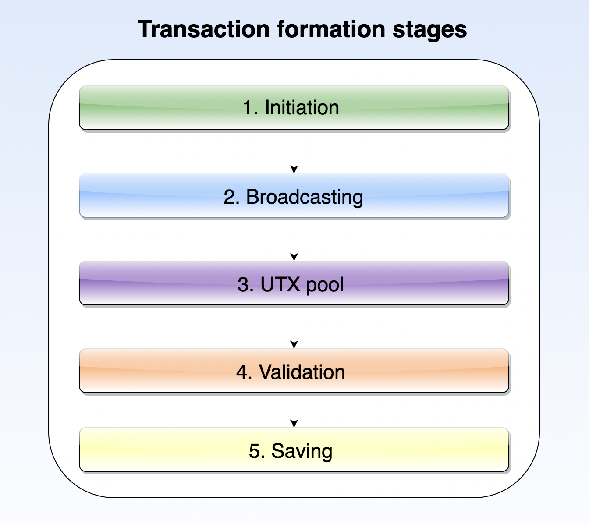
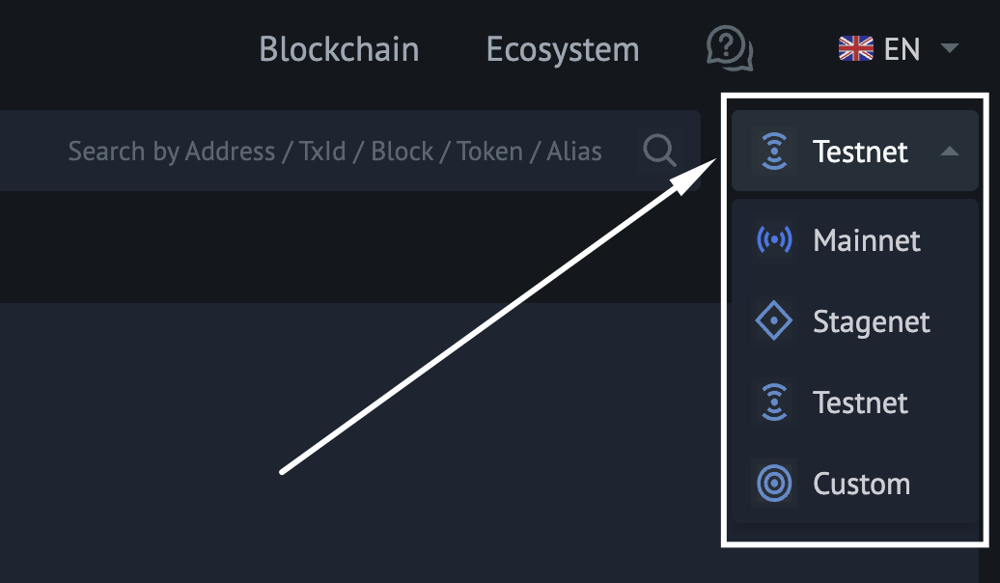
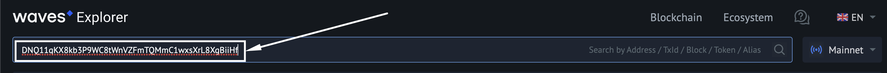
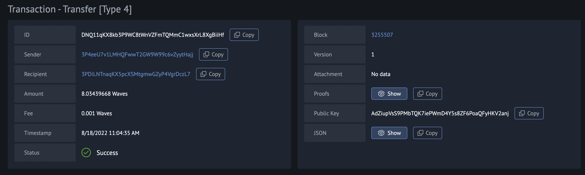
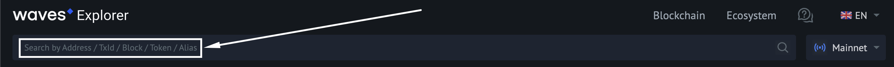

## Transaction definition ##

A transaction is an action made on the blockchain on behalf of an [account](). Every transaction is associated with an account and is inseparable from it. In this lesson’s chapter [Transaction types](#transaction-types), you will become familiar with all possible transaction types within the Waves blockchain. A regular transaction demonstration can be a cryptocurrency transfer from one account to another. Here we have both an account and an action made on behalf of that account - a transfer from one wallet to another.

Every transaction goes through different formation stages, from its initiation to the final appearance on the blockchain, which will be elaborated on in the chapter [Stages of a transaction formation](#stages-of-a-transaction-formation). All transactions are charged with a [fee](#transaction-fees).

## Stages of a transaction formation ##

<Message type="info">

Kindly note that [initializing the library](b36f01e4-ac85-4aa4-8a7f-9fe6a5fc26f8#how-to-initialize-a-library-to-start-operating-with-the-waves-blockchain) is vital before beginning working with transactions. 
</Message>

Before a transaction gets into the blockchain, it must pass all necessary transaction formation stages. In the illustration below, you may see five major steps that every transaction goes through:



There are five important steps:
1. **<u>Transaction initilization</u>**  
    During this step, an account initiates a transaction, specifying all necessary parameters. Once all parameters are specified, the transaction has to be signed with a [private key]() of that account. The signature represents proof that the account owner initiated the transaction. 
    For example, we can refer to an [Issue transaction]() that issues a new asset, where a user needs to specify the name of the asset, its quantity, reissuability, etc. Afterward, the transaction gets signed by the account owner.

    <CodeBlock>

    ```js
    ```
    ```java
    // Create an issue transaction
    IssueTransaction tx = new IssueTransaction(
            senderPublicKey,
            "sampleasset", 
            "description of the asset", 
            1000, 
            2, 
            false,
            null) 
            .addProof(senderPrivateKey); 
    ```
    ```php
    ```
    ```csharp
    ```
    ```go
    ```
    ```python
    ```

    </CodeBlock>
2. **<u>Transaction broadcasting</u>**  
    A signed transaction must be broadcasted to a node, which means sending information about the signed transaction to a node.
    It can be done two ways:
    - [REST API](http://127.0.0.1:6869/api-docs/index.html#/transactions/broadcastSignedTx) service of your node with a [JSON transaction representation](https://docs.waves.tech/en/blockchain/transaction/#json-representation). Read more about [how to run a node]().
    - Client libraries:
        <CodeBlock>

        ```js
        ```
        ```java
        // Broadcast the transaction and wait for it to be included in the blockchain
        node.waitForTransaction(node.broadcast(tx).id())
        ```
        ```php
        ```
        ```csharp
        ```
        ```go
        // Context to cancel the request execution on timeout
        ctx, cancel := context.WithTimeout(context.Background(), 10*time.Second)
        defer cancel()
        // Broadcast the transaction to the network
        _, err = cl.Transactions.Broadcast(ctx, tx)
        if err != nil {
            panic(err)
        }
        ```
        ```python
        ```

        </CodeBlock>
3. **<u>UTX pool</u>**  
    A node that received a broadcasted transaction will send this transaction to the [UTX pool](https://docs.waves.tech/en/blockchain/glossary#utx-pool) (Unconfirmed Transaction Pool). This is where all transactions are temporarily stored and checked whether they are valid before deciding if they can be included in the blockchain. A real-life comparison can be a conveyer that operates with car parts and separates all working parts from defective ones.
4. **<u>Transaction validation</u>**  
    Multiple nodes in the network are working with the UTX pool and verifying transactions. The verification process includes such elements as checking if an account truly initiated the transaction and signed it with a valid [private key](), if the account had a sufficient available balance, and so on. Different [transaction types](#transaction-types) have different parameters to be verified. 
5. **<u>Saving a transaction into the blockchain</u>**  
    If nodes approve a transaction during the verification step in the UTX pool, a node owner who generates the next block will include a transaction in the blockchain. The blockchain will store the transaction data in binary format (bytes). If you wish to earn a reward for generating a block, read the module [Mining and earning on it]() to discover the steps to make it.

An example of a complete transaction (from its initiation to broadcasting to a node) can look like this:

<CodeBlock>

```js
```
```java
Node node = new Node(Profile.TESTNET);
PrivateKey privateKey = PrivateKey.fromSeed("seed phrase");
IssueTransaction tx = new IssueTransaction(
        privateKey.publicKey(),
        "asset", 
        "description", 
        1000, 
        2, 
        false,
        null) 
        .addProof(privateKey); 
node.waitForTransaction(node.broadcast(tx).id());
```
```php
```
```csharp
```
```go
```
```python
```

</CodeBlock>

## How to view transaction details ##

All information about completed transactions, both accepted or declined unless failed, can be viewed in three ways:
- [Waves Explorer](https://new.wavesexplorer.com/)  
    To find a transaction and view it in a user-friendly interface, you can use [Waves Explorer](https://new.wavesexplorer.com/). It will be possible to find a transaction by its ID. To find out the details of a transaction, follow the steps below:
    1. Open [Waves Explorer](https://new.wavesexplorer.com/);
    2. Select the [network]() where this transaction was made:
        
    3. Insert the ID of a transaction into the search bar and click enter:
        
    4. You will see details of the transaction:
        

    As well, you can encounter a transaction among operations made with a particular token ID, a particular account address, its alias, or within a block that included this transaction:

    
- [REST API UI]()  
    With [REST API of your node](https://docs.waves.tech/en/waves-node/node-api/) or the [Mainnet REST API](https://nodes.wavesnodes.com/) use the following methods:
    * **GET** `/transactions/info/{id}`  
        Returns transaction data by transaction ID.
    * **GET** `/transactions/address/{address}/limit/{limit}`  
        Returns the list of transactions where the specified address is involved.
    * **GET** `/blocks/at/{height}`  
        Returns block data at the specified height, including all transactions in the block.

    As an output, you will see a JSON representation of the requested data, for example:

    ```
    {
        "type": 3,
        "id": "DG2xFkPdDwKUoBkzGAhQtLpSGzfXLiCYPEzeKH2Ad24p",
        "fee": 100400000,
        "feeAssetId": null,
        "timestamp": 1574429393962,
        "version": 2,
        "sender": "3PC9BfRwJWWiw9AREE2B3eWzCks3CYtg4yo",
        "senderPublicKey": "BRnVwSVctnV8pge5vRpsJdWnkjWEJspFb6QvrmZvu3Ht",
        "proofs": [
            "3HNpbVkgP69NWSeb9hGYauiQDaXrRXh3tXFzNsGwsAAXnFrA29SYGbLtziW9JLpXEq7qW1uytv5Fnm5XTUMB2BxU"
        ],
        "assetId": "DG2xFkPdDwKUoBkzGAhQtLpSGzfXLiCYPEzeKH2Ad24p",
        "name": "USD-N",
        "quantity": 1000000000000000000,
        "reissuable": false,
        "decimals": 6,
        "description": "Neutrino USD",
        "script": null,
        "chainId": 87,
        "height": 1806810,
        "spentComplexity": 0
    }
    ```
- [Client libraries]()  
   After every listed transaction, we will provide a variable that enables logging information about it. 
   You can see an [example](issuetx) with a variable that is intended for logging transaction information:

   <CodeBlock>

    ```js
    ```
    ```java
    // Get information about the transaction from a node
    IssueTransactionInfo issueTxInfo = node.getTransactionInfo(ussueTx.id(), IssueTransactionInfo.class);
    ```
    ```php
    ```
    ```csharp
    ```
    ```go
    ```
    ```python
    ```

    </CodeBlock>

## Transaction fees ##

Transactions performance on the Waves blockchain is charged with a fee. A fee is paid by an account owner that initiated a transaction. The bigger the fee is, the quicker a transaction will be added to a new block. Transaction fees in the Waves blockchain are ultimately cheap. Below you can see a table with the fee amount for a few transaction types:

| Transaction type | Transaction type ID | Minimum transaction fee in WAVES |
| :--- | :--- | :--- |
| [Issue transaction]() | 3 | - 1 for [reqular token]()<br> - 0.001 for [non-fungible token]() |
| [Transfer transaction]() | 4 | 0.001 | 
| [Create alias transaction]() | 10 | 0.001 |

For more details on all transaction types, refer to the [complete documentation](https://docs.waves.tech/en/blockchain/transaction/transaction-fee#minimum-fee).

## Transaction types ##

All transaction types that exist within the Waves blockchain can be split into five modules:
1. **<u>[Work with assets]()</u>**
   - [Issue transaction]()  
        Creates a new token.
   - [Reissue transaction]()  
        Increases the amount of a token on the blockchain and/or prohibits its reissue.
   - [Update asset info transaction]()  
        Modifies the name and description of a token.
   - [Burn transaction]()  
        Decreases the amount of a token on a sender's account and, thereby, the total amount of the token on the blockchain.
   - [Set asset script transaction]()  
        Replaces an asset script.
   - [Sponsor fee transaction]()  
        Enables or disables sponsorship that allows users to pay a fee in the sponsored asset instead of WAVES.
2. **<u>[Work with accounts]()</u>**
   - [Create alias transaction]()  
        Creates an alias for a sender's address.
   - [Data transaction]()  
        Adds, modifies, and deletes data entries in a sender's account data storage.
   - [Set script transaction]()  
        Assigns a dApp script or an account script to the sender's account.
   - [Invoke script transaction]()  
        Invokes a callable function of a dApp.
3. **<u>[Performing transfers]()</u>**
   - [Transfer transaction]()  
        Transfers a certain amount of a token to another account.
   - [Mass transfer transaction]()  
        Transfers a token to several accounts (from 1 to 100).
   - [Exchange transaction]()  
        Exchanges two different tokens between two accounts.
4. **<u>[Leasing]()</u>**
   - [Lease transaction]()  
        Leases WAVES to another account.
   - [Lease cancel transaction]()  
        Cancels leasing.
5. **<u>[Ethereum transaction]()</u>**  
   - [Ethereum transfer]()  
         A MetaMask user can sign an Ethereum transaction that transfers a token and sends the transaction to the Waves blockchain.
   - [Ethereum dApp script invocation]()  
         A MetaMask user can sign an Ethereum transaction that invokes a dApp script and send the transaction to the Waves blockchain.

Every transaction type will be described in the relevant transaction module with its detailed description and code examples.
