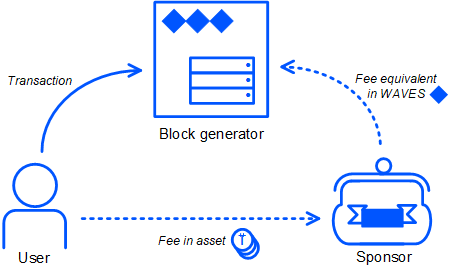

## Transactions of work with assets ##  

As we mentioned in [Transaction types]() of the lesson [Transaction definition and work with transactions](), there are six transactions types that can be classified as transactions intended for work with assets:
- [Issue transaction](#issue-transaction)  
- [Reissue transaction](#reissue-transaction)  
- [Update asset info transaction](#update-asset-info-transaction)  
- [Burn transaction](#burn-transaction)  
- [Set asset script transaction](#set-asset-script-transaction)  
- [Sponsor fee transaction](#sponsor-fee-transaction)

Within this lesson, we will describe these transaction types in detail. Firstly, we will discuss what a transaction is intended for. Secondly, transaction attributes will be explained. Lastly, a demonstration of how this transaction is created in different programming languages (Javascript, Java, PHP, C#, Go, Python) will be given.

## Issue transaction ##

### Description ###

The issue transaction is intended for issuing a new token on the Waves blockchain. As per [Asset creation and operation with assets](), we mentioned two different purposes for creating a new token within the blockchain: a new token as a cryptocurrency or as an object. 

The minimum fee for an issue transaction is 1 WAVES, in case of issue of a non-fungible token (NFT) 0.001 WAVES. Read more about [Issue transaction](https://docs.waves.tech/en/blockchain/transaction-type/issue-transaction).

### Attributes ###

### Transaction example ###


<CodeBlock>

```js
```
```java
```
```php
```
```csharp
```
```go
```
```python
```

</CodeBlock>

## Reissue transaction ##

### Description ###

The reissue transaction aims to increase the amount of a token that was created via [Issue transaction](#issue-transaction). Only the token issuer can perform a reissue transaction. The additional amount of token increases the balance of the transaction sender. As well, it is possible to make your token non-reissuable, which would limit the amount of a token in the blockchain.

The minimum fee for a reissue transaction is 0.001 WAVES. Read more about [Reissue transaction](https://docs.waves.tech/en/blockchain/transaction-type/reissue-transaction).

### Attributes ###

### Transaction example ###

<CodeBlock>

```js
```
```java
```
```php
```
```csharp
```
```go
```
```python
```

</CodeBlock>

## Update asset info transaction ##

### Description ###

The update asset info transaction updates the name or the description of a token. Only the token issuer can perform a update asset info transaction.  
The token name and/or description can be changed in [different networks]():
- **<u>Mainnet and Testnet</u>**:  
    After 100,000 or more blocks from the last change (or the token issue);
- **<u>Stagenet</u>**:  
    After 10 or more blocks.
The average time of a block creation is approximately one minute.

The minimum fee for an update asset info transaction is 0.001 WAVES, in case of a smart asset 0.005 WAVES. Read more about [Update asset info transaction](https://docs.waves.tech/en/blockchain/transaction-type/update-asset-info-transaction).

### Attributes ###

### Transaction example ###

<CodeBlock>

```js
```
```java
```
```php
```
```csharp
```
```go
```
```python
```

</CodeBlock>

## Burn transaction ##

### Description ###

The burn transaction decreases the amount of a token on the sender's account and thereby the total amount of the token on the blockchain. Any account that owns a token (not necessarily the token issuer) can perform a burn transaction. Burned tokens cannot be restored back to the account.

The minimum fee for a burn transaction is 0.001 WAVES, in case of burning a smart asset 0.005 WAVES. Read more about [Burn transaction](https://docs.waves.tech/en/blockchain/transaction-type/burn-transaction).

### Attributes ###

### Transaction example ###

<CodeBlock>

```js
```
```java
```
```php
```
```csharp
```
```go
```
```python
```

</CodeBlock>

## Set asset script transaction ##

### Description ###

The set asset script transaction replaces an asset's script. Only the token issuer can perform an asset script transaction. If a token is issued without a script, then no script can be assigned to it later. It is also impossible to remove the script and turn a smart asset into a regular one.

The minimum fee for a set asset script transaction is 1 WAVES. Read more about [Set asset script transaction](https://docs.waves.tech/en/blockchain/transaction-type/set-asset-script-transaction).

### Attributes ###

### Transaction example ###

<CodeBlock>

```js
```
```java
```
```php
```
```csharp
```
```go
```
```python
```

</CodeBlock>

## Sponsor fee transaction ##

### Description ###

The sponsor fee transaction enables or disables sponsorship. Sponsorship allows any sender to pay a fee in the sponsored asset (instead of WAVES) for [invoke script transactions]() and [transfer transactions](). Only the asset issuer can set up a sponsorship. A smart asset cannot be a sponsored asset.

To understand the concept of the sponsor fee transaction, we can recall that performing any transaction on the Waves blockchain is not free, and there is always a cheap fee (for most transactions, the minimum fee is 0.001 WAVES). Let's imagine a scenario where paying a transaction fee would become unnecessary. A developer created an [asset](#issue-transaction), called SAMPLE, where he enabled sponsorship, so every user who wishes to operate with that asset will not need to pay fees in WAVES. The developer gave away 100 SAMPLE to a random user. If the user transfers this token from his account to another, he will not pay the fee for the transfer in WAVES. Instead, he will pay a fee in the sponsored asset, SAMPLE, and the asset creator will pay the fee equivalent in WAVES for this token transfer. 



Read more about [Sponsor fee transaction](https://docs.waves.tech/en/blockchain/transaction-type/sponsor-fee-transaction).

### Attributes ###

### Transaction example ###

<CodeBlock>

```js
```
```java
```
```php
```
```csharp
```
```go
```
```python
```

</CodeBlock>