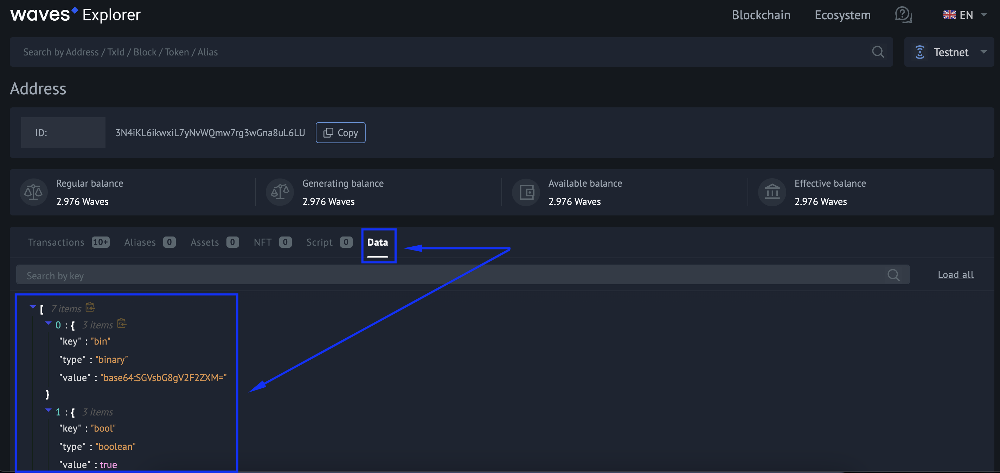

## Transactions of work with accounts ##  

As we mentioned in [Transaction types]() of the lesson [Transaction definition and work with transactions](), there are four transactions types that can be classified as transactions intended for work with accounts:
- [Create alias transaction](#create-alias-transaction)
- [Data transaction](#data-transaction)  
- [Set script transaction](#set-script-transaction)  
- [Invoke script transaction](#invoke-script-transaction)  

Within this lesson, we will describe these transaction types in detail. Firstly, we will discuss what a transaction is intended for. Secondly, transaction attributes will be explained. Lastly, a demonstration of how this transaction is created in different programming languages (Javascript, Java, PHP, C#, Go, Python) will be given.

## Create alias transaction ##

### Description ###

The create alias transaction creates an alias for the sender's address. Every account is given an address that may look like this `3PF1hoz9hFBJQHXvCbHJ3Nk4ndqnEZ2n3Q8`, however, a user can also create an alias for the acccount. An alias can be somewhat similar to a nickname, for example, an alias "wavesfan" can be used the same way as an account address. Once an alias is created, it no longer can be deleted. 

The minimum fee for a Create Alias transaction is 0.001 WAVES. Read more about [Create alias transactions](https://docs.waves.tech/en/blockchain/transaction-type/create-alias-transaction).

### Attributes ###

### Transaction example ###


<CodeBlock>

```js
```
```java
```
```php
```
```csharp
```
```go
```
```python
```

</CodeBlock>

## Data transaction ##

### Description ###

The data transaction adds, modifies and deletes data entries in the sender's account [data storage](https://docs.waves.tech/en/blockchain/account/account-data-storage).

We will give a short explanation of what account data storage is and how it can be used in real world. Data storage of any account, as well as other blockchain data, are public and can be read by anyone. You can see data entries in [Waves Explorer](https://wavesexplorer.com/). To do this, find an account by its [address](https://docs.waves.tech/en/blockchain/account/address) or [alias](https://docs.waves.tech/en/blockchain/account/alias) and switch to the Data tab. 



As to practical use, for example, a developer could create a game, using the Waves blockchain as a database, where every account in the game has its progress saved in the account data storage.

The minimum fee for a Data transaction is 0.001 WAVES per kilobyte, the size is rounded up to an integer number of kilobytes. Read more about [Data transaction](https://docs.waves.tech/en/blockchain/transaction-type/data-transaction).

### Attributes ###

### Transaction example ###

<CodeBlock>

```js
```
```java
```
```php
```
```csharp
```
```go
```
```python
```

</CodeBlock>

## Set script transaction ##

### Description ###

The set script transaction assigns a [dApp script]() or an [account script]() to the sender's account. 

The minimum fee for a set script transaction is based on the script size: 0.001 WAVES per kilobyte. Read more about [Set script transaction](https://docs.waves.tech/en/blockchain/transaction-type/set-script-transaction).

### Attributes ###

### Transaction example ###

<CodeBlock>

```js
```
```java
```
```php
```
```csharp
```
```go
```
```python
```

</CodeBlock>

## Invoke script transaction ##

### Description ###

The invoke script transaction invokes a [callable function]() of a [dApp]().

The minimum fee in WAVES for an Invoke Script transaction is calculated as follows:
```
Fee = 0.005 + S + 1 × I
```
- If the transaction sender is a dApp or smart account, and that the complexity of the account script or dApp script verifier function exceeds the [sender complexity threshold](https://docs.waves.tech/en/ride/limits/), then `S` = 0.004, otherwise `S` = 0.
- `I` is the number of issued assets that are not NFT.

Read more about [Invoke script transaction](https://docs.waves.tech/en/blockchain/transaction-type/invoke-script-transaction).

### Attributes ###

### Transaction example ###

<CodeBlock>

```js
```
```java
```
```php
```
```csharp
```
```go
```
```python
```

</CodeBlock>