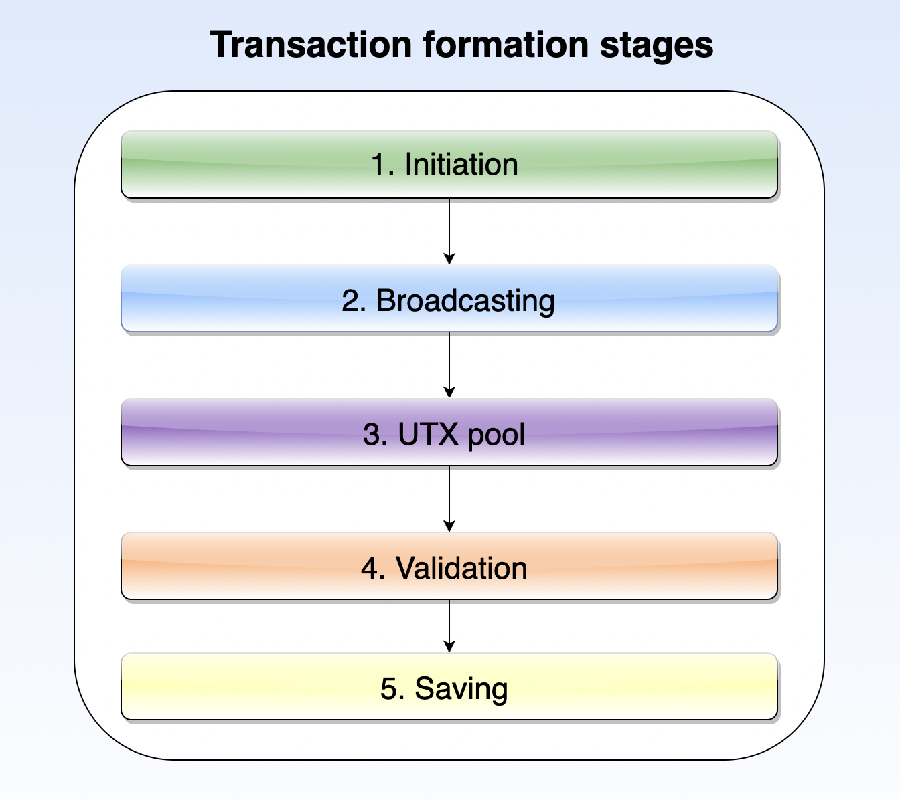

- [Transaction definition](#transaction-definition)
- [Stages of a transaction formation](#stages-of-a-transaction-formation)
- [Transaction fees](#transaction-fees)
- [Transaction types](#transaction-types)

## Transaction definition ##

A transaction is an action made on the blockchain on behalf of an [account](). Every transaction is associated with an account and is inseparable from it. In this lesson’s chapter [Transaction types](#transaction-types), you will become familiar with all possible transaction types within the Waves blockchain. A regular transaction demonstration can be a cryptocurrency transfer from one account to another. Here we have both an account and an action made on behalf of that account - a transfer from one wallet to another.

Every transaction goes through different formation stages, from its initiation to the final appearance on the blockchain, which will be elaborated in the chapter [Stages of a transaction formation](#stages-of-a-transaction-formation). All transactions are charged with a [fee](#transaction-fees).

## Stages of a transaction formation ##

Before a transaction gets into the blockchain, it has to pass all necessary stages of transaction formation. At the illustration below you may see five major steps that every transaction goes through:



There are five important steps:
1. **<u>Transaction initilization</u>**  
    During this step, an account initiates a transaction, specifying all necessary parameters. Once all parameters are specified, the transaction has to be signed with a [private key]() of that account. The signature represents proof that the account owner initiated the transaction. For example, we can refer to an [Issue transaction]() that issues a new asset, where a user needs to specify the name of the asset, its quantity, reissuability, etc. Afterward, the transaction gets signed by the account owner.
2. **<u>Transaction broadcasting</u>**  
    A signed transaction has to be broadcasted to a node, which means sending to a node an information about the signed transaction. For example, it can be done via the [REST API](http://127.0.0.1:6869/api-docs/index.html#/transactions/broadcastSignedTx) service of your node with a [JSON transaction representation](https://docs.waves.tech/en/blockchain/transaction/#json-representation). Also, if a user is more interface-oriented, another example can be given: once an account in [Waves Exchange](https://waves.exchange/) goes to the [WAVES withdrawal page](https://waves.exchange/withdraw/WAVES) and transfers WAVES to another wallet, the transaction will be broadcasted to a node.
3. **<u>UTX pool</u>**  
    A node that received a broadcasted transaction will send this transaction to the UTX pool (Unconfirmed Transaction Pool). This is a place, where all transactions are temporarily stored and checked whether they are valid before it is decided if this transaction can be included in the blockchain. A real life comparison can be a conveyer that operates with car parts and separates all working parts from defective ones. 
4. **<u>Transaction Validation</u>**  
    Multiple nodes in the network are working with the UTX pool and verifying transactions. The verification process includes such elements as checking if an account truly initiated the transaction and signed it with a valid private key, if the account had a sufficient available balance, and so on. Different [transaction types](#transaction-types) have different parameters to be verified. 
5. **<u>Saving into the blockchain</u>**  
    In the module [Mining and earning on it](), we installed a node that is ready for mining. In this final step, a node that will generate the next block will include a transaction in the blockchain if it was verified by nodes within the verification step out of the UTX pool. The transaction data will be stored in binary format (bytes) in the blockchain.
     
All information about completed transactions, both accepted or declined, unless failed, can be viewed three ways:
- [Waves Explorer](https://new.wavesexplorer.com/)  
    To find a transaction and view it in a user-friendly interface, you can use [Waves Explplorer](https://new.wavesexplorer.com/). It will be possible to find a transaction by its ID. 
    
    To find out details of a transaction, follow the steps below:
    1. Open [Waves Explplorer](https://new.wavesexplorer.com/);
    2. Select the [network]() where this transaction was made: 
    3. Insert the ID of a transaction to the search bar and click enter:
        
    4. You will see details of the transaction.
        

    As well you can encounter a transaction among operations made with a particular token ID, a particular account address, its alias or within a block that included this transaction:

    
- [REST API UI]()  
    With [REST API of your node](https://docs.waves.tech/en/waves-node/node-api/) or the [official Mainnet REST API](https://nodes.wavesnodes.com/) use the following methods:
    * GET /transactions/info/{id} returns transaction data by transaction ID.
    * GET /transactions/address/{address}/limit/{limit} returns the list of transactions where the specified address is involved.
    * GET /blocks/at/{height} returns block data at the specified height including all transactions in the block.

    As an output, you will see a JSON representation of the requested data. For example:

    ```
    {
        "type": 3,
        "id": "DG2xFkPdDwKUoBkzGAhQtLpSGzfXLiCYPEzeKH2Ad24p",
        "fee": 100400000,
        "feeAssetId": null,
        "timestamp": 1574429393962,
        "version": 2,
        "sender": "3PC9BfRwJWWiw9AREE2B3eWzCks3CYtg4yo",
        "senderPublicKey": "BRnVwSVctnV8pge5vRpsJdWnkjWEJspFb6QvrmZvu3Ht",
        "proofs": [
            "3HNpbVkgP69NWSeb9hGYauiQDaXrRXh3tXFzNsGwsAAXnFrA29SYGbLtziW9JLpXEq7qW1uytv5Fnm5XTUMB2BxU"
        ],
        "assetId": "DG2xFkPdDwKUoBkzGAhQtLpSGzfXLiCYPEzeKH2Ad24p",
        "name": "USD-N",
        "quantity": 1000000000000000000,
        "reissuable": false,
        "decimals": 6,
        "description": "Neutrino USD",
        "script": null,
        "chainId": 87,
        "height": 1806810,
        "spentComplexity": 0
    }
    ```
- [Client libraries]()  
    Clients libraries, written in different programming languages, allow interaction with the Waves blockchain. As one of the features, you can log information about transactions within your IDE. We will cover the [Client libraries]() topic a bit later.

## Transaction fees ##

All transactions on the Waves blockchain are charged with a fee. A fee is paid by an account owner that initiated a transaction. The bigger the fee is, the quicker a transaction will be added to a new block. Transaction fees in the Waves blockchain are ultimately cheap. Below you can see a table with the fee amount for a few transaction types:

| Transaction type | Transaction type ID | Minimum transaction fee in WAVES |
| :--- | :--- | :--- |
| [Issue transaction]() | 3 | - 1 for [reqular token]()<br> - 0.001 for [non-fungible token]() |
| [Transfer transaction]() | 4 | 0.001 | 
| [Create alias transaction]| 10 | 0.001 |

For more details on all transaction types, refer to the [complete documentation](https://docs.waves.tech/en/blockchain/transaction/transaction-fee#minimum-fee).

## Transaction types ##

All transaction types that exist within the Waves blockchain can be split into five modules:
1. **<u>Work with assets</u>**
   - [Issue transaction]()  
        Creates a new token.
   - [Reissue transaction]()  
        Increases the amount of a token on the blockchain and/or prohibits its reissue.
   - [Update asset info transaction]()  
        Modifies the name and description of a token.
   - [Burn transaction]()  
        Decreases the amount of a token on a sender's account and thereby the total amount of the token on the blockchain.
   - [Set asset script transaction]()  
        Replaces an asset script.
   - [Sponsor Fee Transaction]()  
        Enables or disables sponsorship that allows any user to pay a fee in the sponsored asset instead of WAVES.
2. **<u>Work with accounts</u>**
   - [Alias]()
   - [Data]()
   - [Set script]()
   - [Invoke script]()
3. **<u>Performing transfers</u>**
   - [Transfer]()
   - [Mass transfer]()
   - [Exchange]()
4. **<u>Leasing</u>**
   - [Lease]()
   - [Lease cancel]()
5. **<u>Ethereum transaction</u>**
    
