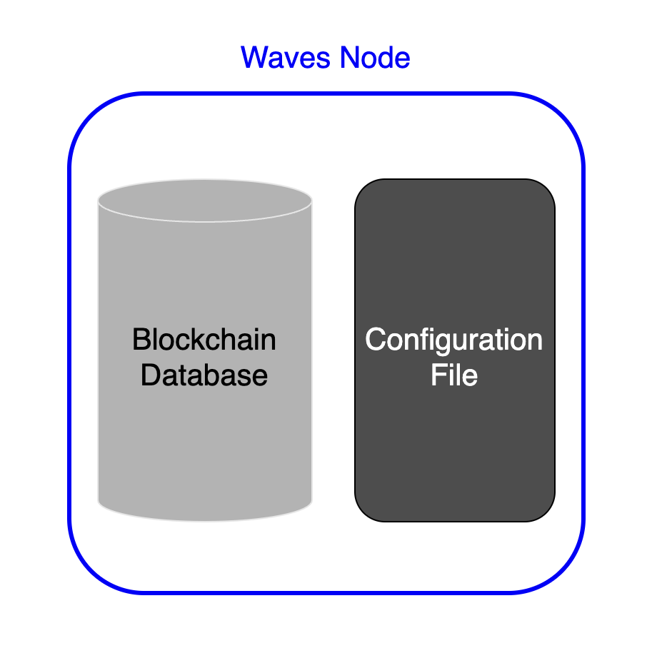

# Windows Node Installation #

  - [Node Structure](#node-structures)
  - [Prerequisites](#prerequisites)
  - [Node Installation](#node-installation)
    - [Docker Installation](#docker-installation)
    - [Waves Package Installation](#waves-package-installations)
 

---

## Node Structure ##

To make all of our steps of node installation clear, it is better, to begin with, a node structure explanation.  
Understanding the structure of the node will shed some light on major essences that the node interacts with.  

Under the bonnet, every node has:
- **<ins>Blockchain database</ins>**:  
    All the nodes of the Waves blockchain are intended to ensure [decentralization]().  
    Therefore, an indentical copy of all the blockchain data needs to be stored in every single node.  
- **<ins>Configuration file</ins>**:  
    A configuration file is a set of instructions of how a node should be working.  
    In the configuration file, we can define multiple parameters, for instance, which [network]() to connect to.



---

## Prerequisites ##

Before starting installation, make sure your Waves account has a [generating balance]() at least 1000 WAVES.  
Also, it would be necessary to keep on hand a Base58 encoded string of the seed phrase of your account.  
Here is how you can encode a seed phrase to Base58:  
1. Open the [Waves IDE](https://waves-ide.com/);
2. Click "RideREPL" down the screen:  
      
3. Insert in the function your seed phrase:
    `"your-seed-phrase".toBytes().toBase58String()`  
    For example, `"surround fever above evil walk slam left thought credit pinch life follow arch work stock".toBytes().toBase58String()`
4. Copy the function with your seed phrase to the console:  
      
5. Click "Enter" to get a Base58 encoded string of your seed phrase:
    
6. Save this Base58 encoded string, as we will use it later for node installation.  

---

## Node Installation ##

To install a node, you may use:
- <ins>[Docker](#docker-installation)</ins>:  
  Out-of-the-box solution easy to launch.  
  It is a ready container with minimum configurations you can run to have your own Waves node.
- <ins>[Waves Package](#waves-package-installation-s)</ins>:  
  For advanced users, it is possible to use the package.  
  Using the package is the way to set up a node with multiple configurations. 

Both ways are going to give you a fully working node.  
Feel free to use either of them.
  
### Docker Installation ###

Running a Waves docker container is the easiest way to install a node.  
Follow the steps below to install a Waves node:
1. Install [Docker Desktop](https://docs.docker.com/desktop/install/windows-install/) on Windows if it wasn't yet installed.
2. Pull the latest [docker image](https://hub.docker.com/r/wavesplatform/wavesnode) of the node:
    ```
    docker pull wavesplatform/wavesnode
    ```
3. Create folders to store the blockchain copy and a configuration file:

    ```
    md C:\wavesnode\data C:\wavesnode\conf
    ```
4. Open the Docker Desktop app in the "Images" section and click "Run":
    
5. The app will require you to fill in settings of the container that is about to run:
    |  |  | 
    | :-----: | :-----: |

    It will be necessary to fill the following fields:

    | Field Name | Description | Example |
    | :----- | :----- | :----- |
    | Container Name | Gives a name to a Docker container. | wavesnode |
    | Host Port | The port that will enable the REST API service on your localhos, for example, 127.0.0.1:6869.<br>In the next lesson, [Node Configuration](), we will configure REST API of your node.  | 6869 |
    | Volumes<br>(Host Path - Container Path) | [Docker volumes](https://docs.docker.com/storage/volumes/) are intended for "connecting" the data we store locally on our host with the storage of the container.<br>It is necessary to do it for both directories that store the blockchain data (`C:\wavesnode\data`) and the configuration file (`C:\wavesnode\conf`).<br>It will "link" the data from your host to the container's storage to:<br>- `/var/lib/waves` for the blockchain data;<br>- `/etc/waves` for the configuration file.<br>In case you would stop or restart the container, the blockchain copy and the configuration file will be cached locally on your computer, so no data will be lost after re-start.| Host Path:<br>`C:\wavesnode\data`<br>Container Path:<br>`etc/waves`<br><br>Host Path:<br>`C:\wavesnode\conf`<br>Container Path:<br>`var/lib/waves`| 
6.  Grant access to the folders.  
    A notification regarding access request to `C:\wavesnode\data` and `C:\wavesnode\conf` may pop up.  
7.  In the "Containers" section, make sure the status of the container is "Running". 
8.  Click on the container name:
    
    You will see multiple lines of logs.  
    Please, note it may take a few moments to deploy a node.  
    
    Once you see notifications about the height of the blockchain, it means everything is working properly:

    
All done! You have a working node deployed within your docker container!  
In the next lesson, [node configuration](), we will learn how to setup a configuration file of your node.  

### Waves Package Installation ###

Waves node installation via package is a more advanced way of node deployment.  
Follow the steps below to install a Waves node:
1. Install Java (OpenJDK 8).  
    Please, note, if you already have OpenJDK 11 installed, there is no need to roll it back to OpenJDK 8.  
    The node Installation is supported in both the 8th and the 11th versions.  
    Install OpenJDK8 as mentioned in the [documentation](https://access.redhat.com/documentation/en-us/openjdk/8/html/installing_and_using_openjdk_8_for_windows/openjdk8-windows-installation-options).  

    Check the JDK version with the following command:  
    
    ```
    java -version
    ```

    If you see in the output the version is such as below or higher, you can move to the next step:  

    ```
    java version "1.8.0_201"
    Java(TM) SE Runtime Environment (build 1.8.0_201-b09)
    Java HotSpot(TM) 64-Bit Server VM (build 25.201-b09, mixed mode)
    ```

2. Create folders to store the blockchain copy and a configuration file.  

    ```
     md C:\wavesnode\data C:\wavesnode\conf
    ```

3. Download the [latest version](https://github.com/wavesplatform/Waves/releases) of `waves-all-<version number>.jar` to the folder `C:\wavesnode`.
4. Download the [sample](https://github.com/wavesplatform/Waves/blob/master/node/waves-sample.conf) configuration file to `C:\wavesnode\conf`.  
5. Study the minimum parameters.  
    It will be necessary to edit the configuration file to run a node.  
    The file contains multiple parameters related to the wallet, blockchain, rest-api, etc.  
    Within this lesson, we don't have a goal to configure them all, as we have the lesson [Node Configurations]() dedicated to it.  
    As of now, it would be enough to run a node with minimum parameters.  

    | Parameter | Description | Example |
    | :---- | :---- | :---- |
    | password | The password you are setting up locally on your host.<br> This password will be stored locally within the `wallet.dat` file.<br>Please, save this password to not to lose the access to the account. | `password = "RandomPassword_"` |
    | seed | The seed phrase of your Waves account encoded to Base58 string. <br> |  `seed = "K6XzUChB6DwTYCM1WxtVrv1BM6jTdcaBJrn6vkB3cK7qXCnqLV"` |
6. Edit and save the configuration file.  
    Open `waves-sample.conf` in the directory `C:\wavesnode\conf`.  
    We may remove all the parameters except the password and the seed of the wallet.  
    Set a password and insert a seed Base58 encoded string.  
    It may look something as in the code below:  

    ```
    waves {

    wallet {
            # Password to protect wallet file
            password = "RandomPassword_"

            # Wallet seed as BASE58 string
            seed = "K6XzUChB6DwTYCM1WxtVrv1BM6jTdcaBJrn6vkB3cK7qXCnqLV"
        }
    }
    ```
7. Run the script in the current directory to deploy a node.  
    Replace {*} with the actual file name.
    ```
    cd C:\wavesnode
    java -jar {*}.jar ./conf/{*}.conf
    ```
    For example:
    ```
    cd /opt/waves
    java -jar waves-all-1.4.7.jar .\conf\waves-sample.conf
    ```
8. Please, note it may take a few moments to deploy a node.  
    Once you see logs about the height of the blockchain, it means everything is working properly:

    ```
    INFO [appender-22] c.w.s.BlockchainUpdaterImpl - New height: 5100
    ```
    
Congratulations!  
You would have a working node deployed!
    
In the next lesson, [node configuration](), we will learn how to setup a configuration file of your node.  