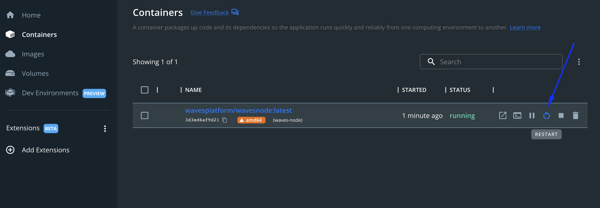

# Node Configuration # 


  - [Node Configuration File Description](#node-configuration-file-description)
  - [Parameters In The Configuration File](#working-with-the-configuration-file)
  - [Ubuntu Node Configuration](#ubuntu-node-configuration)
    - [Deb Package Configuration](#deb-package-configuration)
    - [Docker Configuration](#docker-configuration)
    - [Waves Package Configuration](#waves-package-configuration)
  - [MacOS Node Configuration](#macos-node-configuration)
    - [Docker Configuration](#docker-configuration-1)
    - [Waves Package Configuration](#waves-package-configuration-1)
  - [Windows Node Configuration](#windows-node-configuration)
    - [Docker Configuration](#docker-node-configuration-2)
    - [Waves Package Configuration](#waves-package-configuration-2)

---

## Node Configuration File Description ##

As we previosuly mentioned in the [Node Structure]() chapter, every node has a:
- Configuration file;
- Blockchain copy.
  
Within this lesson, we are going to work with the configuration file of node.  
In the [next lesson](), we will talk about node synchronization with the Waves blockchain.  

A configuration file is a way of setting up instructions of a how a node should work.  
  
---

## Parameters In The Configuration File ##

The essential node parameters are wrapped within the `Waves` configuration section.  
There we can define what modules we would like to configure.  
In the [sample configuration file](https://github.com/wavesplatform/Waves/blob/version-1.4.x/node/waves-sample.conf), we have 4 modules included (wallet, blockchain, rest-api, network):  

```
waves {
    wallet {
    }

    blockchain {
    }

    rest-api {
    }

    network {
    }
}
```

This list of modules in the given example is not full, you can find the full list of Waves node modules and their parameters in the [documentation](https://docs.waves.tech/en/waves-node/node-configuration#sections-of-the-configuration-file).  

For the sake of simplicity, we will concentrate on the same modules as the ones included in the [sample configuration file](https://github.com/wavesplatform/Waves/blob/version-1.4.x/node/waves-sample.conf):  
- **<ins>[Wallet](https://docs.waves.tech/en/waves-node/node-configuration#wallet-settings)</ins>**  
    Built in node wallet parameters.  
    In the wallet module, you can configure parameters of the [wallet built in the Waves node](https://docs.waves.tech/en/waves-node/how-to-work-with-node-wallet).  
    [Previously](), we defined the seed of the wallet Base58 encoded and set a password to protect the `wallet.dat` file:
    
    ```
    waves {
        wallet{
            password = "RandomPassword_"
            seed = "K6XzUChB6DwTYCM1WxtVrv1BM6jTdcaBJrn6vkB3cK7qXCnqLV"
        }
    }
    ```

    Wallet parameters:  
    | Name | Description | Example |
    | :---- | :---- | :---- |
    | password | Sets the password string to protect the wallet file. | RandomPassword_ |
    | seed | Connects your wallet to your node via the wallet seed Base58 econded.<br><br>If you don’t have any existing wallet, comment out this parameter and start a node.<br>During the first run, the application will create a new wallet with a random seed for you.<br>In this case, the seed will be displayed in the application log.<br>If you miss it or if you don’t want to check the log files, it will also be available in REST API using the `wallet/seed` method.|  K6XzUChB6DwTYCM1WxtVrv1BM6jTdcaBJrn6vkB3cK7qXCnqLV |

    Read more about [Wallet Settings](https://docs.waves.tech/en/waves-node/node-configuration#wallet-settings).
- **<ins>[Blockchain](https://docs.waves.tech/en/waves-node/node-configuration#blockchain-settings)</ins>**  
    Blockchain parameters.  
    In the blockchain section, you can select the blockchain type.  
    Since we are aimed at mining and receiving rewards for block generation, we will use the MAINNET type.  

    ```
    waves {
        blockchain {
            type = MAINNET
        }
    }
    ```

    Blockchain parameters:  
    | Name | Description | Example |
    | :---- | :---- | :---- |
    | type | Selects the blockchain type: [MAINNET, STAGENET, TESTNET]() or [CUSTOM](https://docs.waves.tech/en/waves-node/private-waves-network). | MAINNET | 

    Read more about [Blockchain Settings](https://docs.waves.tech/en/waves-node/node-configuration#blockchain-settings).
- **<ins>[REST API](https://docs.waves.tech/en/waves-node/node-configuration#rest-api-settings)</ins>**  
    Node API parameters.  
    The Waves node REST API is the main interface for blockchain interaction.  
    The API has both public (available for everyone) and private (avaialable only via aurthorization) endpoints.  
    For example, you may check the swagger REST API interface for the [MAINNET network](https://nodes.wavesnodes.com/).  

    Once this parameters is configured, you may get access to the REST API service of your personal node directly:  

    
    ```
    waves {
        rest-api {
            enable = yes
            bind-address = "127.0.0.1"
            port = 6869
            api-key-hash = "CvTpRm21PyZf15q1dD7bz46meYYtWQAgA1kQU1iqXKriv"
        }
    }
    ```

    Right after the node is deployed, you would be able to access the REST API by `127.0.0.1:6869` address in your browser.  

    REST API parameters:  
    | Name | Description | Example |
    | :---- | :---- | :---- |
    | enable | Activates REST API.<br>If you want to deactivate REST API, change the default value to no. | yes |
    | bind-address | Network address where the REST API accepts incoming connections.<br>Please, note, it's not recommended to change the default value.<br>Use [Nginx’s proxy pass module](http://nginx.org/en/docs/http/ngx_http_proxy_module.html) or [SSH port forwarding](https://blog.trackets.com/2014/05/17/ssh-tunnel-local-and-remote-port-forwarding-explained-with-examples.html) for external access. | 127.0.0.1 |
    | port | Port number where the REST API accepts incoming connections. | 6869 |
    | api-key-hash | Hash of the API key to access private endpoints.<br>To generate the API key, please, check details in the [article](https://docs.waves.tech/en/waves-node/node-api/api-key2). | CvTpRm21PyZf15q1dD7bz46meYYtWQAgA1kQU1iqXKriv |

    Read more about [REST API Settings](https://docs.waves.tech/en/waves-node/node-configuration#rest-api-settings).
- **<ins>[Network](https://docs.waves.tech/en/waves-node/node-configuration#network-settings)</ins>**  
    Peer to peer network parameters.  
    This module allows you to define how your node would interact with other nodes within the network:

    ```
    waves {
        network {
            node-name = "default-node-name"
            bind-address = "0.0.0.0"
            port = 6868
        }
    }
    ```

    Network parameters:  
    | Name | Description | Example |
    | :---- | :---- | :---- |
    | node-name | Sets the name of your node visible to other participants of the P2P network.<br>The name is transmitted during initial handshake. | default-node-name | 
    | bind-address | Sets the IP address of local network interface on which Waves Node will accept incoming connections.<br>By default, node binds to 0.0.0.0 that means that it will listen on all available network adapters. | 0.0.0.0 | 
    | port | Sets the network port number to which other Waves nodes will connect.<br>Check that the port is reachable from outside, otherwise your node will connect to P2P network using only outgoing connections.<br>If this the port is used by other application, your node won’t start.<br>For example:<br>-6868 for Mainnet<br>-6863 for Testnet<br>-6862 for Stagenet| 6868 | 

     Read more about [Network Settings](https://docs.waves.tech/en/waves-node/node-configuration#network-settings).
  

## Ubuntu Node Configuration ##

### Deb Package Configuration ###

Follow the instructions below for setting up configurations:

1. Go to the directory with the configuration file:
   
   ```
   sudo cd /usr/share/waves/conf/waves.conf 
   ```

2.  Edit the configuration file.  
    In the previous lesson, we already added the `waves.wallet` module.  
    Make sure to add `blockchain`, `rest-api`, and `network` modules to the file as well.  
    Please, note `rest-api.api-key-hash` parameter doesn't necessarily have to match with the example below.  
    You can [generate the API key](https://docs.waves.tech/en/waves-node/node-api/api-key#set-api-key) and insert it in the `rest-api.api-key-hash` parameter.

    ```
    waves {

        wallet {
            password = "RandomPassword_"
            seed = "K6XzUChB6DwTYCM1WxtVrv1BM6jTdcaBJrn6vkB3cK7qXCnqLV"
        }

        blockchain {
            type = MAINNET
        }

        rest-api {
            enable = yes
            bind-address = "127.0.0.1"
            port = 6869
            api-key-hash = "CvTpRm21PyZf15q1dD7bz46meYYtWQAgA1kQU1iqXKriv"
        

        network {
            node-name = "default-node-name"
            bind-address = "0.0.0.0"
            port = 6868
        }

    }
    ```
3. Save the file and deploy a node once again.

### Docker Configuration ###

1. Once a node has been deployed, a configuration file gets automatically created.  
   Run the command below to start editing the configuration file:
   
   ```
   sudo nano /opt/waves-node/conf/waves.conf
   ```
2.  Edit the configuration file.  
    In the previous lesson, we already added the `waves.wallet` module.  
    Make sure to add `blockchain`, `rest-api`, and `network` modules to the file as well.  
    Please, note `rest-api.api-key-hash` parameter doesn't necessarily have to match with the example below.  
    You can [generate the API key](https://docs.waves.tech/en/waves-node/node-api/api-key#set-api-key) and insert it in the `rest-api.api-key-hash` parameter.

    ```
    waves {

        wallet {
            password = "RandomPassword_"
            seed = "K6XzUChB6DwTYCM1WxtVrv1BM6jTdcaBJrn6vkB3cK7qXCnqLV"
        }

        blockchain {
            type = MAINNET
        }

        rest-api {
            enable = yes
            bind-address = "127.0.0.1"
            port = 6869
            api-key-hash = "CvTpRm21PyZf15q1dD7bz46meYYtWQAgA1kQU1iqXKriv"
        

        network {
            node-name = "default-node-name"
            bind-address = "0.0.0.0"
            port = 6868
        }

    }
    ```
3. Save the file and deploy a node once again by restarting a container.  
    Firslty, check the current container's id:  

    ```
    docker ps
    ```

    The container ID may look like this:
    
    ```
    CONTAINER ID 
    c3f7dacea0d4
    ```

    Restart the container:
    
    ```
    docker container restart c3f7dacea0d4
    ```

### Waves Package Configuration ###

1. Go to the directory with the configuration file:
   
   ```
   sudo cd /opt/waves-node/conf
   ```
2. Edit the configuration file.  
   In the previous lesson, we already added the `waves.wallet` module.  
   Make sure to add `blockchain`, `rest-api`, and `network` modules to the file as well.  
   Please, note `rest-api.api-key-hash` parameter doesn't necessarily have to match with the example below.  
   You can [generate the API key](https://docs.waves.tech/en/waves-node/node-api/api-key#set-api-key) and insert it in the `rest-api.api-key-hash` parameter.

    ```
    waves {

        wallet {
            password = "RandomPassword_"
            seed = "K6XzUChB6DwTYCM1WxtVrv1BM6jTdcaBJrn6vkB3cK7qXCnqLV"
        }

        blockchain {
            type = MAINNET
        }

        rest-api {
            enable = yes
            bind-address = "127.0.0.1"
            port = 6869
            api-key-hash = "CvTpRm21PyZf15q1dD7bz46meYYtWQAgA1kQU1iqXKriv"
        

        network {
            node-name = "default-node-name"
            bind-address = "0.0.0.0"
            port = 6868
        }

    }
    ```
3. Save the file and deploy a node once again.

---

## MacOS Node Configuration ##


### Docker Configuration ###

1. Once a node has been deployed, a configuration file gets automatically created.  
   Run the command below to start editing the configuration file:
   
   ```
   sudo nano /opt/waves-node/conf/waves.conf
   ```
2.  Edit the configuration file.  
    In the previous lesson, we already added the `waves.wallet` module.  
    Make sure to add `blockchain`, `rest-api`, and `network` modules to the file as well.  
    Please, note `rest-api.api-key-hash` parameter doesn't necessarily have to match with the example below.  
    You can [generate the API key](https://docs.waves.tech/en/waves-node/node-api/api-key#set-api-key) and insert it in the `rest-api.api-key-hash` parameter.

    ```
    waves {

        wallet {
            password = "RandomPassword_"
            seed = "K6XzUChB6DwTYCM1WxtVrv1BM6jTdcaBJrn6vkB3cK7qXCnqLV"
        }

        blockchain {
            type = MAINNET
        }

        rest-api {
            enable = yes
            bind-address = "127.0.0.1"
            port = 6869
            api-key-hash = "CvTpRm21PyZf15q1dD7bz46meYYtWQAgA1kQU1iqXKriv"
        

        network {
            node-name = "default-node-name"
            bind-address = "0.0.0.0"
            port = 6868
        }

    }
    ```
3. Save the file and deploy a node once again by restarting a container.  
    Firslty, check the current container's id:  

    ```
    docker ps
    ```

    The container ID may look like this:
    
    ```
    CONTAINER ID 
    c3f7dacea0d4
    ```

    Restart the container:
    
    ```
    docker container restart c3f7dacea0d4
    ```

### Waves Package Configuration ###

1. Go to the directory with the configuration file:
   
   ```
   sudo cd /opt/waves-node/conf
   ```
2. Edit the configuration file.  
   In the previous lesson, we already added the `waves.wallet` module.  
   Make sure to add `blockchain`, `rest-api`, and `network` modules to the file as well.  
   Please, note `rest-api.api-key-hash` parameter doesn't necessarily have to match with the example below.  
   You can [generate the API key](https://docs.waves.tech/en/waves-node/node-api/api-key#set-api-key) and insert it in the `rest-api.api-key-hash` parameter.

    ```
    waves {

        wallet {
            password = "RandomPassword_"
            seed = "K6XzUChB6DwTYCM1WxtVrv1BM6jTdcaBJrn6vkB3cK7qXCnqLV"
        }

        blockchain {
            type = MAINNET
        }

        rest-api {
            enable = yes
            bind-address = "127.0.0.1"
            port = 6869
            api-key-hash = "CvTpRm21PyZf15q1dD7bz46meYYtWQAgA1kQU1iqXKriv"
        

        network {
            node-name = "default-node-name"
            bind-address = "0.0.0.0"
            port = 6868
        }

    }
    ```
3. Save the file and deploy a node once again.


## Windows Node Configuration ##

### Docker Configuration ###

1. Go to the directory with the configuration file (`C:\wavesnode\conf\waves-sample.conf`)
2. Edit the configuration file.  
   In the previous lesson, we already added the `waves.wallet` module.  
   Make sure to add `blockchain`, `rest-api`, and `network` modules to the file as well.  
   Please, note `rest-api.api-key-hash` parameter doesn't necessarily have to match with the example below.  
   You can [generate the API key](https://docs.waves.tech/en/waves-node/node-api/api-key#set-api-key) and insert it in the `rest-api.api-key-hash` parameter.

    ```
    waves {

        wallet {
            password = "RandomPassword_"
            seed = "K6XzUChB6DwTYCM1WxtVrv1BM6jTdcaBJrn6vkB3cK7qXCnqLV"
        }

        blockchain {
            type = MAINNET
        }

        rest-api {
            enable = yes
            bind-address = "127.0.0.1"
            port = 6869
            api-key-hash = "CvTpRm21PyZf15q1dD7bz46meYYtWQAgA1kQU1iqXKriv"
        

        network {
            node-name = "default-node-name"
            bind-address = "0.0.0.0"
            port = 6868
        }

    }
    ```
3. Restart the docker container:
    
    

### Waves Package Configuration ###

1. Go to the directory with the configuration file (`C:\wavesnode\conf\waves-sample.conf`)
2. Edit the configuration file.  
   In the previous lesson, we already added the `waves.wallet` module.  
   Make sure to add `blockchain`, `rest-api`, and `network` modules to the file as well.  
   Please, note `rest-api.api-key-hash` parameter doesn't necessarily have to match with the example below.  
   You can [generate the API key](https://docs.waves.tech/en/waves-node/node-api/api-key#set-api-key) and insert it in the `rest-api.api-key-hash` parameter.

    ```
    waves {

        wallet {
            password = "RandomPassword_"
            seed = "K6XzUChB6DwTYCM1WxtVrv1BM6jTdcaBJrn6vkB3cK7qXCnqLV"
        }

        blockchain {
            type = MAINNET
        }

        rest-api {
            enable = yes
            bind-address = "127.0.0.1"
            port = 6869
            api-key-hash = "CvTpRm21PyZf15q1dD7bz46meYYtWQAgA1kQU1iqXKriv"
        

        network {
            node-name = "default-node-name"
            bind-address = "0.0.0.0"
            port = 6868
        }

    }
    ```
3. Save the file and deploy a node once again.