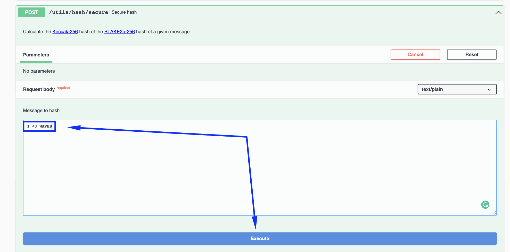

# Node Configuration # 


  - [Node Configuration File Description](#node-configuration-file-description)
  - [Modules In The Configuration File](#modules-in-the-configuration-file)
  - [Ubuntu Node Configuration](#ubuntu-node-configuration)
    - [Deb Package Configuration](#deb-package-configuration)
    - [Docker Configuration](#docker-configuration)
    - [Waves Package Configuration](#waves-package-configuration)
  - [MacOS Node Configuration](#macos-node-configuration)
    - [Docker Configuration](#docker-configuration-1)
    - [Waves Package Configuration](#waves-package-configuration-1)
  - [Windows Node Configuration](#windows-node-configuration)
    - [Docker Configuration](#docker-node-configuration-2)
    - [Waves Package Configuration](#waves-package-configuration-2)

---

## Node Configuration File Description ##

As we previosuly mentioned in the [Node Structure]() chapter, every node has:
- A configuration file;
- The blockchain copy.
  
Within this lesson, we are going to work with the configuration file of node.  
In the [next lesson](), we will talk about node synchronization with the Waves blockchain.  

A configuration file is a way of setting up instructions of a how a node should work.  
  
---

## Modules In The Configuration File ##

All the node modules are wrapped within the `Waves` configuration section.  
There we can define what modules we would like to configure.  
In the [sample configuration file](https://github.com/wavesplatform/Waves/blob/version-1.4.x/node/waves-sample.conf), we have 4 of them included (`wallet`, `blockchain`, `rest-api`, `network`):  

```
waves {
    wallet {
    }

    blockchain {
    }

    rest-api {
    }

    network {
    }
}
```

This list of modules in the given example is not full, you can find the full list of Waves node modules and their parameters in the [documentation](https://docs.waves.tech/en/waves-node/node-configuration#sections-of-the-configuration-file).  

For the sake of simplicity, we will concentrate on the same modules as the ones included in the [sample configuration file](https://github.com/wavesplatform/Waves/blob/version-1.4.x/node/waves-sample.conf):  
- **<ins>[Wallet](https://docs.waves.tech/en/waves-node/node-configuration#wallet-settings)</ins>**  
    Built in node wallet parameters.  
    In the wallet module, you can configure parameters of the [wallet built in the Waves node](https://docs.waves.tech/en/waves-node/how-to-work-with-node-wallet).  
    [Previously](), we defined the seed of the wallet Base58 encoded and set a password to encode the seed in `wallet.dat` file:
    
    ```
    waves {
        wallet{
            password = "RandomPassword_"
            seed = "K6XzUChB6DwTYCM1WxtVrv1BM6jTdcaBJrn6vkB3cK7qXCnqLV"
        }
    }
    ```

    Wallet parameters:  
    | Name | Description | Example |
    | :---- | :---- | :---- |
    | password | Random password a user sets. Encodes your seed Base58 string in the `wallet.dat` file. | RandomPassword_ |
    | seed | Connects your wallet to your node via the [wallet seed Base58 econded]().<br><br>If you don’t have any existing wallet, comment out this parameter and start a node.<br>During the first run, the application will create a new wallet with a random seed for you.<br>In this case, the seed will be displayed in the application log.<br>If you miss it or if you don’t want to check the log files, it will also be available in [REST API]() using the `wallet/seed` method.|  K6XzUChB6DwTYCM1WxtVrv1BM6jTdcaBJrn6vkB3cK7qXCnqLV |

    Read more about [Wallet Settings](https://docs.waves.tech/en/waves-node/node-configuration#wallet-settings).
- **<ins>[Blockchain](https://docs.waves.tech/en/waves-node/node-configuration#blockchain-settings)</ins>**  
    Blockchain parameters.  
    In the blockchain module, you can select the blockchain type.  
    Since we are aimed at mining and receiving rewards for block generation, we will use the MAINNET type.  

    ```
    waves {
        blockchain {
            type = MAINNET
        }
    }
    ```

    Blockchain parameters:  
    | Name | Description | Example |
    | :---- | :---- | :---- |
    | type | Selects the blockchain type: [MAINNET, STAGENET, TESTNET]() or [CUSTOM](https://docs.waves.tech/en/waves-node/private-waves-network). | MAINNET | 

    Read more about [Blockchain Settings](https://docs.waves.tech/en/waves-node/node-configuration#blockchain-settings).
- **<ins>[REST API](https://docs.waves.tech/en/waves-node/node-configuration#rest-api-settings)</ins>**  
    Node API parameters.  
    The Waves node REST API is the main interface for blockchain interaction.  
    The API has both public (available for everyone) and private (avaialable only via aurthorization) endpoints.  
    You may check the swagger REST API interface for the [MAINNET network](https://nodes.wavesnodes.com/) to get an idea how it looks like.  

    Once this parameters is configured, you may get access to the REST API service of your personal node directly:  

    
    ```
    waves {
        rest-api {
            enable = yes
            bind-address = "127.0.0.1"
            port = 6869
            api-key-hash = "CvTpRm21PyZf15q1dD7bz46meYYtWQAgA1kQU1iqXKriv"
        }
    }
    ```

    REST API parameters:  
    | Name | Description | Example |
    | :---- | :---- | :---- |
    | enable | Activates REST API.<br>If you want to deactivate REST API, change the default value to no. | yes |
    | bind-address | Network address where the REST API accepts incoming connections.<br>Please, note that it is necessary to use:<br>- 0.0.0.0 address if you are deploying a node with Docker;<br>- 127.0.0.1 address if you deploy a node with deb package or waves package. <br>Use [Nginx’s proxy pass module](http://nginx.org/en/docs/http/ngx_http_proxy_module.html) or [SSH port forwarding](https://blog.trackets.com/2014/05/17/ssh-tunnel-local-and-remote-port-forwarding-explained-with-examples.html) for external access. | 127.0.0.1 |
    | port | Port number where the REST API accepts incoming connections. | 6869 |
    | api-key-hash | Hash of the API key to access private endpoints.<br>Please, check the chapter [API Key Of Your Node](#api-key-of-your-node) to generate the API Key. | CvTpRm21PyZf15q1dD7bz46meYYtWQAgA1kQU1iqXKriv |

    Read more about [REST API Settings](https://docs.waves.tech/en/waves-node/node-configuration#rest-api-settings).
- **<ins>[Network](https://docs.waves.tech/en/waves-node/node-configuration#network-settings)</ins>**  
    Peer to peer network parameters.  
    This module allows you to define how your node would interact with other nodes within the network:

    ```
    waves {
        network {
            node-name = "waves-node"
            bind-address = "0.0.0.0"
            port = 6868
        }
    }
    ```

    Network parameters:  
    | Name | Description | Example |
    | :---- | :---- | :---- |
    | node-name | Sets the name of your node visible to other participants of the P2P network.<br>The name is transmitted during initial handshake. | waves-node | 
    | bind-address | Sets the IP address of local network interface on which Waves Node will accept incoming connections.<br>By default, node binds to 0.0.0.0 that means that it will listen on all available network adapters. | 0.0.0.0 | 
    | port | Sets the network port number to which other Waves nodes will connect.<br>Check that the port is reachable from outside, otherwise your node will connect to P2P network using only outgoing connections.<br>If this the port is used by other application, your node won’t start.<br>For example:<br>-6868 for Mainnet<br>-6863 for Testnet<br>-6862 for Stagenet| 6868 | 

     Read more about [Network Settings](https://docs.waves.tech/en/waves-node/node-configuration#network-settings).

## API Key Of Your Node ##  

After the REST API module configured and node deployed, you will be able to access the Swagger interface for blockchain interaction.  
There you can access different methods that will allow you:
- Read the blockchain data:
    - `Account data`  
        (balances, data storage entries, aliases, scripts assigned)
    - `Token data`  
        (parameters, distribution by accounts)
    - `Active leases`
    - `Blocks`
    - `Transactions`
    - `Etc`
- Operate with transactions: 
    - `Broadcast signed transactions`
    - `Validate transactions`
    - `Check status of transactions`
- Use utilities:
    -  `Generate an address from a public key`
    -  `Generate a random seed`
    -  `Calculate hashes` 
    -  `Etc`

These methods can be:
- **<ins>Public</ins>**:  
    Methods available to everyone. Public methods do not:
    - Operate with any private data of the node owner;
    - Invoke any methods that would make an action with any node, like stopping a node or connecting to a peer.  
  
    For example, [`/blocks/height`](https://nodes.wavesnodes.com/api-docs/index.html#/blocks/getHeight) is a method that checks current height of the blockchain.  
    This information is not private and do not make any action with a node, therefore it doesn't require any additional authorization. 
- **<ins>Private</ins>**:  
    Methods available only to node owners.  
    These methods can be invoked only by node owners via API key and API key hash authorization.  
    For example, [`/debug/configInfo`](https://nodes.wavesnodes.com/api-docs/index.html#/debug/getConfig) is a method that checks the configuration of the currently running node.

The chapter goal is to get these API key and API key hash to be able to operate with private methods of your node.  
Here is how you can do it:
1. Open [`/utils/hash/secure`](https://nodes.wavesnodes.com/api-docs/index.html#/utils/hashSecure) in the Swagger REST API node interfance.
2. Click "Try it out":  
      
3. Enter any random string value and click "Execute":
      
    Please, do not use example in the screenshot, as it is given for demonstration purpose only.
4. In the response section below, you will receive a hash:
      
5. Save both the original phrase you entered (API key) and the hash (API key hash) of it as we will use them for interaction with private node methods in this lesson.

## Ubuntu Node Configuration ##

### Deb Package Configuration ###

Follow the instructions below for setting up configurations:

1. Edit the configuration file:  

    ```
    sudo nano /opt/waves-node/conf/waves-sample.conf
    ```

    [In the previous lesson](), we already added the `waves.wallet` module.  
    Make sure to add `blockchain`, `rest-api`, and `network` modules to the file as well.  
      
    Please, note `rest-api.api-key-hash` parameter doesn't necessarily have to match with the example below.  
    In the chapter [API Key Of Your Node](#api-key-of-your-node), an instruction of how to generate the API key hash was given.  
    Insert the API key hash in the `rest-api.api-key-hash` parameter.
      
    After the edit, the `waves.conf` file can look something like this: 

    ```
    waves {

        wallet {
            password = "RandomPassword_"
            seed = "K6XzUChB6DwTYCM1WxtVrv1BM6jTdcaBJrn6vkB3cK7qXCnqLV"
        }

        blockchain {
            type = MAINNET
        }

        rest-api {
            enable = yes
            bind-address = "127.0.0.1"
            port = 6869
            api-key-hash = "CvTpRm21PyZf15q1dD7bz46meYYtWQAgA1kQU1iqXKriv"
        

        network {
            node-name = "waves-node"
            bind-address = "0.0.0.0"
            port = 6868
        }

    }
    ```
2. Save the file and deploy a node once again.  
    To restart the node, use the command below:  

    ```
    sudo systemctl restart waves.service
    ```
    Please, wait a few moments for the node to restart.  
3. Check the [REST API interface](http://localhost:6869/api-docs/index.html) of your deployed node.  
    There you would be able to see multiple methods to interact with your node.  
    For example, you can try a:
    - [Public method](http://127.0.0.1:6869/api-docs/index.html#/addresses):  
        All public methods don't require any additional authorization.  
        For example, `/addresses/` method, will return the address of your node wallet.  
         
    - [Private method](http://127.0.0.1:6869/api-docs/index.html#/debug/getConfig):  
        All private methods require authorization with API key and API key hash.    
        Kindly note that the API key hash that you inserted in the configuration file is not equal to the API key.  
        The API key hash is the random string you typed in the [`/utils/hash/secure`](https://nodes.wavesnodes.com/api-docs/index.html#/utils/hashSecure) method.  
        In case you do not remember what API key and API key hash are, please, check [API Key Of Your Node](#api-key-of-your-node).  
          
        To authorize for private method usage:
        1. Click "Authorize":
            
        2. Enter your API key (not the API hash) and click "Authorize":
            
            Please, note the API key on the screen is an example.  
            You need to use your own API key.
        3. Click "Close":
            
        4. Now you can use private methods of your node.  
            For example, [`/configInfo`](http://127.0.0.1:6869/api-docs/index.html#/debug/getConfig) method will return configurations of the currently running node.
               
      
    Read more about [Node REST API](https://docs.waves.tech/en/waves-node/node-api/).   


### Docker Configuration ###

Follow the instructions below for setting up configurations:
1. Once a node has been deployed, a configuration file gets automatically created.  
   Run the command below to start editing the configuration file:
   
   ```
   sudo nano /opt/waves-node/conf/waves.conf
   ```
2.  Edit the configuration file.  
    [In the previous lesson](), we deployed a docker container with the Base58 encoded seed and the password as environment variables.  
    It looked something like this but with your own seed and password: 
    
    ```
    -e WAVES_WALLET_SEED="K6XzUChB6DwTYCM1WxtVrv1BM6jTdcaBJrn6vkB3cK7qXCnqLV" \
    -e WAVES_WALLET_PASSWORD="RandomPassword_"
    ```
    
    As of now, we will write these details in the configuration file within the `waves.wallet` module.  
    Make sure to add `wallet`, `blockchain`, `rest-api`, and `network` modules to the file.    

    Please, note `rest-api.api-key-hash` parameter doesn't necessarily have to match with the example below.  
    In the chapter [API Key Of Your Node](#api-key-of-your-node), an instruction of how to generate the API key hash was given.  
    Insert the API key hash in the `rest-api.api-key-hash` parameter.
      
    After the edit, the `waves.conf` file can look something like this:  

    ```
    waves {
        wallet {
            password = "RandomPassword_"
            seed = "K6XzUChB6DwTYCM1WxtVrv1BM6jTdcaBJrn6vkB3cK7qXCnqLV"
        }

        blockchain {
            type = MAINNET
        }

        rest-api {
            enable = yes
            bind-address = "0.0.0.0"
            port = 6869
            api-key-hash = "CvTpRm21PyZf15q1dD7bz46meYYtWQAgA1kQU1iqXKriv"
        }

        network {
            node-name = "waves-node"
            bind-address = "0.0.0.0"
            port = 6868
        }
    }
    ```
3. Save the file and deploy a node once again by restarting a container:
    
    ```
    docker container restart waves-node
    ```
    Please, wait a few moments for the node to restart.  
4. Check the [REST API interface](http://localhost:6869/api-docs/index.html) of your deployed node.  
    There you would be able to see multiple methods to interact with your node.  
    For example, you can try a:
    - [Public method](http://127.0.0.1:6869/api-docs/index.html#/addresses):  
        All public methods don't require any additional authorization.  
        For example, `/addresses/` method, will return the address of your node wallet.  
         
    - [Private method](http://127.0.0.1:6869/api-docs/index.html#/debug/getConfig):  
        All private methods require authorization with API key and API key hash.    
        Kindly note that the API key hash that you inserted in the configuration file is not equal to the API key.  
        The API key hash is the random string you typed in the [`/utils/hash/secure`](https://nodes.wavesnodes.com/api-docs/index.html#/utils/hashSecure) method.  
        In case you do not remember what API key and API key hash are, please, check [API Key Of Your Node](#api-key-of-your-node).  
          
        To authorize for private method usage:
        1. Click "Authorize":
            
        2. Enter your API key (not the API hash) and click "Authorize":
            
            Please, note the API key on the screen is an example.  
            You need to use your own API key.
        3. Click "Close":
            
        4. Now you can use private methods of your node.  
            For example, [`/configInfo`](http://127.0.0.1:6869/api-docs/index.html#/debug/getConfig) method will return configurations of the currently running node.
               
      
    Read more about [Node REST API](https://docs.waves.tech/en/waves-node/node-api/).  


### Waves Package Configuration ###

Follow the instructions below for setting up configurations:
1. Edit the configuration file:  

    ```
    sudo nano /opt/waves-node/conf/waves-sample.conf
    ```

    [In the previous lesson](), we already added the `waves.wallet` module.  
    Make sure to add `blockchain`, `rest-api`, and `network` modules to the file as well.  
      
    Please, note `rest-api.api-key-hash` parameter doesn't necessarily have to match with the example below.  
    In the chapter [API Key Of Your Node](#api-key-of-your-node), an instruction of how to generate the API key hash was given.  
    Insert the API key hash in the `rest-api.api-key-hash` parameter.
      
    After the edit, the `waves.conf` file can look something like this: 

    ```
    waves {

        wallet {
            password = "RandomPassword_"
            seed = "K6XzUChB6DwTYCM1WxtVrv1BM6jTdcaBJrn6vkB3cK7qXCnqLV"
        }

        blockchain {
            type = MAINNET
        }

        rest-api {
            enable = yes
            bind-address = "127.0.0.1"
            port = 6869
            api-key-hash = "CvTpRm21PyZf15q1dD7bz46meYYtWQAgA1kQU1iqXKriv"
        

        network {
            node-name = "waves-node"
            bind-address = "0.0.0.0"
            port = 6868
        }

    }
    ```
2. Save the file and deploy a node once again:  
    Replace {*} with the actual file name:

    ```
    cd /opt/waves-node
    java -jar {*}.jar ./conf/{*}.conf
    ```

    For example:

    ```
    cd /opt/waves-node
    java -jar waves-all-1.4.7.jar ./conf/waves-sample.conf
    ```
    Please, note that it may take a few moments to deploy a node.
3. Check the [REST API interface](http://localhost:6869/api-docs/index.html) of your deployed node.  
    There you would be able to see multiple methods to interact with your node.  
    For example, you can try a:
    - [Public method](http://127.0.0.1:6869/api-docs/index.html#/addresses):  
        All public methods don't require any additional authorization.  
        For example, `/addresses/` method, will return the address of your node wallet.  
         
    - [Private method](http://127.0.0.1:6869/api-docs/index.html#/debug/getConfig):  
        All private methods require authorization with API key and API key hash.    
        Kindly note that the API key hash that you inserted in the configuration file is not equal to the API key.  
        The API key hash is the random string you typed in the [`/utils/hash/secure`](https://nodes.wavesnodes.com/api-docs/index.html#/utils/hashSecure) method.  
        In case you do not remember what API key and API key hash are, please, check [API Key Of Your Node](#api-key-of-your-node).  
          
        To authorize for private method usage:
        1. Click "Authorize":
            
        2. Enter your API key (not the API hash) and click "Authorize":
            
            Please, note the API key on the screen is an example.  
            You need to use your own API key.
        3. Click "Close":
            
        4. Now you can use private methods of your node.  
            For example, [`/configInfo`](http://127.0.0.1:6869/api-docs/index.html#/debug/getConfig) method will return configurations of the currently running node.
               
      
    Read more about [Node REST API](https://docs.waves.tech/en/waves-node/node-api/).  


---

## MacOS Node Configuration ##


### Docker Configuration ###
Follow the instructions below for setting up configurations:

1. Once a node has been deployed, a configuration file gets automatically created.  
   Run the command below to start editing the configuration file:
   
   ```
   sudo nano /opt/waves-node/conf/waves.conf
   ```
2.  Edit the configuration file.  
    [In the previous lesson](), we deployed a docker container with the Base58 encoded seed and the password as environment variables.  
    It looked something like this but with your own seed and password: 
    
    ```
    -e WAVES_WALLET_SEED="K6XzUChB6DwTYCM1WxtVrv1BM6jTdcaBJrn6vkB3cK7qXCnqLV" \
    -e WAVES_WALLET_PASSWORD="RandomPassword_"
    ```
    
    As of now, we will write these details in the configuration file within the `waves.wallet` module.  
    Make sure to add `wallet`, `blockchain`, `rest-api`, and `network` modules to the file.    

    Please, note `rest-api.api-key-hash` parameter doesn't necessarily have to match with the example below.  
    In the chapter [API Key Of Your Node](#api-key-of-your-node), an instruction of how to generate the API key hash was given.  
    Insert the API key hash in the `rest-api.api-key-hash` parameter.
      
    After the edit, the `waves.conf` file can look something like this:  

    ```
    waves {
        wallet {
            password = "RandomPassword_"
            seed = "K6XzUChB6DwTYCM1WxtVrv1BM6jTdcaBJrn6vkB3cK7qXCnqLV"
        }

        blockchain {
            type = MAINNET
        }

        rest-api {
            enable = yes
            bind-address = "0.0.0.0"
            port = 6869
            api-key-hash = "CvTpRm21PyZf15q1dD7bz46meYYtWQAgA1kQU1iqXKriv"
        }

        network {
            node-name = "waves-node"
            bind-address = "0.0.0.0"
            port = 6868
        }
    }
    ```
3. Save the file and deploy a node once again by restarting a container:
    
    ```
    docker container restart waves-node
    ```
    Please, wait a few moments for the node to restart.  
4. Check the [REST API interface](http://localhost:6869/api-docs/index.html) of your deployed node.  
    There you would be able to see multiple methods to interact with your node.  
    For example, you can try a:
    - [Public method](http://127.0.0.1:6869/api-docs/index.html#/addresses):  
        All public methods don't require any additional authorization.  
        For example, `/addresses/` method, will return the address of your node wallet.  
         
    - [Private method](http://127.0.0.1:6869/api-docs/index.html#/debug/getConfig):  
        All private methods require authorization with API key and API key hash.    
        Kindly note that the API key hash that you inserted in the configuration file is not equal to the API key.  
        The API key hash is the random string you typed in the [`/utils/hash/secure`](https://nodes.wavesnodes.com/api-docs/index.html#/utils/hashSecure) method.  
        In case you do not remember what API key and API key hash are, please, check [API Key Of Your Node](#api-key-of-your-node).  
          
        To authorize for private method usage:
        1. Click "Authorize":
            
        2. Enter your API key (not the API hash) and click "Authorize":
            
            Please, note the API key on the screen is an example.  
            You need to use your own API key.
        3. Click "Close":
            
        4. Now you can use private methods of your node.  
            For example, [`/configInfo`](http://127.0.0.1:6869/api-docs/index.html#/debug/getConfig) method will return configurations of the currently running node.
               
      
    Read more about [Node REST API](https://docs.waves.tech/en/waves-node/node-api/).     

### Waves Package Configuration ###

Follow the instructions below for setting up configurations:
1. Edit the configuration file:  

    ```
    sudo nano /opt/waves-node/conf/waves-sample.conf
    ```

    [In the previous lesson](), we already added the `waves.wallet` module.  
    Make sure to add `blockchain`, `rest-api`, and `network` modules to the file as well.  
      
    Please, note `rest-api.api-key-hash` parameter doesn't necessarily have to match with the example below.  
    In the chapter [API Key Of Your Node](#api-key-of-your-node), an instruction of how to generate the API key hash was given.  
    Insert the API key hash in the `rest-api.api-key-hash` parameter.
      
    After the edit, the `waves.conf` file can look something like this: 

    ```
    waves {

        wallet {
            password = "RandomPassword_"
            seed = "K6XzUChB6DwTYCM1WxtVrv1BM6jTdcaBJrn6vkB3cK7qXCnqLV"
        }

        blockchain {
            type = MAINNET
        }

        rest-api {
            enable = yes
            bind-address = "127.0.0.1"
            port = 6869
            api-key-hash = "CvTpRm21PyZf15q1dD7bz46meYYtWQAgA1kQU1iqXKriv"
        

        network {
            node-name = "waves-node"
            bind-address = "0.0.0.0"
            port = 6868
        }

    }
    ```
2. Save the file and deploy a node once again:  
    Replace {*} with the actual file name:

    ```
    cd /opt/waves-node
    java -jar {*}.jar ./conf/{*}.conf
    ```

    For example:

    ```
    cd /opt/waves-node
    java -jar waves-all-1.4.7.jar ./conf/waves-sample.conf
    ```
    Please, note that it may take a few moments to deploy a node.
3. Check the [REST API interface](http://localhost:6869/api-docs/index.html) of your deployed node.  
    There you would be able to see multiple methods to interact with your node.  
    For example, you can try a:
    - [Public method](http://127.0.0.1:6869/api-docs/index.html#/addresses):  
        All public methods don't require any additional authorization.  
        For example, `/addresses/` method, will return the address of your node wallet.  
         
    - [Private method](http://127.0.0.1:6869/api-docs/index.html#/debug/getConfig):  
        All private methods require authorization with API key and API key hash.    
        Kindly note that the API key hash that you inserted in the configuration file is not equal to the API key.  
        The API key hash is the random string you typed in the [`/utils/hash/secure`](https://nodes.wavesnodes.com/api-docs/index.html#/utils/hashSecure) method.  
        In case you do not remember what API key and API key hash are, please, check [API Key Of Your Node](#api-key-of-your-node).  
          
        To authorize for private method usage:
        1. Click "Authorize":
            
        2. Enter your API key (not the API hash) and click "Authorize":
            
            Please, note the API key on the screen is an example.  
            You need to use your own API key.
        3. Click "Close":
            
        4. Now you can use private methods of your node.  
            For example, [`/configInfo`](http://127.0.0.1:6869/api-docs/index.html#/debug/getConfig) method will return configurations of the currently running node.
               
      
    Read more about [Node REST API](https://docs.waves.tech/en/waves-node/node-api/).  


## Windows Node Configuration ##

### Docker Configuration ###

Follow the instructions below for setting up configurations:
1.  Once a node has been deployed, a configuration file gets automatically created.   
    Go to the directory with the configuration file (`C:\wavesnode\conf\waves-sample.conf`).
2.  Edit the configuration file.  
    [In the previous lesson](), we deployed a docker container with the Base58 encoded seed and the password as environment variables.  
    It looked something like this but with your own seed and password: 
      
    
    As of now, we will write these details in the configuration file within the `waves.wallet` module.  
    Make sure to add `wallet`, `blockchain`, `rest-api`, and `network` modules to the file.    

    Please, note `rest-api.api-key-hash` parameter doesn't necessarily have to match with the example below.  
    In the chapter [API Key Of Your Node](#api-key-of-your-node), an instruction of how to generate the API key hash was given.  
    Insert the API key hash in the `rest-api.api-key-hash` parameter.
      
    After the edit, the `waves.conf` file can look something like this:  

    ```
    waves {
        wallet {
            password = "RandomPassword_"
            seed = "K6XzUChB6DwTYCM1WxtVrv1BM6jTdcaBJrn6vkB3cK7qXCnqLV"
        }

        blockchain {
            type = MAINNET
        }

        rest-api {
            enable = yes
            bind-address = "0.0.0.0"
            port = 6869
            api-key-hash = "CvTpRm21PyZf15q1dD7bz46meYYtWQAgA1kQU1iqXKriv"
        }

        network {
            node-name = "waves-node"
            bind-address = "0.0.0.0"
            port = 6868
        }
    }
    ```
3. Save the file and deploy a node once again by restarting a container:  
      
    Please, wait a few moments for the node to restart.  
4. Check the [REST API interface](http://localhost:6869/api-docs/index.html) of your deployed node.  
    There you would be able to see multiple methods to interact with your node.  
    For example, you can try a:
    - [Public method](http://127.0.0.1:6869/api-docs/index.html#/addresses):  
        All public methods don't require any additional authorization.  
        For example, `/addresses/` method, will return the address of your node wallet.  
         
    - [Private method](http://127.0.0.1:6869/api-docs/index.html#/debug/getConfig):  
        All private methods require authorization with API key and API key hash.    
        Kindly note that the API key hash that you inserted in the configuration file is not equal to the API key.  
        The API key hash is the random string you typed in the [`/utils/hash/secure`](https://nodes.wavesnodes.com/api-docs/index.html#/utils/hashSecure) method.  
        In case you do not remember what API key and API key hash are, please, check [API Key Of Your Node](#api-key-of-your-node).  
          
        To authorize for private method usage:
        1. Click "Authorize":
            
        2. Enter your API key (not the API hash) and click "Authorize":
            
            Please, note the API key on the screen is an example.  
            You need to use your own API key.
        3. Click "Close":
            
        4. Now you can use private methods of your node.  
            For example, [`/configInfo`](http://127.0.0.1:6869/api-docs/index.html#/debug/getConfig) method will return configurations of the currently running node.
               
      
    Read more about [Node REST API](https://docs.waves.tech/en/waves-node/node-api/).   

### Waves Package Configuration ###

Follow the instructions below for setting up configurations:
1. Go to the directory with the configuration file (`C:\wavesnode\conf\waves-sample.conf`)
2. Edit the configuration file.  
    [In the previous lesson](), we already added the `waves.wallet` module.  
    Make sure to add `blockchain`, `rest-api`, and `network` modules to the file as well.  
      
    Please, note `rest-api.api-key-hash` parameter doesn't necessarily have to match with the example below.  
    In the chapter [API Key Of Your Node](#api-key-of-your-node), an instruction of how to generate the API key hash was given.  
    Insert the API key hash in the `rest-api.api-key-hash` parameter.
      
    After the edit, the `waves.conf` file can look something like this: 

    ```
    waves {

        wallet {
            password = "RandomPassword_"
            seed = "K6XzUChB6DwTYCM1WxtVrv1BM6jTdcaBJrn6vkB3cK7qXCnqLV"
        }

        blockchain {
            type = MAINNET
        }

        rest-api {
            enable = yes
            bind-address = "127.0.0.1"
            port = 6869
            api-key-hash = "CvTpRm21PyZf15q1dD7bz46meYYtWQAgA1kQU1iqXKriv"
        

        network {
            node-name = "waves-node"
            bind-address = "0.0.0.0"
            port = 6868
        }

    }
    ```
3. Save the file and deploy a node once again.  
    Replace {*} with the actual file name:  

    ```
    cd C:\wavesnode
    java -jar {*}.jar .\conf\{*}.conf
    ```

    For example:  

    ```
    cd C:\wavesnode
    java -jar waves-all-1.4.7.jar .\conf\waves-sample.conf
    ```
    Please, note that it may take a few moments to deploy a node.
4. Check the [REST API interface](http://localhost:6869/api-docs/index.html) of your deployed node.  
    There you would be able to see multiple methods to interact with your node.  
    For example, you can try a:
    - [Public method](http://127.0.0.1:6869/api-docs/index.html#/addresses):  
        All public methods don't require any additional authorization.  
        For example, `/addresses/` method, will return the address of your node wallet.  
         
    - [Private method](http://127.0.0.1:6869/api-docs/index.html#/debug/getConfig):  
        All private methods require authorization with API key and API key hash.    
        Kindly note that the API key hash that you inserted in the configuration file is not equal to the API key.  
        The API key hash is the random string you typed in the [`/utils/hash/secure`](https://nodes.wavesnodes.com/api-docs/index.html#/utils/hashSecure) method.  
        In case you do not remember what API key and API key hash are, please, check [API Key Of Your Node](#api-key-of-your-node).  
          
        To authorize for private method usage:
        1. Click "Authorize":
            
        2. Enter your API key (not the API hash) and click "Authorize":
            
            Please, note the API key on the screen is an example.  
            You need to use your own API key.
        3. Click "Close":
            
        4. Now you can use private methods of your node.  
            For example, [`/configInfo`](http://127.0.0.1:6869/api-docs/index.html#/debug/getConfig) method will return configurations of the currently running node.
               
      
    Read more about [Node REST API](https://docs.waves.tech/en/waves-node/node-api/). 